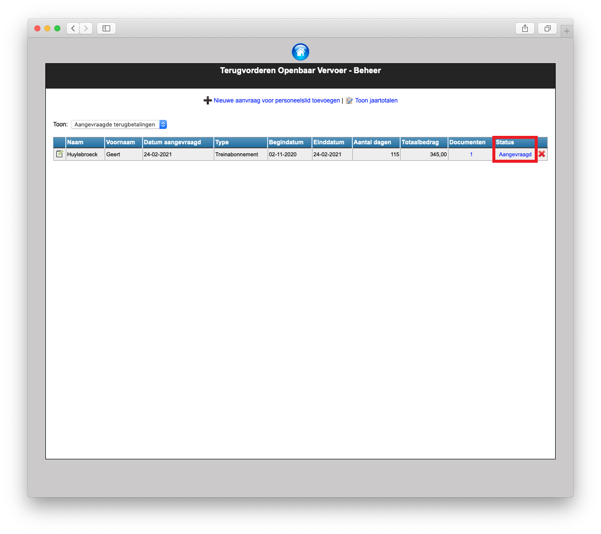
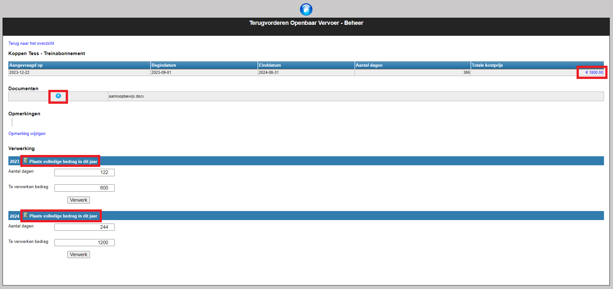
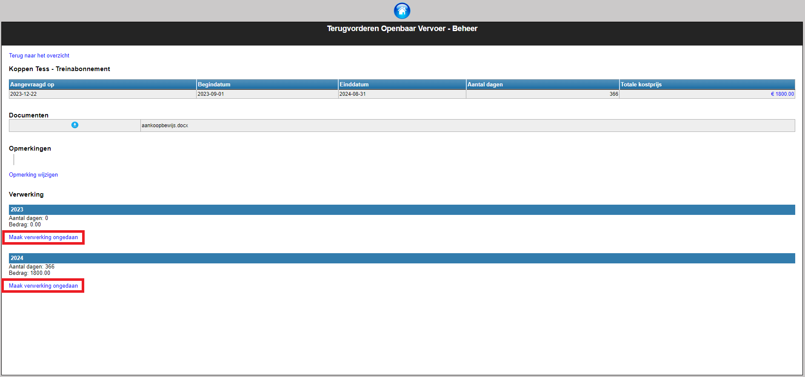
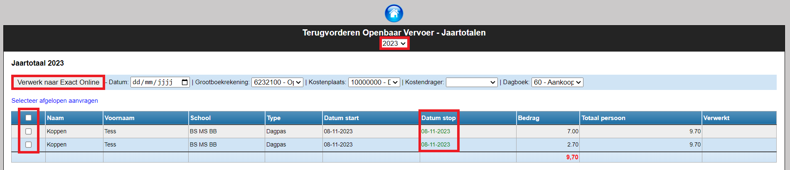
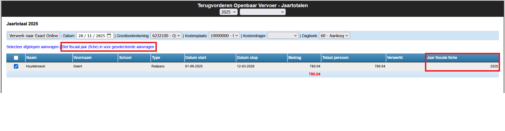

Iemand met het gebruikersrecht 'Openbaar vervoer Beheer' krijgt in de module **Openbaar vervoer** bovenaan nog een extra knop 'Beheer aanvragen' te zien. Via die knop kan de beheerder een overzicht krijgen van alle lopende en alle ingediende aanvragen of een aanvraag indienen voor een andere collega. *Klik [hier](/gebruikersbeheer) voor meer info over het toekennen van gebruikersrechten in de module Gebruikersbeheer.*

De beheerder krijgt vervolgens een tabel te zien met alle (openstaande) aanvragen. Achteraan klik je op de status 'Aangevraagd' om de aanvraag in detail te openen.

Je krijgt nu een overzicht van de aanvraag te zien. Bovenaan zie je de looptijd van het abonnenment en het ingevulde bedrag. Indien nodig, kan je in die tabel op de totale kostprijs klikken om een aangepast totaalbedrag in te vullen. 

Onder de tabel kan je de toegevoegde documenten vinden en downloaden via de blauwe knop. Je kan ook opmerkingen toevoegen. Die zijn enkel voor de beheerder zichtbaar.

Als het abonnement volledig binnen het boekjaar valt (bv. looptijd van 1/3/2024 tot 4/5/2024), dan krijg je bij het onderdeel 'Verwerking' één balk te zien voor dat boekjaar. Je verwerkt het volledige bedrag binnen dat boekjaar door op 'Verwerk' te klikken.

Loopt een abonnement over meerdere boekjaren (bv. van 1/9/2024 tot 31/8/2025), dan wordt automatisch een splitsing per boekjaar voorgesteld op basis van het aantal dagen, zodat dit boekhoudkundig correct verwerkt kan worden, ook al vindt de uitbetaling pas plaats na afloop van het abonnement. In dat geval worden er 2 lijnen getoond die allebei verwerkt moeten worden. Je kan er ook voor kiezen om via de rekenmachine het volledige bedrag op 1 boekjaar te zetten. 

Je kan eventueel een verwerkte aanvraag nog aanpassen door te klikken op 'Maak verwerking ongedaan'. Deze functie is beschikbaar zolang de verwerkte aanvraag nog niet is overgezet naar Exact Online. 

Van zodra de volledige aanvraag is verwerkt, ga je terug naar het overzicht en kan je een volgende aanvraag verwerken.

## 1. Verwerkte aanvraag uitbetalen

Alle verwerkte aanvragen worden samengevat in het scherm **Toon jaartotalen**. Daar kan je per kalenderjaar zien welke aanvragen er werden verwerkt. 
Heeft een personeelslid meerdere aanvragen ingediend, dan zie je ook een totaal per persoon staan.

De einddatum van het abonnement wordt in het groen gemarkeerd van zodra die datum gepasseerd is. 
In principe kan je die onkosten dan terugbetalen.

Het verder verwerken naar Exact Online is vrij eenvoudig: vink vooraan aan welke aanvragen je wil overzetten en klik op 'Verwerk naar Exact Online'. 
De geselecteerde bedragen alsook de bijhorende documenten worden dan overgezet naar de boekhouding en ook zo gemarkeerd in het scherm van de Jaartotalen.

Bovenaan worden de boekhoudkundige parameters getoond die gebruikt worden in Exact Online. 
Dit zijn standaard de parameters die zijn ingesteld in de module Instellingen > Openbaar vervoer. 
Indien nodig kunnen die in dit scherm nog worden aangepast. 

## 2. Fiscaal jaar instellen voor verwerking naar BelcoTax
Het kan zijn dat de boekhoudkundige verwerking in een eerder boekjaar plaatsvindt dan de uitbetaling. 
Voor een correcte verwerking naar het fiscale fiche dient het jaar van uitbetaling opgegeven te worden.
Dit kan eenvoudig aangepast worden door de desbetreffende lijnen te selecteren 
en vervolgens te klikken op de blauwe hyperlinktekst: <LegacyAction img="Fiscaal_jaar_hyperlink.png"/>

