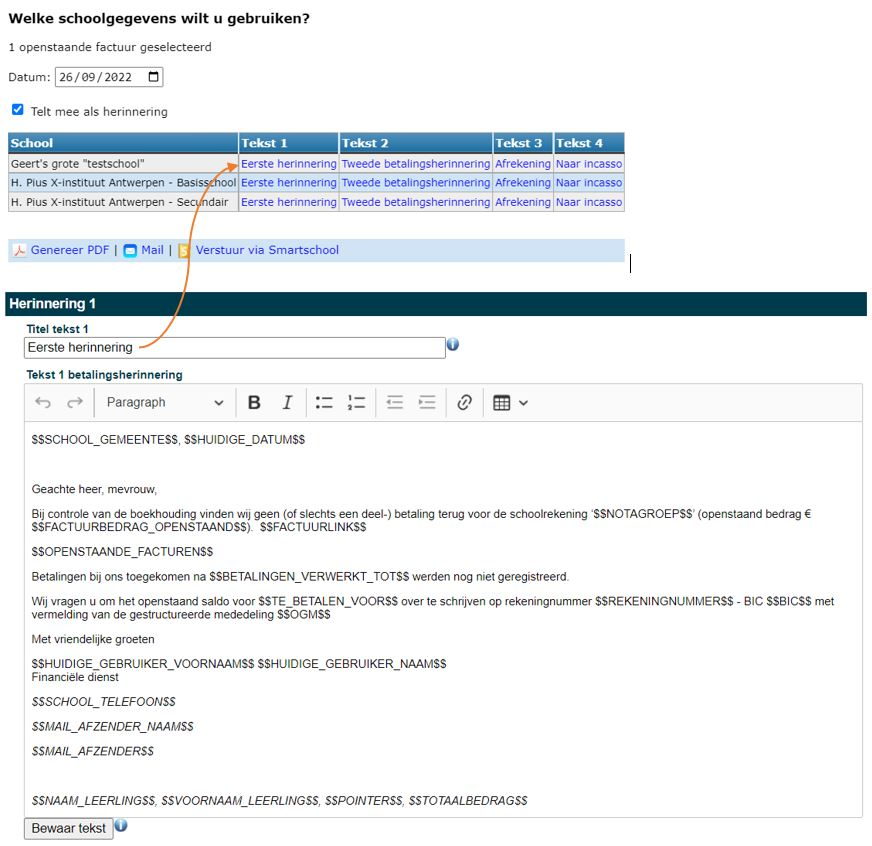
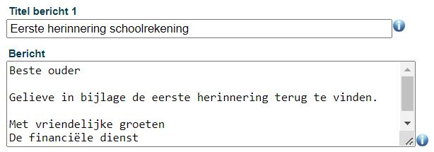
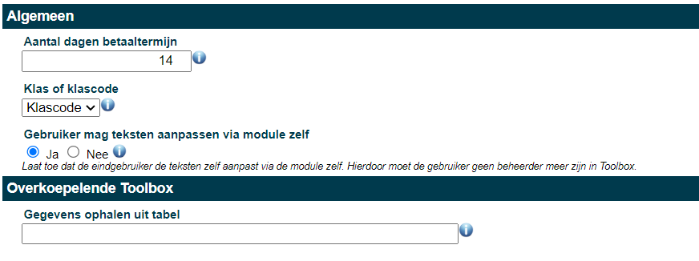

Kies in de module Instellingen voor 'Openstaande facturen'. Op deze plaats kan je een aantal configuraties voor die module instellen. 

Bovenaan kan je opgeven uit welke dagboeken van Exact Online er gegevens getoond moeten worden. Je kan meerdere dagboeken opgeven, gescheiden door komma's. 

Daaronder kan je 4 briefsjablonen opmaken. De titel die wordt opgegeven, is tevens de titel op de (herinnerings)brief. Hij wordt ook gebruikt als benaming van het type brief waaruit je kan kiezen bij het versturen van de betalingsherinneringen. [Hier](/openstaande_facturen/voorbeeldteksten) vind je enkele voorbeeldteksten. 

In het tekstbericht kunnen allerlei dynamische variabelen gebruikt worden. Hieronder een opsomming met de functionaliteiten:

- $$NOTAGROEP$$: naam van de notagroep/factuur 
- $$BETALINGEN_VERWERKT_TOT$$: Geeft weer tot wanneer (datum) de betalingen in Exact Online zijn bijgewerkt
- $$HUIDIGE_GEBRUIKER_VOORNAAM$$: De voornaam van de persoon die is ingelogd in Toolbox
- $$HUIDIGE_GEBRUIKER_NAAM$$: De achternaam van de persoon die is ingelogd in Toolbox
- $$TE_BETALEN_VOOR$$: De vervaldatum van de herinnering. Het aantal dagen tot de vervaldag kan helemaal onderaan worden ingevoerd. Op basis hiervan wordt de vervaldatum automatisch gegenereerd. 
- $NAAM_LEERLING$$: Naam van de leerling waarvoor men een herinnering/brief stuurt
- $$VOORNAAM_LEERLING$$: Naam van de leerling waarvoor men een herinnering/brief stuurt
- $$POINTER$$: het uniek nummer van de leerling (zowel in Toolbox, Exact Online als in het administratief pakket voor de leerlingenadministratie bv. Informat of Wisa)
- $$HUIDIGE_DATUM$$: De datum van vandaag
- $$OPENSTAANDE_FACTUREN$$: Hiermee geef je een overzicht van alle openstaande facturen met een link naar de originele facturen. 
- $$OPENSTAANDE_FACTUREN_ZONDER_LINK$$: Hiermee geef je een overzicht van alle openstaande facturen zonder de link naar de originele facturen
- $$FACTUURLINK$$: De link naar de originele factuur
- $$FACTUURBEDRAG_OPENSTAAND$$: Het openstaande factuurbedrag (Indien er reeds een deelbetaling heeft plaatsgevonden, wordt dit verrekend) 
- $$OGM: het OGM-nummer van de orginele factuur

Volgende variabelen kunnen enkel gebruikt worden indien de corresponderende gegevens zijn ingevuld bij 'scholen' in de module leerlingenrekeningen:

- $$SCHOOL_ADRES$$: Adres van de school
- $$SCHOOL_POSTCODE$$: Postcode van de school
- $$SCHOOL_GEMEENTE$$: Gemeente waar de school gelegen is
- $$SCHOOL_TELEFOON$$: Telefoonnummer van de school
- $$REKENINGNUMMER$$: Rekeningnummer van de school
- $$BIC$$: BIC-code horende bij het rekeningnummer van de school.
- $$MAIL_AFZENDER_NAAM$$: De naam van de afzender. Dit kan ook bv. 'Directie' of 'Fincanciële dienst' zijn.
- $$MAIL_AFZENDER$$: Het e-mailadres van waaruit de leerlingenrekeneningen en de openstaande facturen gemaild worden. 

Je kan er per briefsjabloon voor kiezen om een QR code te tonen op de herinnering. In dat geval wordt er steeds een EPC QR code gegenereerd en géén POM QR code, omdat de POM QR code gekoppeld is aan slechts één bepaalde factuur. 

De titel die je vervolgens kan ingeven, is het onderwerp van het smartschool- of e-mailbericht. Het bericht daaronder is de bijhorende berichttekst. In dit bericht kan je géén dynamische variabelen opnemen.

- **Betaaltermijn:** Helemaal onderaan de pagina kan je het aantal dagen van de betaaltermijn invoeren. Bij gebruik van de dynamische variabele $$TE_BETALEN_VOOR$$, wordt er op de herinneringsbrief automatisch een vervaldatum gegenereerd o.b.v. het hier ingevoerde getal. 
- **Klas of klascode:** Je kan in de module Openstaande facturen gebruiken maken van de klascode of de volledige benaming van de klas (uit het administratief pakket). 
-  **Teksten:** Vervolgens kan je ook aangeven of de gebruikers van de module Openstaande facturen de teksten mogen aanpassen via de module zelf. Indien ja, zal er in de module Openstaande facturen het icoon <LegacyAction img="configure.png" text="Teksten"/> zichtbaar zijn. Indien nee, kunnen teksten alleen door een beheerder aangepast worden in de module Instellingen.
- **Overkoepelende Toolbox:** Indien er een overkoepelende Toolbox is, worden deze gegevens door Toolbox zelf ingevuld. Dit veld moet nooit door een gebruiker of beheerder worden aangepast! 

