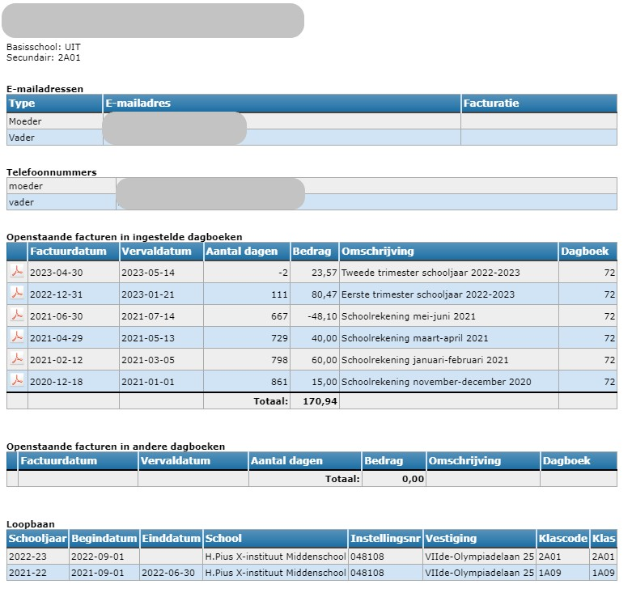
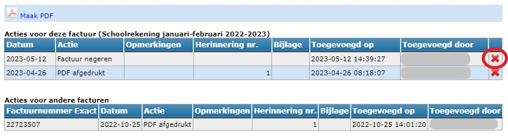

<ImageTitle img="openstaandefacturen.png">Openstaande facturen</ImageTitle>

Herbekijk hier de webinar van 16/11/2023 over de module Openstaande facturen.

Klik [hier](./ppt.pdf) om de powerpoint te raadplegen die gebruikt werd tijdens de webinar. 

<Youtube url="https://www.youtube.com/embed/BQG5s6uKPQI"/>  

 

De module openstaande facturen biedt de mogelijkheid om onbetaalde schoolrekeningen op te volgen nadat ze verwerkt zijn in de module leerlingenrekeningen en geïmporteerd in Exact Online (EOL). Vanuit deze module kunnen herinneringen verstuurd worden naar de ouders. Per leerling kan men opvolgingsacties, (af)betalingsregelingen en bijkomende informatie registreren. De synchronisatie met Exact Online maakt het mogelijk om steeds met actuele boekhoudkundige gegevens te werken zonder dat er een account voor EOL nodig is.

De module is ingericht om per factuur (lees: per notagroep) te herinneren, maar ook het versturen van overzichten behoort tot de mogelijkheden. Hiervoor kan je 6 verschillende herinneringsteksten instellen. Idealiter is de eerste herinnering een vriendelijke tekst waarin je vermeldt dat de ontvanger de factuur mogelijk over het hoofd heeft gezien. Hierbij kan je een link naar de originele factuur toevoegen. Na de vervaldatum van de eerste herinnering kan een tweede, iets dwingendere herinnering gestuurd worden. Het derde sjabloon kan eventueel gebruikt worden als melding aan de ouder(s) dat de factuur na herhaaldelijk herinneren aan een gerechtsdeurwaarder of incassobureau wordt overgemaakt. In het vierde sjabloon kan je bv. een overzicht van alle onbetaalde facturen instellen zonder te verwijzen naar een specifieke factuur. Enkele voorbeeldteksten vind je [hier](./openstaande_facturen/voorbeeldteksten).

## 1. Synchronisatie met Exact Online

Om met de recentste boekhoudkundige gegevens te kunnen werken, moet er regelmatig gesynchroniseerd worden met Exact Online. Gegevens ophalen uit Exact Online kan enkel door iemand met een account in EOL, bv. een beheerder of (regio)boekhouder en dit door bovenaan op de blauwtekst of het bijhorende icoon te klikken of via de synchronisatiemodule in de overkoepelende Toolbox. Alle gebruikers kunnen wel steeds zien wanneer de laatste synchronisatie heeft plaatsgevonden. Dit gebeurt best vlak voor het aanmaken van de herinneringen.

## 2. Gegevens zoeken, filteren en sorteren

Via de taakbalk kan je aan de hand van verschillende filters selecteren welke gegevens er getoond moeten worden. Het veld **filter** werkt als zoekfunctie waarin je een aantal karakters kan typen en vervolgens de zoekresultaten te zien krijgt door te enteren. 

Standaard worden alle facturen apart weergegeven. Heeft een leerling 5 openstaande facturen, dan zal die leerling 5 keer voorkomen in het overzicht. Door de **weergave** te wijzigen naar 'Totalen', krijg je per leerling 1 lijn te zien met het totaalbedrag van alle openstaande facturen. Via deze weergave is het aantal acties beperkt. Enkel de [betalingsregeling](#--relatie-betalingsregeling-relatie-wijzigen) en de [opmerkingen](#--relatie-opmerking-bij-relatie-wijzigen) kunnen aangepast worden. 

Standaard worden enkel facturen **Buiten vervaltermijn** getoond. Wil je graag een overzicht van alle openstaande facturen, wijzig dan bovenaan de filter bij 'Toon'. 

Door een bepaald **dagboek** of een bepaalde **notagroep** te selecteren, worden enkel de openstaande facturen van dat dagboek of van die notagroep getoond. Je kan meerdere dagboeken of notagroepen tegelijk selecteren. 
- Bij de notagroepen kan je met de bovenste checkbox (Selecteer alle) alle openstaande facturen weergeven. 
- Door de checkbox vóór een bepaald schooljaar aan te vinken toon je enkel de openstaande facturen van dat betreffende schooljaar. 
- Wil je één of slechts enkele notagroepen weergeven in het overzicht, klap dan via dit pijltje **>** het schooljaar open en selecteer de gewenste notagroep(en) met behulp van de checkboxen. 

Filteren op **aanmaningen** biedt de mogelijkheid om alle facturen op te vragen waarvoor bv. al een 1e of 2e aanmaning werd verstuurd. Dat maakt de administratieve opvolging eenvoudiger. 

In de tabel zelf kan je ook klikken op de pointer of de naam van een relatie. Dan wordt meteen een overzicht van openstaande facturen van die relatie getoond.

Je kan ook op een klas, vestiging of dagboek klikken om daarop te filteren.

De taakbalk daaronder laat je toe om de gegevens op verschillende manieren te sorteren. Zo kan je niet alleen op naam of klas sorteren, maar ook op betalingsregeling, opmerking, aantal aanmaningen, ... 

<LegacyAction img="person.png"/> Via dit icoon (vóór de naam van elke leerling) open je de relatiefiche van de leerling. Deze fiche bevat de contactgegevens uit het administratief pakket, maar ook info over de schoolloopbaan. Je vindt er eveneens een overzicht van de openstaande facturen terug voor de dagboeken die gekoppeld zijn aan jouw Toolbox. Daaronder worden ook de openstaande facturen getoond in andere dagboeken binnen eenzelfde Exact Online dossier. Wanneer je met de vzw werkt in een eengemaakt dossier, zal je hier dus ook de openstaande facturen van deze leerling in de andere scholen (binnen de vzw) kunnen raadplegen. Je zal die enkel kunnen consulteren en kan daar verder geen acties voor ondernemen. 

 

<LegacyAction img="pdf.png"/>Dit icoon wordt op verschillende plaatsen in de module getoond en bevat steeds de originele factuur.

<LegacyAction img="checklist.png"/>Via dit icoon verkrijg je een overzicht van alle genomen acties voor deze leerling. De laatst genomen actie wordt ook steeds in het algemeen overzicht getoond. 

## 3. Mogelijke acties

### <LegacyAction img="reminder.png"/> Betalingsherinnering versturen

Je hebt de mogelijkheid om herinneringen te versturen via mail of Smartschool of door een PDF te genereren. Je selecteert in het overzicht één of meerdere facturen van één of meerdere leerlingen. 

:::caution Opgelet
Indien je een sjabloon gebruikt waarin een overzicht van alle openstaande facturen wordt getoond m.b.v. de variabele $$OPENSTAANDE_FACTUREN$$, volstaat het om per leerling 1 factuur aan te vinken. Per vinkje wordt er een pdf-document gegenereerd/mail/smartschoolbericht verstuurd. Wanneer er bij een leerling met 5 openstaande facturen alle facturen worden aangevinkt, zullen er 5 identieke documenten worden aangemaakt of 5 identieke berichten worden verstuurd. 

Maak gebruik van de knop <LegacyAction img="select.png" text="Selecteer unieke leerlingen"/> om in een hele lijst van openstaande facturen elke leerling maar 1x te selecteren.
:::

Indien je aanvinkt dat de afdruk of mailing **meetelt als herinnering**, zal het aantal aanmaningen in het overzicht optellen. LET OP als je de herinneringen eerst als PDF genereert ter controle om ze vervolgens te versturen via mail of Smartschool. In dat geval vink je deze optie best af vóór het genereren van de PDF om te voorkomen dat je de herinnering 2 keer als aanmaning registreert. 

Met het tweede vinkje kan je het **aantal herinneringen verhogen voor alle openstaande facturen**. Dit vinkje zal enkel werken indien een sjabloon gekozen wordt waarin de variable $$OPENSTAANDE_FACTUREN$$ wordt gebruikt. Je kan dus niet 'per ongeluk' het aantal aanmaningen van alle openstaande facturen van een leerling verhogen door het vinkje aan te laten staan. Staat het vinkje aan, dan wordt de teller van het aantal aanmaningen enkel verhoogd bij de facturen die effectief in de tabel op de aanmaning getoond worden. Heb je facturen aangeduid als 'niet verwerken' dan komen deze facturen niet mee in het overzicht te staan en zal de teller voor deze facturen ook NIET worden verhoogd. 

Indien je kiest voor mail of Smartschool kan je hier het bericht nog aanpassen. Die aanpassing heeft enkel betrekking op deze berichten. Indien je de tekst standaard wil wijzigen, doe je dat via de module [Instellingen](./openstaande_facturen/instellingen) van Toolbox of via <LegacyAction img="configure.png" text="Teksten"/> in de module Openstaande facturen zelf. 

Je hebt ook steeds de mogelijkheid om digitale berichten te versturen in testmodus. Vervolgens verschijnt er een pop-up met de vraag naar welk e-mailadres/smartschoolaccount het testbericht verstuurd mag worden. Het bericht zal bijgevolg niet naar de ouders vertrekken, maar naar de opgegeven ontvanger. 

De herinneringstypes en daarbij horende teksten kunnen gedefinieerd en aangepast worden in de module [Instellingen](./openstaande_facturen/instellingen) van Toolbox of via <LegacyAction img="configure.png" text="Teksten"/> in de module Openstaande facturen zelf. 

### <LegacyAction img="actie.png"/> Actie toevoegen
Je kan allerlei ondernomen acties registreren, zoals bv. een telefonisch contact met de ouders. Dergelijke actie kan je ook laten meetellen als aanmaning, waardoor het totaal aantal aanmaningen in het overzichtsscherm zal verhogen. Standaard kan je uit een aantal acties kiezen, maar je kan evengoed zelf een actie intypen in het tekstveld. Naast bijkomende info kan je ook een bijlage opladen, zoals bv. een e-mailbericht. De laatst geregistreede actie wordt getoond in het overzichtsscherm. 

### <LegacyAction img="noAccess.png"/> Niet verwerken
Je kan een factuur selecteren en ervoor kiezen om deze niet te verwerken. Wanneer je vervolgens in bulk facturen selecteert om herinneringen te versturen, zal deze factuur niet mee aangevinkt worden. Men zal bijgevolg voor deze factuur geen herinnering ontvangen. Je kan dit ook ineens voor meerdere facturen tegelijk doen door ze vooraan te selecteren. 

Als je een tekst gebruikt met de variabele $$OPENSTAANDE_FACTUREN$$ wordt er normaliter een overzicht van alle openstaande facturen van die leerling getoond. Door een factuur aan te duiden als ‘niet verwerken’ wordt deze factuur niet meer getoond in dit overzicht.

Je kan deze actie ongedaan maken door achteraan op het klembord <LegacyAction img="checklist.png"/> te klikken. Via het rode kruisje kan je de actie verwijderen en zal de factuur opnieuw mee verwerkt worden in het overzicht. De rode lijn zal opnieuw zwart zijn.  

Je kan dit ook ineens voor meerdere facturen tegelijk doen door de lijnen vooraan te selecteren en te klikken op <LegacyAction img="noAccess.png" text="Niet verwerken"/>. Vervolgens kan je het 'niet verwerken' (eventueel in bulk) ongedaan maken. 

### <LegacyAction img="person.png"/> <LegacyAction img="budget.png"/> Relatie: Betalingsregeling relatie wijzigen
Via het relatie-icoontje <LegacyAction img="person.png"/> kan je een betalingsregeling registreren. Deze info wordt vervolgens weergegeven in het overzichtsscherm. Door te dubbelklikken in het veld, kan je eveneens de betalingsregeling toevoegen of aanpassen. Ook in de weergave 'Totalen' is de betalingsregeling beschikbaar en bewerkbaar. In de module Leerlingenrekeningen kan je diezelfde info terugvinden en eventueel aanpassen via het menu Inschrijvingen. Je kan kiezen uit de volgende mogelijkheden:

- Incassobureau
- Collectieve schuldenregeling
- OCMW
- Afbetalingsplan
- Voorafbetaling

Meer info over de betalingsregeling kan je invoeren via 'opmerkingen bij relatie wijzigen'. 

### <LegacyAction img="person.png"/> <LegacyAction img="edit.png"/> Relatie: Opmerking bij relatie wijzigen
In dit tekstveld kan je vrij allerhande opmerkingen en bijkomende info toevoegen. Enkele mogelijkheden: de factuur of herinnering moet altijd op papier worden meegegeven met de leerling, de grootouders betalen de factuur, de contactgegevens van de schuldbemiddelaar, ...

De info die hier wordt ingevoerd, wordt automatisch mee overgenomen naar de module leerlingenrekeningen (inschrijvingen en aanrekenen) en andersom. In het overzichtsscherm geeft het <LegacyAction img="info.png"/> icoon weer dat er info beschikbaar is. Die kan je raadplegen door je cursor op het icoon te plaatsen of door 1x te klikken. Dubbelklikken op het icoon laat je toe om wijzigingen aan te brengen. Je kan de info ook wijzigen via het relatie-icoontje <LegacyAction img="person.png"/>. 

### <LegacyAction img="select.png"/>Selecteer unieke leerlingen
Dit is een handige functie in combinatie met het gebruik van de variabele $$OPENSTAANDE_FACTUREN$$. Aan de hand van deze variabele wordt er in een tabel een overzicht van alle openstaande facturen getoond. Daarbij volstaat het om per leerling slechts één factuur aan te vinken, want per vinkje wordt er een pdf-document gegenereerd of een bericht gestuurd. Wanneer er b.v. bij een leerling met vijf openstaande facturen alle facturen worden aangevinkt, zullen er dus vijf identieke documenten worden aangemaakt of vijf identieke berichten worden verstuurd.

Door de knop <LegacyAction img="select.png" text="Selecteer unieke leerlingen"/> te gebruiken, selecteer je automatisch elke leerling maar één keer, waardoor er voor elke leerling ook maar één pdf-document wordt gegenereerd of maar één e-mail- of smartschoolbericht wordt verstuurd.  

### <LegacyAction img="klembord.png"/> Verzendrapporten

Via deze knop kan je nagaan wanneer er digitaal herinneringen werden verstuurd en of het verzenden geslaagd is. 

### <LegacyAction img="pdf.png"/><LegacyAction img="excel.png"/>Rapporten in Excel en PDF

Je kan een overzicht van openstaande facturen genereren en deze naar Excel en/of PDF exporteren. Dat kan je doen voor alle openstaande of voor een beperkte selectie (aangevinkte) facturen. 

### <LegacyAction img="configure.png"/> Teksten instellen
De teksten kunnen gedefinieerd en aangepast worden in de module [Instellingen](./openstaande_facturen/instellingen) of rechtstreeks in de module Openstaande facturen (indien deze optie is geactiveerd in de module Instellingen). [Hier](/openstaande_facturen/voorbeeldteksten) vind je enkele voorbeeldteksten. Klik [hier](./openstaande_facturen/instellingen) voor een overzicht van alle mogelijke variabelen. 

In de module zelf kan je ook de betaaltermijn definiëren. De overige instellingen, zoals welke dagboeken er getoond worden, zijn enkel in te stellen via de module [Instellingen](./openstaande_facturen/instellingen). Deze module is enkel toegankelijk voor een beheerder. Om te weten wie je Toolbox-beheerder is, klik je op de startpagina van Toolbox rechts bovenaan op het vraagteken > contact.

### <LegacyAction img="pdf.png"/> Leerlingenrekeningen
Door middel van deze actieknop kunnen de originele facturen (uit de leerlingenrekeningen) in bulk als PDF opgevraagd worden. Selecteer vooraan de openstaande facturen waarvoor u de originele factuur wil opvragen en klik op de actieknop. 

## 4. Acties raadplegen, verwijderen en documenten koppelen

In het overzicht van de openstaande facturen kan je via het klembord-icoon <LegacyAction img="checklist.png"/> achteraan een historiek raadplegen van alle ondernomen acties voor de betreffende factuur én alle andere openstaande facturen van die leerling. 

Indien er bij het toevoegen van een actie <LegacyAction img="actie.png"/> een document werd gekoppeld, kan je dat via deze weg opvragen of terug verwijderen.

Je kan eveneens de volledige actie verwijderen door achteraan op het rode kruisje te klikken. 

Het is ook mogelijk om achteraf nog documenten toe te voegen. Klik daarvoor op de blauwe plus in de kolom 'Bijlage' en kies het bestand dat je wil toevoegen. 

