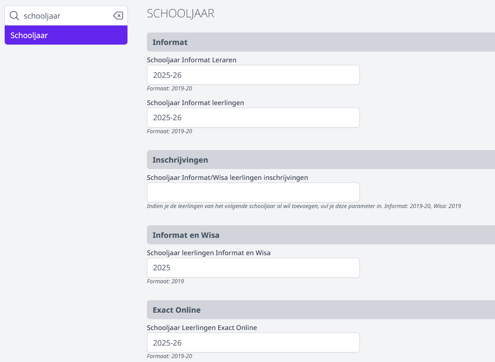
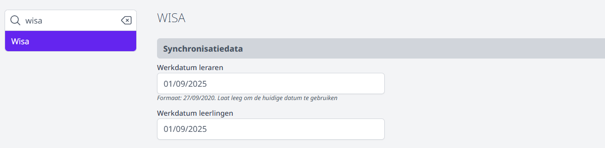
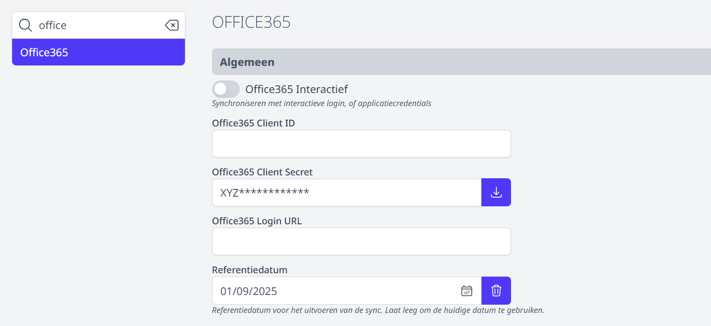
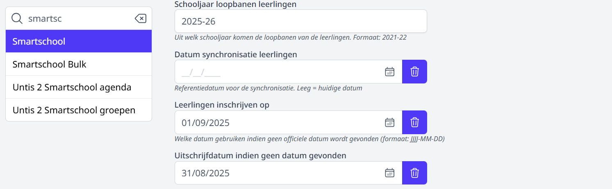
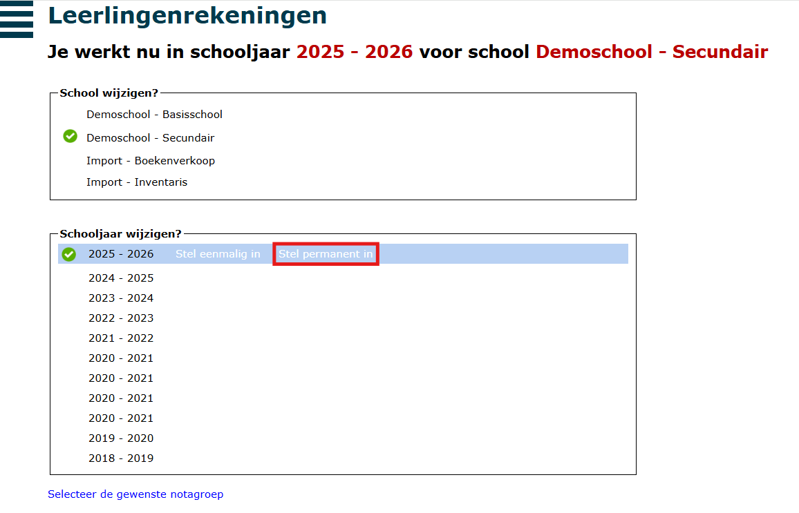
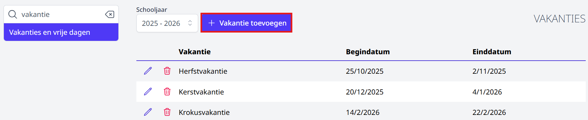

Bij de start van het nieuwe schooljaar moeten er in Toolbox een aantal instellingen gewijzigd worden. Hieronder kan je lezen wat er allemaal in orde gebracht moet worden om aan de slag te kunnen in het nieuwe schooljaar. Aan de rechterkant op deze pagina vind je een snelmenu waardoor je makkelijk en snel de juiste info kan terugvinden.  

## 1. Stel het nieuwe schooljaar in 

Stel eerst het nieuwe schooljaar in in de module **Instellingen => Schooljaar**. Kijk hieronder bij [1.1 Informat](/opstart_schooljaar#11-informat) en [1.2 Wisa](/opstart_schooljaar#12-wisa) om na te gaan welke velden je precies moet invullen afhankelijk van het administratief pakket waarmee je werkt. 

### 1.1 Informat
Werk je met Informat? Dan vul je in de module **Instellingen => Schooljaar** volgende zaken in: 
- Bij de rubriek **Informat** vul je bij de onderdelen **Schooljaar Informat Leraren** en **Schooljaar Informat Leerlingen** het nieuwe schooljaar in. Gebruik daarvoor het volgende formaat: '2025-26'.
- Het veld onder **Inschrijvingen** maak je leeg.
- Bij de rubriek **Informat en Wisa** => **Schooljaar leerlingen Informat en Wisa** vul je '2025' in 
- Bij **Exact Online** vul je '2025-26' in.

Als je reeds in augustus gegevens uit Informat wil ophalen, dan moet je tijdelijk de referentiedatum instellen op 1 september.
Dat doe je via de module **Instellingen => Informat => Gegevens => Referentiedatum leerling**. Daar vul je 01/09/2025 in als datum.

:::caution opgelet
Maak vanaf 1 september dit datumveld leeg door op het vuilnisbakje te klikken. Vanaf dan wordt de huidige datum als referentiedatum gebruikt en haal je steeds de meest recente informatie op uit Informat.
:::

### 1.2 Wisa
Werk je met Wisa? Dan vul je in de module **Instellingen => Schooljaar** volgende zaken in: 
- Vul  bij de rubriek **Informat en Wisa** '2025' in. 
- Het veld onder **Inschrijvingen** maak je leeg.
- Bij **Exact Online** vul je '2025-26' in.

Wil je al in augustus gegevens van het nieuwe schooljaar ophalen, dan vul je in de module **Instellingen => Wisa => Synchronisatiedata** => de 'Werkdatum leraren' en 'Werkdatum leerlingen' in: 01/09/2025.

:::caution belangrijk
Maak vanaf 1 september beide velden leeg om steeds de meest actuele data op te halen. Als werkdatum wordt dan automatisch de huidige datum gebruikt.
:::

## 2. Synchronisatie met Active Directory
Om in augustus de leerlingen voor het nieuwe schooljaar al te kunnen synchroniseren met de Active Directory stel je in de module **Instellingen => Active Directory** de referentiedatum in op 01/09/2025. 

:::caution belangrijk
Vanaf 1 september maak je deze datum terug leeg en wordt de huidige datum gebruikt als synchronisatiedatum.
:::

## 3. Synchronisatie met Office 365
Wil je in augustus al synchroniseren met Office 365, stel dan in de module **Instellingen => Office 365** de referentiedatum in op 01/09/2025. 

:::caution belangrijk
Vanaf 1 september maak je deze datum terug leeg en wordt de huidige datum gebruikt als synchronisatiedatum.
:::

## 4. Synchronisatie met Smartschool
Gebruik je Toolbox om je leerlingen met Smartschool te synchroniseren, dan moet je ook enkele instellingen aanpassen. Die kan je vinden
in de module **Instellingen => Smartschool**.

- Eerst en vooral wijzig je het **Schooljaar loopbanen leerlingen**: hier vul je '2025-26' in.
- Als datum voor **Leerlingen inschrijven op** gebruik je '01/09/2025'.
- Als **uitschrijfdatum indien geen datum gevonden** kies je voor '31/08/2025'.

Wil je de synchronisatie al in augustus uitvoeren? Vul dan bij **Datum synchronisatie leerlingen** '2025-09-01' in zodat er wordt gekeken naar
de inschrijvingen in het nieuwe schooljaar.

:::caution belangrijk
Vanaf 1 september maak je deze datum leeg en wordt de huidige datum gebruikt als synchronisatiedatum.
:::

## 5. Co-accounts aanmaken in Smartschool
Toolbox biedt de optie om met enkele klikken voor alle nieuwe leerlingen co-accounts aan te maken. Dat gebeurt in de module **Synchronisatie leerlingen** op basis van de beschikbare e-mailadressen van ouders in het administratief pakket (Informat of Wisa). voor elk e-mailadres wordt een co-account aangemaakt. Elke co-account krijgt een uniek paswoord. Je kan dat paswoord, samen met wat extra informatie over het gebruik van Smartschool meteen mailen vanuit Toolbox.

Is er geen mailadres beschikbaar, dan wordt er één co-account aangemaakt. Door middel van een Excel-bestand dat je uit Toolbox kan downloaden, kan je een mailmerge maken en op die manier een brief genereren voor de ouders.

Bestaande co-accounts worden niet gewijzigd!

Via de module **Smartschool Co-accounts** kan je ook heel makkelijk de co-accounts opvolgen: rapportage, paswoorden resetten, extra accounts aanmaken, ... 
Je hoeft hiervoor geen beheerder in Smartschool te zijn. Ideaal dus om dit werk aan een secretariaatsmedewerker over te laten.

Meer informatie kan je terugvinden in de handleiding: [Handleiding Smartschool co-accounts](/smartschool_coaccounts) 

## 6. Synchroniseren met Exact Online
Zodra de data correct zijn ingesteld ([zie punt 1](/opstart_schooljaar#1-stel-het-nieuwe-schooljaar-in)), kan je synchroniseren met Exact Online. Mogelijk heb je in het nieuwe schooljaar nieuwe klassen aangemaakt.
De synchronisatie zal dit merken en zal je vragen om die klassen manueel toe te voegen aan Exact Online.
Hiervoor open je Exact Online best in een ander browservenster naast Toolbox. Ga vervolgens in de instellingen van Exact Online naar de **Stamgegevens - classificaties (relaties)**. 

Onder classificatie 4 zal je de reeds aangemaakte klassen zien staan. Kopieer nu elke klas uit de lijst in Toolbox één voor één en voeg die toe als nieuwe klas binnen classificatie 4.

Als dat is gebeurd, laat je de synchronisatie opnieuw lopen. Dan zou de lijst met toe te voegen klassen weg moeten verdwijnen en zou de eigenlijke 
synchronisatie van start moeten gaan.

:::caution Let op
Bij het begin van een schooljaar moeten er heel veel wijzigingen gebeuren. Zo moet de klas van elke leerling aangepast worden.
Exact Online legt limieten op in het aantal wijzigingen dat je per minuut/uur/dag mag doen. Krijg je een ***foutmelding 429***, dan heb je één van die limieten overschreden. Zeker in grotere dossiers kom je hier al snel aan. Soms volstaat het om een minuut of een uur te wachten en dan verder te gaan, maar als je daglimiet is overschreden, dan kan je de volgende wijzigingen pas de dag nadien doorvoeren.
:::

## 7. Nieuwe Toolbox-gebruikers/personeelsleden
Heb je nieuwe Toolbox-gebruikers in je school? Zorg dan dat ze eerst in het administratief pakket voor personeelsadministratie (Informat of Wisa) worden aangemaakt. Laat vervolgens
de **synchronisatie Leraren** lopen (eerste twee stappen). Zo worden deze personen ook als gebruiker in Toolbox aangemaakt.

Nu kan je via de module [Gebruikersbeheer](/gebruikersbeheer) bijkomende rechten toekennen via de opties 'Gebruikers aan beveiligingsgroepen koppelen' of 'Beveiligingsgroepen aan gebruikers koppelen'. Start er een nieuwe directeur of stafmedewerker? Vergeet dan niet het gebruikersrecht 'directie_stafmedewerker' toe te kennen. Dit gebruikersrecht is nodig om op regioniveau een onkostenvergoeding te kunnen aanvragen.  

Ook in de module Gebruikersbeheer kan je de gebruikersopties van de nieuwe gebruiker wijzigen. Denk bijvoorbeeld aan de gebruikernaam: 
als die afwijkt van wat je in Smartschool, Office 365 of Google gebruikt, dan zal de gebruiker niet kunnen aanmelden via single sign on. In dat geval pas je de gebruikersnaam aan.
Je kan die gebruikersnaam ook wijzigen via de module **Synchronisatie leraren => Controleer gebruikersnamen => vrij wijzigen**.

Het initiële paswoord van een gebruiker kan je altijd terugvinden via diezelfde module **Synchronisatie leraren => PDF afdrukken of Exporteer XLSX**.

Voor meer info zie ook de handleiding over de [synchronisatiemodules](/synchronisatie) en het [gebruikersbeheer](/gebruikersbeheer).

## 8. Leerlingenrekeningen
Ook in de module Leerlingenrekeningen moet er een nieuw schooljaar aangemaakt worden. Hiervoor ga naar het menu [**Schooljaren**](/leerlingenrekeningen/Schooljaar/). 
Als het nieuwe schooljaar 2025-2026 nog niet is aangemaakt, klik je bovenaan op de blauwe plus en vervolgens op toevoegen.
Ga vervolgens naar het menu **Start**. Daar kan je nu in het onderste kader het nieuwe schooljaar instellen. Kies hier voor 'stel permanent in'.
  

## 9. Afdrukcentrum
Van zodra de module Adrukcentrum actief staat (via module Instellingen => Modules => Afdrukcentrum actief = ja), kunnen gebruikers dit gebruiken. Wil je dat voorkomen, dan kan je in de module Instellingen het afdrukcentrum uitschakelen door 'Afdrukcentrum actief' op 'Nee' te zetten. Gebruikers kunnen dan (voorlopig) geen nieuwe opdrachten toevoegen.

Bijkomend kan je ook een bericht instellen dat bovenaan in het afdrukcentrum wordt getoond (via de Module Instellingen => Afdrukcentrum => Bericht bovenaan afdrukcentrum).

Het schooljaar van het Afdrukcentrum kan je instellen in de module **Instellingen => Uniflow** voor gebruikers van **Canon** of **Instellingen => MyQ** voor gebruikers van **Ricoh**. Daar vul je als schooljaar '2025-26' in.

Wil je het afdrukcentrum reeds in augustus ter beschikking stellen? Vul dan in de module **Instellingen => Afdrukcentrum** de referentiedatum in op 1 september 2025.

:::caution belangrijk
Vanaf 1 september maak je het veld 'referentiedatum' terug leeg om de actuele situatie te zien.
:::

## 10. Kassa

Wil je in augustus reeds gebruik maken van de kassa om items te verkopen aan leerlingen? Zet dan in de module **Instellingen => Kassa** de referentiedatum voor de aanrekeningen op 01/09/2025. 

:::caution belangrijk
Vanaf 1 september maak je deze datum terug leeg en wordt de huidige datum gebruikt als referentiedatum.
:::

## 11. Vakanties en schoolvrije dagen

Vul via de module **Instellingen => Vakanties en vrije dagen** de schoolvakanties en andere vrije dagen in voor volgend schooljaar. 

Met deze gegevens wordt rekening gehouden in volgende modules:
- **Fiscale attesten kinderopvang**: Voor het attest kinderopvang wordt er rekening gehouden met de schoolvrije dagen en vakanties in de berekening van het aantal dagen opvang dat vermeld wordt op het attest. 
- **Fietsvergoeding**: Dagen die in een vakantie of op een schoolvrije dag vallen, worden getoond met een rood kadertje errond. Hiermee wordt er enkel visueel duidelijk gemaakt dat het gaat om een dag waarop er normaal gezien niet wordt gewerkt. Een personeelslid kan deze dag alsnog aanduiden als 'gefietst'.
- **Onkosten**: In de onkostenmodule wordt er eveneens aangegeven wanneer een dienstverplaatsing heeft plaatsgevonden op een vrije dag. Ook in deze module kan het personeelslid de aanvraag wel afronden. 

    

## 12. Contactpersonen in Toolbox
Via de lijst ‘contactpersonen’ in Toolbox kan je aangeven wie een bepaalde functie uitoefent in de school en wat de contactgegevens zijn van deze persoon. Via deze lijsten verzendt Toolbox nieuwe informatie voor het uitoefenen van de vernoemde functie en nodigt medewerkers uit voor vormingen, bevragingen en netwerkevenementen met collega’s in eenzelfde functie. Deze contactpersonen ontvangen eveneens de **Toolbox nieuwsbrief**.

Kijk jaarlijks deze contactpersonenlijst eens goed na. Nieuwe directeur, administratieve medewerkers, ICT’ers, ...? Voeg ze toe als contactpersoon in de Toolbox van je school. Zo zijn ze steeds op de hoogte van het laatste Toolbox-nieuws! 

