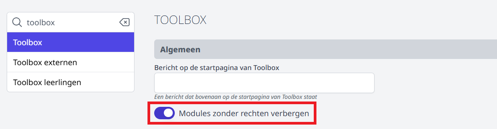

<ImageTitle img="overheidsopdrachten.png">Overheidsopdrachten</ImageTitle>

Sinds 1 juli 2013 zijn alle (hoge)schoolbesturen, internaatbesturen en centrumbesturen van het vrij gesubsidieerd onderwijs volledig onderworpen aan de wetgeving overheidsopdrachten. Concreet betekent dit dat je niet zo maar bij het even wie iets mag aankopen, maar dat je – afhankelijk van het bedrag – strikte procedures moet volgen. Om het voor scholen zo eenvoudig mogelijk te maken, zorgden de strategische aankopers (en binnenkort bij uitbreiding de bouwadviseurs) voor overheidsopdrachten waarbinnen je éénmalig of herhaaldelijk (de zgn. raamovereenkomsten) iets kan en mag aankopen. Ook DOKO, de diensten ter ondersteuning van Katholiek Onderwijs Vlaanderen proberen je zo te ontzorgen. 

Om vlot door het bos de bomen te kunnen zien, ontwierpen de strategische aankopers van alle KOBA-regio’s samen met de Toolbox-collega’s een nieuwe tegel waar je - op maat van jouw school - kan zien welke contracten er cfr. de wetgeving overheidsopdrachten zijn afgesloten.

:::danger Belangrijk aandachtspunt
Gezien de vertrouwelijkheid binnen wetgeving overheidsopdrachten, is het zeer belangrijk steeds met de afgevaardigd bestuurder af te stemmen of de rechten wel mogen worden toegekend aan de persoon die de rechten vraagt. 
:::

Voor meer informatie over hoe je rechten moet instellen, verwijzen we graag door naar de module [Gebruikersbeheer](/gebruikersbeheer).

## Toolbox-rechten: 3 niveaus
-	**Default-niveau**: je krijgt de tegel niet te zien OF de tegel is ‘uitgevlakt’. 
Keuze tussen uitvlakken of niet zichtbaar zetten doe je in Toolbox via de module 'Instellingen > Toolbox > Modules zonder rechten verbergen'.
    - Optie aan: voor personeelsleden zonder rechten is de tegel niet zichtbaar.
    - Optie uit: voor personeelsleden zonder rechten is de tegel onderaan in Toolbox uitgevlakt. Het personeelslid kan de module niet openen. 

 

- **Niveau 1**: je krijgt enkel beperkte informatie te zien zoals inhoud van het contract, contractnummer e.d. Via de module Gebruikersbeheer moet het recht ‘Overheidsopdrachten’ worden toegekend. 
- **Niveau 2**: je krijgt naast de beperkte informatie ook nog uitgebreidere informatie te zien zoals bestelwijzes, informatie over contactpersonen e.d. Deze rechten mogen enkel toegekend worden aan personen die effectief het mandaat hebben binnen de school en/of regio om bestellingen te plaatsen. Via de module Gebruikersbeheer moet het recht ‘Overheidsopdrachten_bijkomende_informatie’ worden toegekend. Dit gebruikersrecht volstaat. Het is niet nodig om bijkomend ook rechten voor niveau 1 toe te kennen. 

## Vragen… 
### Over contracten
Voor vragen over de inhoud van de contracten, wend jij je tot je strategische aankoper. 

### Over functionaliteiten van deze tegel
Voor vragen over functionaliteiten van de tegel, wend jij je tot je de coördinator strategische aankopers. 
 

*Handleiding opgesteld door Annemie Marien, coördinator strategische aankopers op 23 oktober 2024* 
*(Laatste aanpassing op 4 november 2024)*

