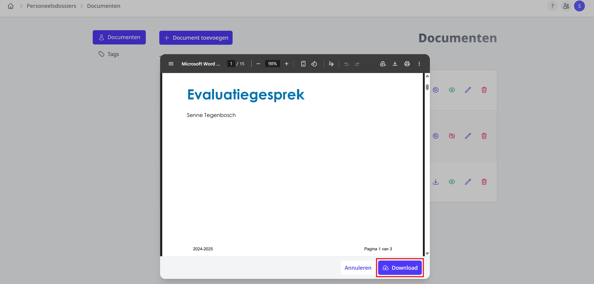
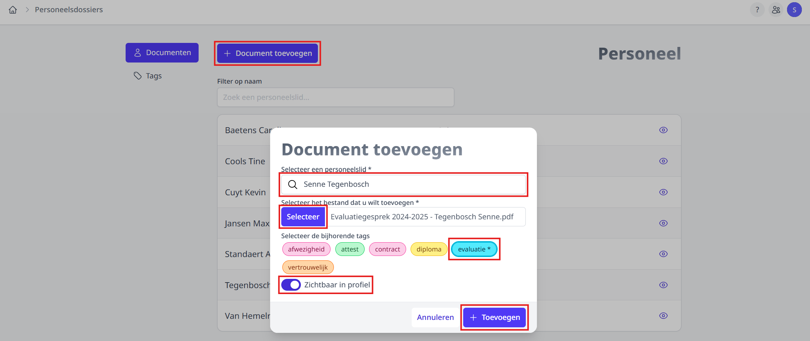
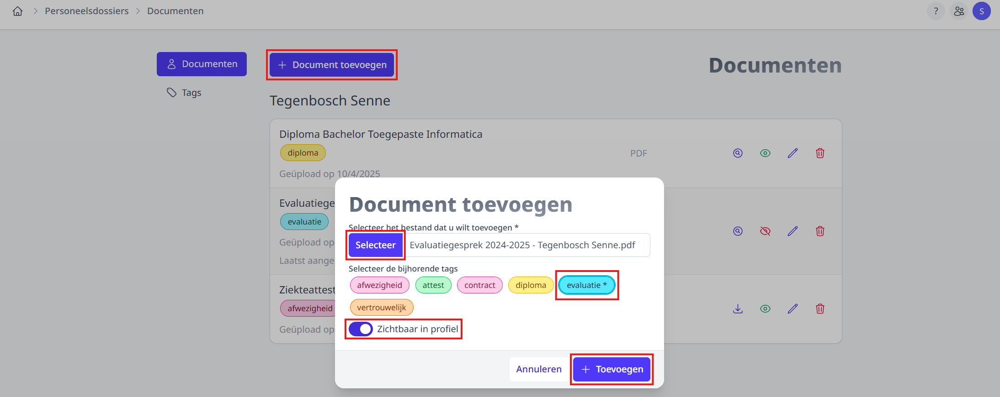
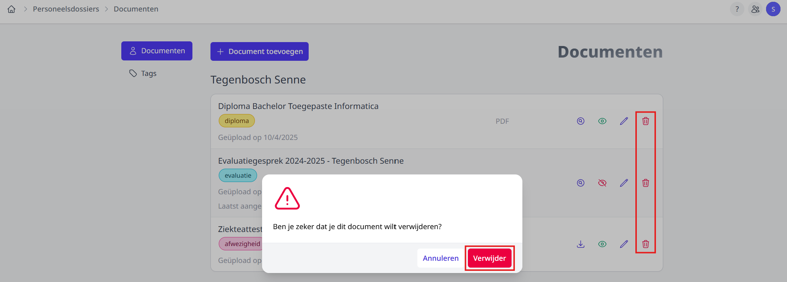
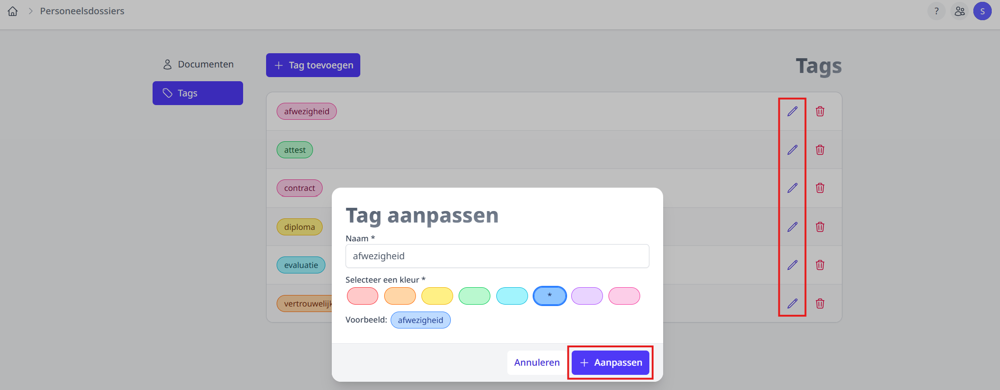

<ImageTitle img="personeelsdossiers.svg">Personeelsdossiers</ImageTitle>

De personeelsdossiersmodule kan gebruikt worden om allerlei documenten van personeelsleden bij te houden. Deze documenten kunnen ingesteld worden zodat ze zichtbaar zijn in het profiel van het personeel.

## Gebruikersbeheer

Enkel de personeelsleden met de juiste rechten kunnen de module gebruiken indien deze is geactiveerd. Dit kan een beheerder doen via de instellingenmodule => modules. Hierna kan de beheerder via de module [Gebruikersbeheer](/gebruikersbeheer) het recht 'personeelsdossiers' toekennen. Personeelsleden met dit recht kunnen documenten toevoegen, aanpassen of verwijderen. 

Let wel op: indien een document op 'zichtbaar' wordt ingesteld, kan de persoon aan wie het document gekoppeld is, het document zien op zijn of haar profiel.

## Documenten

### Document bekijken op profiel

Documenten kunnen getoond worden in het profiel van het personeelslid. Deze kan hij of zij bekijken en/of downloaden door naar zijn of haar profiel te gaan. Dit kan door rechtsbovenaan op het profiel-icoontje te klikken. Klik [hier](../inloggen/#4-rls) voor meer informatie.

### Overzicht van documenten

Wanneer je de personeelsdossiersmodule opent, krijg je een overzicht te zien van alle personeelsleden waaraan documenten zijn gekoppeld. Hier kan je filteren op een specifieke persoon via hun naam. Door op het oog-icoontje te klikken, krijg je de documenten te zien van de betreffende persoon.

Op de documentenpagina krijg je alle documenten te zien van de geselecteerde persoon. Hier heb je de opties om een document te kunnen bekijken, downloaden, toevoegen, aanpassen en verwijderen. Niet elk document kan bekeken worden zonder te downloaden. 

De documenten die je kan bekijken zijn van het bestandstype: 
- jpeg 
- png 
- pdf 

Documenten van een ander bestandstype zal je dus eerst moeten downloaden voor je ze kan bekijken. Om een document te bekijken, druk je op het vergrootglas-icoontje. Hierna kan je het document downloaden door op **Download** te klikken. Documenten die je niet vooraf kan bekijken, kan je downloaden via het download-icoontje.

Het oog-icoontje geeft weer of de persoon het document op zijn of haar profiel kan zien. Indien het icoontje groen is, kan de persoon het zien. Indien het icoontje rood is en een streep door het oog heeft, kan de persoon het document niet zien op zijn of haar profiel.

### Document toevoegen, aanpassen of verwijderen

#### Document toevoegen

Een nieuw document kan je op 2 manieren toevoegen:

- Klik bij het overzicht van personeelsleden op **Document toevoegen** om een document bij eender welk personeelslid toe te voegen. 

- Bij het documentenoverzicht van een personeelslid kan je klikken op **Document toevoegen** om een document toe te voegen voor het specifieke personeelslid. 

Indien je via het overzicht van personeelsleden een nieuw document toevoegt moet je eerst een personeelslid toevoegen.

Klik op **Selecteer** om een bestand toe te voegen.

Om één of meerdere tag(s) toe te voegen kan je op de gewenste tag klikken. Klik [hier](/personeelsdossiers/#tags) voor meer info over tags aanmaken, aanpassen of verwijderen.

Via de schuifknop kan je selecteren of je het document wilt tonen in het profiel van het personeelslid.

Klik op **Toevoegen** om het document toe te voegen.

#### Document aanpassen

Om een document aan te passen klik je in het documentenoverzicht op het potlood-icoontje. Vervolgens kan je de naam, tags en de optie of het document zichtbaar is in het profiel aanpassen. Klik op **Aanpassen** om de bewerking op te slaan.

Als je op een snelle manier de zichtbaarheid van een document in het profiel van het personeelslid wilt aanpassen kan je klikken op het oog-icoontje. Indien het icoontje groen is, kan de persoon het zien. Indien het icoontje rood is en een streep door het oog heeft, kan de persoon het document niet zien op zijn of haar profiel.

#### Document verwijderen

Om een document te verwijderen kan je in het documentenoverzicht op het vuilbak-icoontje klikken van het document dat je wilt verwijderen. Hierna verschijnt er een venster dat vraagt of je zeker bent. Klik op **Verwijder** om het document te verwijderen.

:::danger Let op!
Als je een document verwijdert is het definitief verwijderd. Je kan het document dan niet meer raadplegen.
:::

## Tags

### Overzicht tags

Om naar het overzicht van tags te gaan kan je aan de linkerkant op **Tags** klikken. Hier wordt het overzicht van alle tags getoond.

### Tag toevoegen, aanpassen of verwijderen

#### Tag toevoegen

Om een tag toe te voegen kan je bovenaan op **Tag toevoegen** klikken. Dit opent een venster waarin je een naam kan invoeren en een kleur kan selecteren. Klik op **Toevoegen** om de nieuwe tag aan te maken.

#### Tag aanpassen

Indien je een tag wilt aanpassen kan je op het potlood-icoontje klikken van de tag die je wilt aanpassen. Vervolgens wordt er een scherm geopend waarin je de naam of kleur kan aanpassen. Klik vervolgens op **Aanpassen** om de bewerking op te slaan.

#### Tag verwijderen

Als je op het vuilbak-icoontje klikt van een tag kan je de tag verwijderen. Hierna verschijnt er een venster dat vraagt of je zeker bent. Klik op **Verwijder** om het document te verwijderen. 

:::danger Let op!
Als je een tag verwijdert is het definitief verwijderd. Indien de tag nog aan een document gekoppeld is wordt deze koppeling ontdaan gemaakt.
:::

