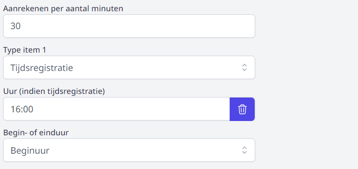

<Youtube url="https://www.youtube.com/embed/g9cDlHUfkKo" /> 

## Items instellen
Vooraleer je aan de slag kan gaan met de module Registratie Basisschool, moeten alle te registreren items worden ingesteld. Ga hiervoor naar de module Instellingen Toolbox en selecteer Registratie Basisschool. Elk item moet apart worden ingesteld.

 

**Naam item**: De benaming die je aan het item toekent is zichtbaar in de module Registratie Basisschool wanneer je met de cursor op de afkorting van het item staat. Dit is tevens de naam die je kan selecteren bij het importeren van de registraties in de module Leerlingenrekeningen. Meer info hierover vind je in het onderdeel [importeren](/leerlingenrekeningen/Importeren/).   

**Type item**: Er zijn 3 types van registratie mogelijk

1. Registratie: Door een klik of een scan geef je aan of een leerling een dienst of artikel wel of niet heeft onvangen (aanwezig-afwezig / gehad-niet gehad).
2. Aantallen: Je kan opgeven hoeveel artikelen een leerling heeft ontvangen (bv. nieuwjaarsbrieven).
3. Tijdsregistratie: Door een klik of een scan doe je een registratie zoals bij het eerste type én registreer tegelijkertijd je het tijdstip. Dit wordt vaak gebruikt wanneer de voor- en/of naschoolse opvang in tijdsblokken wordt geregistreerd.

    Voor een tijdsregistratie moeten er nog een aantal andere zaken worden ingesteld:

     

    **Uur**: Dit uur is het vaste uur. Zo heeft de voorbewaking een vast einduur en de nabewaking een vast beginuur. Het variabele uur wordt geregistreerd via de tijdsregistratie (klikken of scannen) in de module Registratie Basisschool. Dit uur moet niet worden opgegeven in de instellingen, omdat het op dit moment nog niet gekend is. De module werkt met het 24-uurssysteem. 

    **Aanrekenen per aantal minuten** zorgt ervoor dat er achterliggend bepaald wordt hoeveel blokken van (in dit geval) 30 minuten de leerling aanwezig is geweest. Het toekennen van de prijs per blok gebeurt bij het koppelen van een artikel in de module leerlingenrekeningen. 

**Afkoring item**: Deze afkorting mag GEEN spaties bevatten. NB_WOE voor nabewaking woensdag kan bv. wel. Het gebruik van spaties geeft een foutmelding bij het importeren van de registraties in de leerlingenrekeningen. De afkorting is zichtbaar in de module Registratie Basisschool bovenaan de tabel. Door op de blauwe afkorting te klikken, kan je met één klik alle leerlingen uit de gekozen groep selecteren. 

**Groep item**: Dit is de naam van de categorie in het hoofdmenu. Door een nieuwe groepsnaam te gebruiken, maak je een nieuwe categorie aan. Onder één groep kunnen meerdere items geregistreerd worden. De verschillende items kunnen ook verschillende registratietypes zijn. Geef hiervoor bij elk item dezelfde groepsnaam op. Let op dat die naam exact hetzelfde geschreven is. De naam is hoofdletter- en spatiegevoelig. 

**School item**: Dit is geen verplicht veld, maar kan gebruikt worden indien een Toolbox meerdere instellingsnummers heeft en waarbij er per instellingsnummer andere items moeten worden geregistreerd of wanneer de items wel dezelfde zijn, maar er aparte facturen worden gemaakt per instellingsnummer (school).  

 

## Registraties opvragen en barcodes afdrukken

In de module Registratie Basisschool is er ook een onderdeel <LegacyAction img="configure.png" text="beheer" /> . Hier is het mogelijk om alle registraties binnen een bepaalde periode op te vragen. Selecteer de periode en klik op 'toon gegevens'. Deze gegevens kunnen tevens geëxporteerd worden naar Excel. 

 

Je kan ook alle registraties voor een bepaalde leerling opvragen. Klik hiervoor op 'zoek op leerling' en geef (enkele letters uit) de naam van de leerling op.

Bij het gebruik van een scanner voor registratie of tijdsregistratie kan je hier de barcodes van de leerlingen afdrukken. Dat kan per klas of per eigen gedefinieerde groep. Een eigen groep aanmaken doe je in de module Leerlingenrekeningen onder het menu Mijn Groepen. Meer hierover kan je lezen in de Handleiding leerlingenrekeningen. 

De barcode is een uniek nummer per leerling dat ook in Exact Online en Informat wordt gebruikt. Het nummer gaat een hele schoolcarrière mee, dus ook de barcode. Je kan 24 of 27 etiketten op een pagina tonen. Met behulp van de verschuiving kan je aangeven hoeveel etiketten er reeds gebruikt zijn. In de afdruk zal het eerste etiket op de eerstvolgende lege plaats komen te staan. Hieronder vind je een voorbeeld van een verschuiving van 2.

 

## Gebruikersrechten toekennen
Om toegang te krijgen tot de module Registratie basisschool moet de gebruiker hiervoor rechten krijgen. Hoe je die instelt, vind je terug bij [gebruikersbeheer](/gebruikersbeheer).  

 

