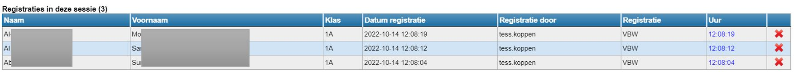
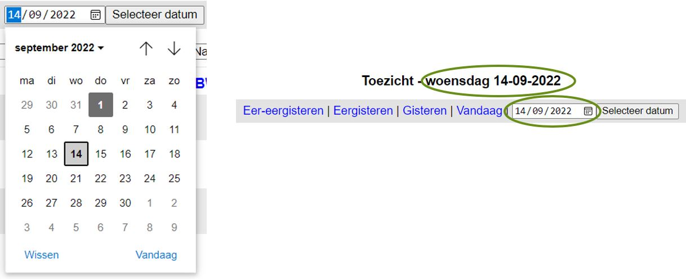
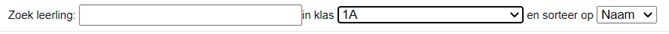
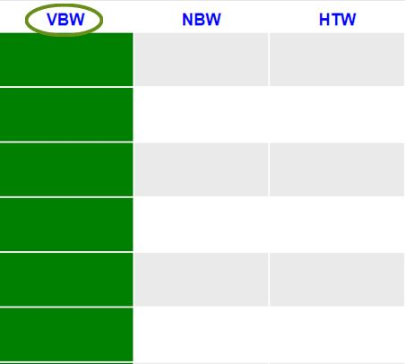
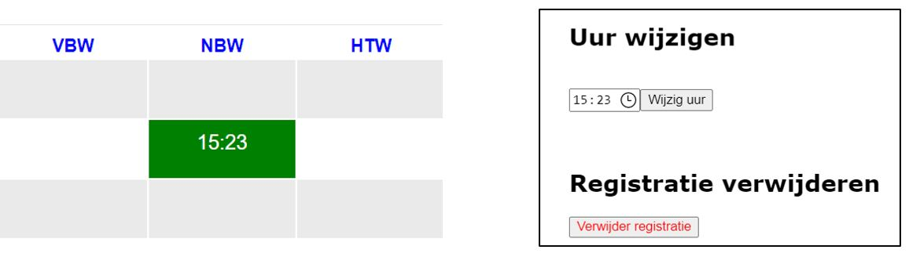

<Youtube url="https://www.youtube.com/embed/TkacAom-Jx0" /> 

 

Log in bij Toolbox en ga naar de module Registratie Basisschool. 
Het menu dat je te zien krijgt, is op voorhand ingesteld op maat van de school en kan dus verschillen van het menu hieronder. 

<Thumbnails img={[
    require('./RBeindgebruiker1.jpg').default, 
]} />

## Scannen
Indien je werkt met een scanner, klik je op de barcode vóór het item dat je wil registreren (bv. toezicht). Selecteer vervolgens het subitem (bv. voorbewaking). Je kan nu de barcode van de leerling scannen. Het item wordt automatisch geregistreerd. 

Het scannen werkt eveneens met de camera van een tablet of smartphone. Om de camera te activeren, volg je de voorgaande stappen en klik je op dit icoon <LegacyAction img="camera.png"/>. Met behulp van de camera kan je eveneens de barcode van de leerling scannen. 

Op het scherm verschijnt na elke scan een bijkomende lijn met gegevens. Zo behoud je het overzicht van wie allemaal ingescand is. Een foutieve scan kan eenvoudig verwijderd worden door achteraan op het rode kruisje te klikken.

 

Als het scannen is afgerond, mag je de module simpelweg sluiten. De gegevens worden automatisch opgeslagen. 

Als je het tijdstip van een gescand item wil aanpassen of na het sluiten van het systeem nog een registratie wil verwijderen, volg je de procedure hieronder voor een manuele registratie. 

## Manueel registreren of een registratie aanpassen/verwijderen

**STAP1: Selecteer het item**
Indien je manueel wenst te registreren of je wenst een eerder geregistreerd item aan te passen of te verwijderen, klik je op de tekstbalk naast de barcode.

**STAP 2: Selecteer de datum**
Elke registratie is verbonden aan een bepaalde datum. Deze datum is niet enkel belangrijk om te weten wanneer een leerling een bepaalde dienst of artikel heeft genoten, maar ook om te bepalen wat de facturatieperiode is. De aanrekening vindt immers plaats door de registraties te importeren over een welbepaald tijdvak.

De datum staat automatisch op vandaag. Je kan dit wijzigen door te klikken op gisteren, eergisteren of eer-eergisteren. De datum wordt vervolgens automatisch aangepast.

Indien je nog een andere datum wil selecteren, klik je op de kalender rechts naast de datum. Er verschijnt vervolgens een grotere kalender waarin je de datum kan selecteren. Klik hierna op ‘selecteer datum’ om te bevestigen. Een datum is pas definitief geselecteerd wanneer die ook in de titel wordt weergegeven.

 

**STAP 3: Selecteer een (klas)groep of zoek een leerling en registreer/wijzig/verwijder het item**

 

Selecteer de gewenste klas uit de lijst. Je krijgt nu alle namen te zien van de leerlingen in deze klas. Deze lijst kan je sorteren op naam, klas of klasnummer. Je laatste selectie en sortering blijft behouden. Wanneer je uitlogt uit Toolbox en op een ander moment terug inlogt, zal je de selectie en sortering niet opnieuw moeten uitvoeren, tenzij je voor een andere klas wil registreren.  

Je kan ook zoeken naar een specifieke leerling door (een aantal letters uit) diens naam in te vullen bij: 'Zoek leerling'. Behalve met klassen, kan je ook werken met eigen samengestelde groepen. Zo’n eigen groep kan gedefinieerd worden in de module Leerlingenrekeningen van Toolbox of in Informat.

Je kan direct achter de leerling de registratie vervolledigen door te klikken of door een aantal op te geven. Datgene wat je hebt geselecteerd zal groen opkleuren. Je kan het item weer verwijderen door er een tweede maal op te klikken of door het aantal terug op 0 te zetten. Opslaan hoeft niet, het systeem zal de selectie direct bewaren.

Je kan een artikel voor de hele groep tegelijk registreren door bovenaan de kolom op de afkorting van het artikel te klikken. Daarna is het nog mogelijk om voor individuele leerlingen de selectie terug ongedaan te maken.  

 

Indien je werkt met tijdsregistratie en je wil hier nog iets aan wijzigen, selecteer je het item door erop te klikken. Nu kan je het uur wijzigen of de registratie volledig verwijderen.

 

De te selecteren items zijn op voorhand als zodanig ingesteld door de school. Ook hoe het artikel moet worden genoemd en of er al dan niet een aantal kan worden opgegeven. Heb je hier vragen over dan kan je je best richten tot je administratie, directie of je lokale beheerder van de Toolbox.
