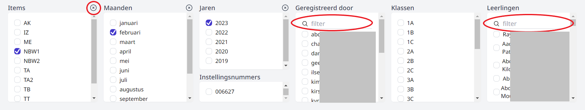
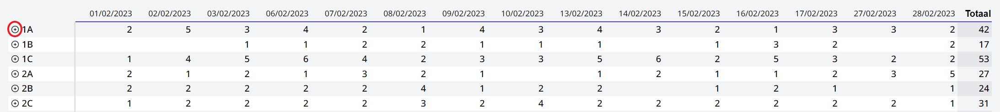
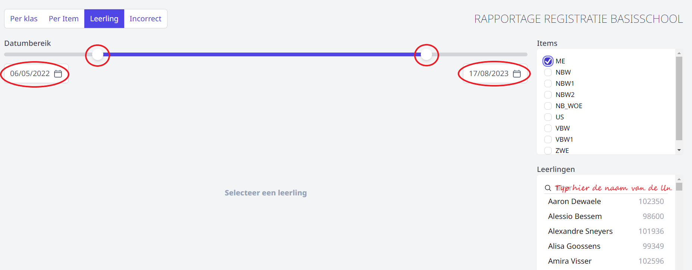
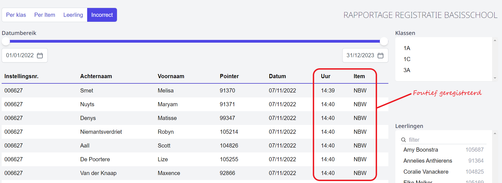

<Youtube url="https://www.youtube.com/embed/ixKr4StBWi8" /> 

 

Via het rapport kan je de registraties opvolgen per klas, per item of per leerling en dit voor een bepaalde periode. Je kan ook nagaan of er foutieve registraties zijn gebeurd. Bv. wanneer de voorbewaking is geregistreerd onder het artikel nabewaking. 

Alle gebruikers die rechten hebben in de module Registratie Basisschool kunnen het rapport raadplegen. Naast het administratief personeel, kunnen dus ook leerkrachten of toezichters via deze weg hun eigen registraties opvolgen en nakijken. 

 

<Thumbnails img={[
    require('./RB_rapport1.png').default, 
    require('./RB_rapport2.png').default, 
]} />

Selecteer bovenaan hoe je de registraties wil weergeven, nl. per klas, per item, per leerling of een overzicht van de foutieve registraties (incorrect). Vervolgens kan je daaronder filters instellen. 

## Per klas

 

Indien je geen vakjes aanvinkt, worden alle registraties getoond. Door vinkjes te zetten, kan je de resultaten verder filteren. Je kan ook meerdere vakjes tegelijk aanvinken.

In dit voorbeeld worden de registraties getoond voor item NBW1 voor de maand februari 2023 en dit voor alle gekoppelde instellingsnummers, alle personen die geregistreerd hebben, alle klassen en alle leerlingen. De resultaten worden gesorteerd per klas. Je kan de resultaten per klas uitklappen door het op plusteken vooraan te klikken. Zo krijg je de details per leerling te zien. Door nogmaals op het plusteken te klikken, worden de details per leerling terug ingeklapt. 

 

## Per item
Het zoeken en filteren werkt net zoals hierboven, met als verschil dat de resultaten niet per klas, maar wel per item worden getoond. 

## Leerling
Je kan ook een rapport genereren per leerling. Dit is soms nodig wanneer ouders de details van een bepaalde facturatieperiode opvragen. Die periode kan je instellen met behulp van de schuifbalk bovenaan of aan de hand van de datumvelden daaronder.

Je kan eventueel een bepaald artikel selecteren. Als je dat niet doet, worden alle geregistreerde items voor de leerling getoond. Selecteer tot slot de leerling waarvoor je de registraties wil zien. 

Je kan dit rapport afdrukken door met de rechtermuisknop te klikken en te kiezen voor 'druk pagina af'. Als je het rapport graag in pdf-formaat wil, kan je bij de printerinstellingen kiezen om af te drukken naar pdf.

 

## Incorrect
Via het tabblad 'Incorrect' kan je nagaan of er artikels foutief werden geregistreerd in een bepaalde periode. Bv. wanneer het artikel nabewaking gekozen werd voor het registreren van de voorbewaking. Dergelijke foutief geregistreerde artikels kunnen voor problemen zorgen bij het importeren in de leerlingenrekeningen. Je kan de correcties manueel doorvoeren in de module registratie basisschool. De periode kan je instellen met behulp van de schuifbalk of aan de hand van de datumvelden vooraan en achteraan.

Ook hier kan je nog verder filteren op klas en op leerling.

 