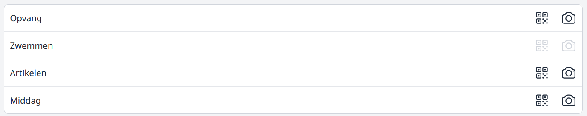
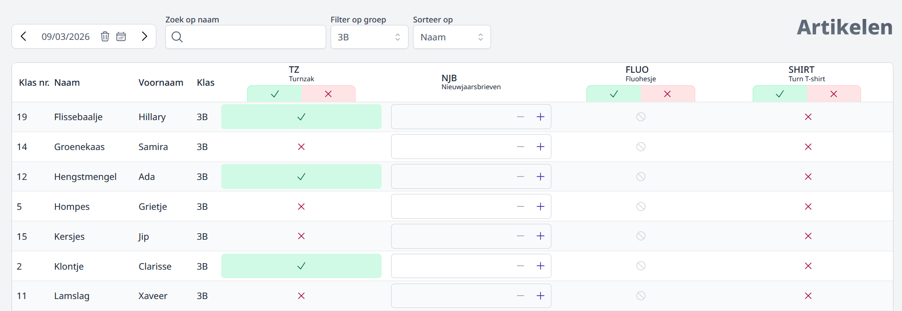
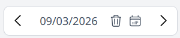
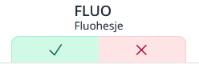
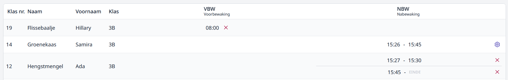
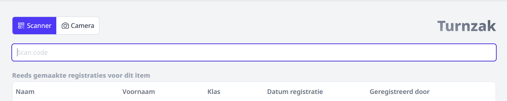

Log in bij Toolbox en ga naar de module Registratie Basisschool. 
Het menu dat je te zien krijgt, is op voorhand ingesteld op maat van de school en kan dus verschillen van het menu hieronder. 

Er zijn drie manieren om een registratie te doen: 
1. Manueel registreren
2. Scannen met een barcodescanner
3. Scannen met een camera van een smartphone of tablet

## 1. Manueel registreren
Klik op de tekst in het menu van de categorie waar het te registreren item onder valt ***(Opvang, Zwemmen, ...)***.
Een weergave van de items die onder de gekozen categorie vallen verschijnt.
Standaard zal de laatste klas, die je hebt aangeduid, worden weergegeven. 

Het is mogelijk om direct een leerling op te zoeken via de 'Zoek op naam' filter in het veld 
met vergrootglas. Van zodra er een karakter wordt opgegeven wordt de lijst met leerlingen al 
gefilterd op zowel de voor- als achternaam.

Verder is het mogelijk om direct een hele klas op te vragen en eventueel een subgroep uit Informat 
of een eigen gemaakte groep uit de leerlingenrekeningen op voorwaarde dat daar is aangeduid dat 
deze kan worden gebruikt in deze module.

De registratie is altijd voor een gekozen datum. Deze zal standaard op vandaag staan. Via < en > symbool
kan er snel van dag gewisseld worden. door op het prullenbakje te klikken ga je direct terug naar de dag van vandaag.
De datum kan ook steeds manueel worden aangepast door er op te klikken of door een datum te kiezen via het kalender-icoontje.

 

In geval het item van het type **registratie** is, kan je alle leerlingen in de selectie selecteren 
danwel deselecteren door op het overeenkomende icoontje onder de naam van het artikel te klikken. 

Bij items van het type **aantallen** dien je een getal op te geven. Wanneer je de TAB-toets van het klavier gebruikt 
kan u naar het volgende in te vullen invoervak gaan. Als er slechts 1 type item in de lijst staat zal dat steeds 
de volgende leerling in de lijst zijn.

Een item van het type **tijdsregistratie** moet altijd individueel per leerling worden aangeklikt. Bij het klikken 
zal immers ook het tijdstip worden bepaald wat weer noodzakelijk is voor de berekening van het aan te rekenen bedrag. 
Klik bij een leerling en het tijdstip wordt weergegeven. Dubbelklik op het tijdstip om deze op te slaan. 
Klik ook zeker op het opslaan-icoontje naast het nieuw opgegeven tijdstip. Is het mogelijk om zowel in- als uit te checken, 
dan kan het 2e tijdstip worden opgegeven door op 'einde' te klikken.
Moet er tussentijds nog een keer worden in- en uitgechecked, klik dan op het tandwiel-icoontje en klik op 'Toevoegen'.
 

## 2. Scannen met een barcodescanner
 Klik hier indien je werkt met een barcodescanner.
Selecteer vervolgens het subitem (bv. voorbewaking), als er meerdere items onder de categorie vallen. 
Je kan nu de barcode van de leerling scannen. Het item wordt automatisch geregistreerd. 
Lukt de registratie niet goed, omdat de barcode beschadigd is, 
dan kan je nog altijd manueel het nummer van de barcode opgeven. 

Op het scherm verschijnt na elke scan een bijkomende lijn met gegevens. 
Zo behoud je het overzicht van wie allemaal ingescand is. 
Een foutieve scan kan eenvoudig verwijderd worden door achteraan op het rode prullenbak-icoontje te klikken. 
In geval van tijdsregistratie kan je ook nog altijd het tijdstip aanpassen in de lijst met gescande leerlingen. 
Klik op het tijdstip en pas de tijd aan. Vergeet niet om op het opslaan-icoontje te klikken naast het gewijzigde tijdstip. 

## 3. Scannen met een camara smartphone / tablet
 Klik hier indien je werkt met de camera van een smartphone of tablet.
Zorg dat je ingelogd bent in de module registratie basisschool en toegang hebt verleend aan de Toolbox om gebruik te maken van de camera.
Daarna verloopt het proces zoals het scannen met een barcodescanner. 

Het is altijd tussentijds mogelijk om te veranderen van camera naar barcodescanner en vica versa.

Als het scannen is afgerond, mag je de module simpelweg sluiten. De gegevens worden automatisch opgeslagen. 

Als je het tijdstip van een gescand item wil aanpassen of na het sluiten van het systeem nog een registratie wil verwijderen, 
dan volg je de procedure voor een manuele registratie. 

De te selecteren items zijn op voorhand als zodanig ingesteld door de school. Ook hoe het artikel moet worden genoemd en of er al dan niet een aantal kan worden opgegeven. Heb je hier vragen over dan kan je je best richten tot je administratie, directie of je lokale beheerder van de Toolbox.
