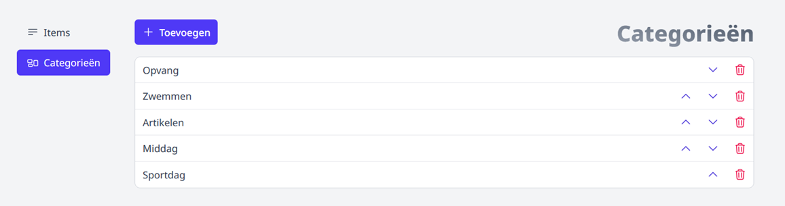
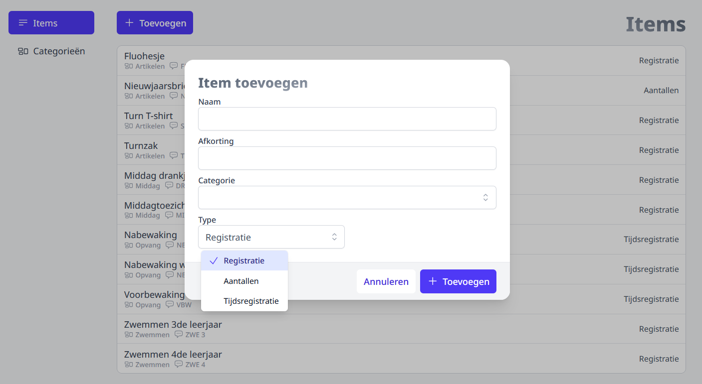
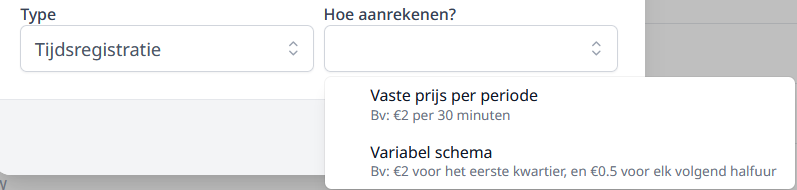
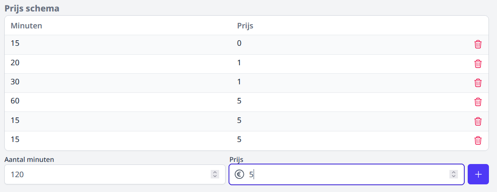
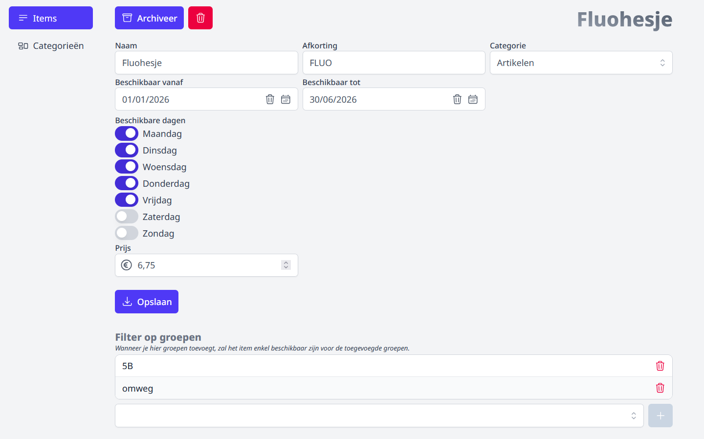

## Gebruikersrechten toekennen

Om de module Registratie basisschool te kunnen gebruiken, moeten er rechten toegekend worden. Dat gebeurt door een beheerder via de module [Gebruikersbeheer](/gebruikersbeheer). 

Voor deze module zijn er twee categorieën van gebruikersrechten voorzien:
- **Registratie basisschool gebruik**: Een gebruiker met deze rechten kan zelf registreren en andere registraties in de module raadplegen en/of wijzigen. Daarnaast heeft deze gebruiker ook toegang tot het rapport met registraties.  
- **Registratie basisschool beheer**: Deze gebruiker heeft alle hogervermelde bevoegdheden en heeft daarbovenop ook toegang tot het onderdeel 'Beheer' waar men overzichten van de registraties kan raadplegen en barcodes voor leerlingen kan aanmaken.  

Naast personeelsledenis het ook mogelijk deze rechten toe te kennen aan externen. 
Dat laatste kan handig zijn om niet-personeelsleden ook toegang te geven tot deze module 
zonder dat ze in de Toolbox voor personeelsleden moeten kunnen inloggen.
Iemand toevoegen als externe verloopt via de module Synchronisatie externen. Bekijk hiervoor de sectie 
[Synchronisatie externen](/synchronisatie/synchronisatie_externen/) van deze handleiding.

## Beheer
Het beheer van de module bestaat uit twee facetten en verloopt volledig binnen de module zelf.
Het opmaken van de te registreren items en het instellen van de categorieën waar de items onder vallen.
Deze laatste vormt meteen ook het menu van het startscherm. 
Aangezien de categorieën naderhand een keuzelijst vormen bij de items zouden deze best eerst ingesteld worden.
Voor toegang tot het beheer is het recht **Registratie basisschool beheer** nodig.

### Categorie
Voor het instellen van een categorie is het voldoende om op 'Categorieën' te klikken 
en vervolgens op ' + Toevoegen'. Een categorie brengt alles dat met elkaar te maken heeft onder in hetzelfde menu.
Moet er tijdens de middag worden geregistreerd wie aanwezig is en direct wie er een drankje heeft gehad,  
dan kan je die twee te registreren items bijvoorbeeld verzamelen onder de categorie 'Middagtoezicht'.
De naam van een reeds aangemaakte categorie kan je wijzigen door op de naam van die categorie te klikken.
Door op de pijl icoontjes (boven, beneden) te klikken kan je de positie van de categorie in het menu wijzigen.

### Item
**Naam**: Geef het item een logische benaming, zodat het duidelijk is waar het om gaat.
Dit is tevens de naam die je kan selecteren bij het importeren van de registraties in de 
module Leerlingenrekeningen. Meer info hierover vind je in het onderdeel [importeren](/leerlingenrekeningen/Importeren/).   

**Afkorting**: Geef het item een afkorting. De afkorting wordt gebruikt om de leesbaarheid te verhogen en in de rapporten. 
Het is aangewezen steeds een unieke afkorting te gebruiken.

**Categorie**: Dit is de naam van de categorie in het hoofdmenu. 
Er dient een keuze gemaakt te worden in de lijst van categorieën die eerder waren ingesteld.

**Type**: Er zijn 3 types van registratie mogelijk

1. **Registratie**: Door een klik of een scan geef je aan of een leerling een dienst of artikel 
wel of niet heeft onvangen (aanwezig-afwezig / gehad-niet gehad).
2. **Aantallen**: Je kan opgeven hoeveel artikelen een leerling heeft ontvangen (bv. nieuwjaarsbrieven).
3. **Tijdsregistratie**: Door een klik of een scan doe je een registratie zoals bij het eerste type 
én registreer je tegelijkertijd het tijdstip. Dit wordt vaak gebruikt wanneer de 
voor- en/of naschoolse opvang in tijdsblokken wordt geregistreerd.
Naderhand bij de extra opties kan het 'scan moment' nog worden ingesteld. 
Dit kan eventueel bij zowel de start als het einde van de opvang zijn ('beide' in de keuzelijst), 
zodat je kan in- en uitchecken en dat eventueel meerdere keren tijdens 
een opvangbeurt. Kan handig zijn als een leerling ook een buitenschoolse activiteit volgt 
en voor dat stuk niet voor opvang moet betalen.

:::caution Belangrijk
Het type registratie kan je na het aanmaken van een item niet meer wijzigen!
:::

Als er wordt gekozen voor **tijdsregistratie** dan kan je vervolgens kiezen hoe je wil aanrekenen. Je hebt hier twee mogelijkheden:
- Vaste prijs per periode: deze optie laat toe om een vast prijs voor een vast aantal minuten in te stellen. Per begonnen aantal minuten wordt dan die prijs aangerekend. Bijvoorbeeld: per begonnen blok van 5 minuten wordt 1 euro aangerekend.

- Variabel schema: hiermee kan je variabel werken en kiezen om in het eerste blok van X-aantal minuten een andere prijs aan te rekenen dan in het volgende blok van Y-aantal minuten. Die optie laat toe om bijvoorbeeld het eerste kwartier goedkoper of gratis te maken en pas na een kwartier beginnen aanrekenen.

### Extra opties toekennen aan een item
Door op een item in de lijst te klikken kan je deze openen om eventueel aanpassingen door te voeren in de naam en afkorting.
Ook kan er nog woren veranderd van categorie. **Het type van registreren kan niet meer gewijzigd worden**.

Afhankelijk van het gekozen type, kunnen er nog bijkomende opties ingesteld worden. 
Voor alle soorten items kan je opgeven vanaf wanneer en tot wanneer een item zichtbaar is voor registratie.  
In het onderstaande voorbeeld van een Fluohesje kan je instellen dat die registratie maar tussen 1 januari en 30 juni kan plaatsvinden. 
Zo kan er worden vermeden dat buiten een bepaalde periode een item nog kan worden geregistreerd.
Je kan ook instellen op welke dagen het item beschikbaar is. 
Gaat het om een nabewaking die niet op woensdag georganiseerd wordt, 
dan vink je enkel maandag, dinsdag, donderdag en vrijdag aan. 
Zo kan men zich niet vergissen tijdens het registreren.

Ook is het al direct mogelijk een prijs voor het item in te stellen. Naderhand bij de import in de leerlingenrekeningen kan deze nog worden overschreven.
De prijs wordt voor deze nieuwe versie van de module nu ook ingesteld in de instellingen van het item.

Voor items van het type Tijdsregistratie moet de prijs ingesteld worden per aantal minuten 
of kan je meerdere lijnen toevoegen om zo een schema op te bouwen. Per lijn geef je dan een prijs op.
In onderstaand schema zijn de eerste 15 minuten gratis, daarna voor de volgende 20 minuten 1 euro 
en als het 3e blok na 35 minuten ingaat komt er nog een euro bij. Na 1 uur en 5 minuten is het bedrag 5 euro voor een uur. 

Optioneel kan je een item beschikbaar stellen voor een selectie van groepen. Ook dat is louter om te voorkomen dat een item voor foutieve groepen wordt geregistreerd. Je kan kiezen uit klassen, subgroepen (uit Informat) of eigen groepen om de filter in te stellen. Enkel voor die groepen zal het item zichtbaar zijn.

## Barcodes afdrukken

Als je gebruik maakt van een barcodescanner om leerlingen te scannen, dan wil je daar ook barcodes voor afdrukken. Dat verloopt niet langer meer via deze module maar gaat via de module [Leerlingenkaarten](/leerlingenkaarten/).

   