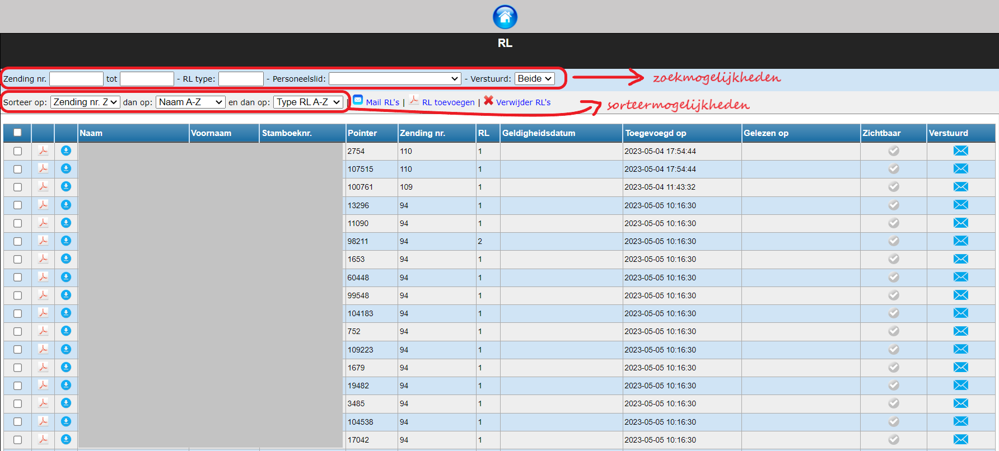
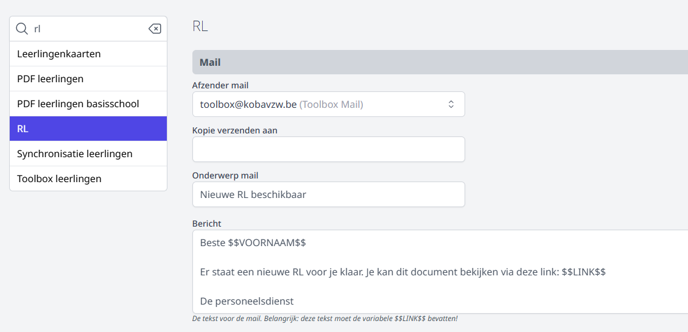

<ImageTitle img="rl.png">RL</ImageTitle>

Deze module laat toe om alle RL's digitaal aan personeelsleden te bezorgen en/of beschikbaar te stellen in hun profiel in Toolbox.

Klik op <LegacyAction img="pdf.png" text="RL toevoegen"/> om een bestand met één of meerdere RL's toe te voegen. Je sleept pdf's uit Informat in deze module (zowel die per personeelslid als die per zending) en Toolbox zal de pdf meteen uitsplitsen per personeelslid. 
De RL's verschijnen vervolgens in het een overzicht. In dit overzicht kan je op verschillende manieren zoeken, filteren en sorteren. 

Door te klikken op <LegacyAction img="remove.png" text="Verwijder RL's"/> kan je de geselecteerde RL's definitief verwijderen uit het overzicht. 

Via het pdf-icoon <LegacyAction img="pdf.png"/> vooraan kan je per personeelslid de RL in pdf raadplegen of via <LegacyAction img="download2.png"/> het document downloaden. 

## RL mailen

Klik op <LegacyAction img="mail.png" text ="Mail RL's"/> om de geselecteerde RL's te versturen via e-mail. Achteraan in het overzicht zie je welke RL's reeds gemaild zijn. Wanneer een mail geopend is, wordt de datum en tijd van het openen toegevoegd aan de kolom 'Gelezen op'. 

- Niet verstuurd: <LegacyAction img="mailEnveloppe.png"/> 

- Verstuurd: <LegacyAction img="mailVerzonden.png"/> 
- Geen e-mailadres beschikbaar in Informat. Voeg een e-mailadres toe en synchroniseer opnieuw met Toolbox (Synchronisatie leraren): <LegacyAction img="alert.png"/> 

Alvorens te kunnen mailen moeten er een aantal zaken worden ingesteld in de module Instellingen > RL. Deze module is enkel toegankelijk voor een Toolbox-beheerder. Om te weten wie beheerder is in een Toolbox, klik je in het startscherm op het vraagteken > contact.

## RL beschikbaar stellen in Toolbox-profiel

De personeelsleden kunnen hun RL's in hun persoonlijk profiel in Toolbox terugvinden wanneer het vinkje in de kolom 'zichtbaar' bij de betreffende RL is aangevinkt <LegacyAction img="vinkjeGroenRond.png"/>. Indien een RL niet meer zichtbaar mag zijn in het profiel, vink je die eenvoudigweg terug uit. 
