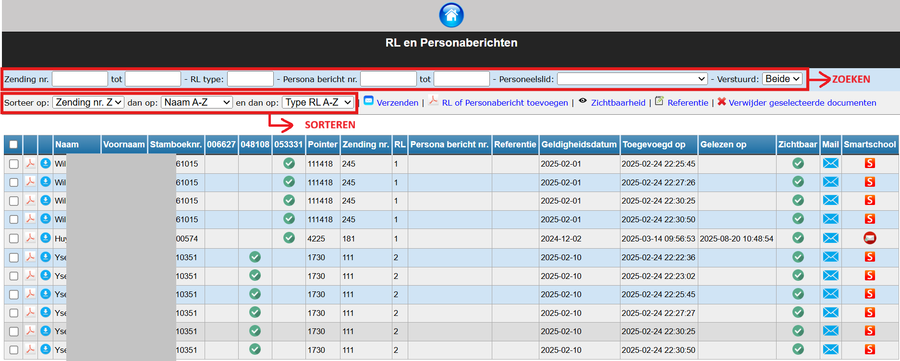
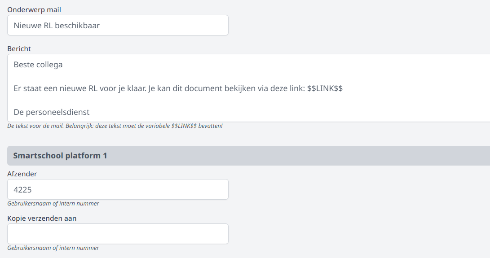

<ImageTitle img="rl.png">RL/Personaberichten</ImageTitle>

Deze module laat toe om alle RL's en Personaberichten uit Informat digitaal (via E-mail of Smartschool) aan personeelsleden te bezorgen en/of beschikbaar te stellen in hun persoonlijk profiel in Toolbox. 

## Voorbereiding

Het personeelslid dat deze module zal beheren, moet beschikken gebruikersrecht 'rl_beheer'. Dat kan toegekend worden door een Toolboxbeheerder via de module [Gebruikersbeheer](/gebruikersbeheer). Klik in Toolbox op het vraagteken rechtsbovenaan om na te gaan wie Toolboxbeheerder is in jouw school. 

## RL/Personabericht toevoegen of verwijderen

Klik op <LegacyAction img="pdf.png" text="RL of Personabericht toevoegen"/> om een bestand met één of meerdere RL's of Personaberichten toe te voegen. Je sleept pdf's uit Informat in deze module (zowel die per personeelslid als die per zending) en Toolbox zal de pdf meteen uitsplitsen per personeelslid. 
De RL's en/of Personaberichten verschijnen vervolgens in het een overzicht. In dit overzicht kan je op verschillende manieren zoeken, filteren en sorteren. 

Door te klikken op <LegacyAction img="remove.png" text="Verwijder geselecteerde document"/> kan je de geselecteerde RL's en/of Personaberichten definitief verwijderen uit het overzicht. 

*Klik op de afbeelding om te vergroten.*

Via het pdf-icoon <LegacyAction img="pdf.png"/> vooraan kan je per personeelslid de RL of het Personabericht in pdf raadplegen of via <LegacyAction img="download2.png"/> het document downloaden. 

## RL/Pesonabericht versturen per e-mail

Klik op <LegacyAction img="mail.png" text ="Verzenden"/> en vervolgens op <LegacyAction img="mail.png" text ="Mail RL's of Persona berichten"/> om de geselecteerde documenten te versturen via e-mail. Achteraan in het overzicht zie je welke RL's reeds gemaild zijn. Wanneer een mail geopend is, wordt de datum en tijd van het openen toegevoegd aan de kolom 'Gelezen op'. 

- Niet verstuurd: <LegacyAction img="mailEnveloppe.png"/> 

- Verstuurd: <LegacyAction img="mailVerzonden.png"/> 
- Geen e-mailadres beschikbaar in Informat. Voeg een e-mailadres toe en synchroniseer opnieuw met Toolbox (Synchronisatie leraren): <LegacyAction img="alert.png"/> 

Alvorens te kunnen mailen moeten er een aantal zaken worden ingesteld in de module Instellingen > RL. Deze module is enkel toegankelijk voor een Toolboxbeheerder. Om te weten wie beheerder is in een Toolbox, klik je in het startscherm op het vraagteken rechtsbovenaan. 

- Selecteer eerst en vooral de afzender van de e-mailberichten. Indien er bij 'Afzender mail' geen afzender beschikbaar is of niet de juiste afzender, moet die nog geconfigureerd worden in de module Instellingen > [E-mail](/e-mail). 
- Vul optioneel een e-mailadres in bij 'Kopie verzenden aan' indien de e-mailberichten steeds in CC verstuurd moeten worden naar een collega of directielid. 
- Verder vul je ook het tekstbericht en het onderwerp van het bericht aan. In het tekstbericht moet minimaal de variabele $$LINK$$ worden gebruikt. Dit zal in het e-mailbericht de link zijn naar de RL of het Personabericht van het personeelslid. Verder kan er optioneel ook gebruikt gemaakt worden van de variabele $$VOORNAAM$$. In dat geval zal bij het versturen van het bericht de variabele vervangen worden door de voornaam van het personeelslid om zo de aanspreking in de mail te personaliseren. 

## RL/Personabericht versturen via Smartschool

Klik op <LegacyAction img="mail.png" text ="Verzenden"/> en vervolgens op <LegacyAction img="smartschool.png" text ="RL's of Persona berichten via Smartschool"/> om de geselecteerde documenten te versturen via Smartschool. Achteraan in het overzicht zie je welke documenten reeds verzonden zijn. Wanneer een bericht geopend is, wordt de datum en tijd van het openen toegevoegd aan de kolom 'Gelezen op'. 

- Niet verstuurd: <LegacyAction img="smartschool.png"/> 

- Verstuurd: <LegacyAction img="mailVerzonden.png"/>

Alvorens te kunnen versturen via Smartschool moeten er een aantal zaken worden ingesteld in de module Instellingen > RL. Deze module is enkel toegankelijk voor een Toolboxbeheerder. Om te weten wie beheerder is in een Toolbox, klik je in het startscherm op het vraagteken rechtsbovenaan. 

Zo moet het tekstbericht worden ingesteld alsook het onderwerp van het bericht. In het tekstbericht moet minimaal de variabele $$LINK$$ worden gebruikt. Dit zal in het Smartschoolbericht de link zijn naar de RL of het Personabericht van het personeelslid. Daarnaast kan er optioneel ook gebruikt gemaakt worden van de variabele $$VOORNAAM$$. In dat geval zal bij het versturen van het bericht de variabele vervangen worden door de voornaam van het personeelslid om zo de aanspreking in het bericht te personaliseren. Verder moet er ook een afzender voor Smartschool worden ingevuld. Afhankelijk of de school gebruik maakt van het intern nummer of de gebruikersnaam van het personeelslid als uniek veld in Smartschool, vul je hier het intern nummer of de gebruikersnaam van de afzender in. 

## RL/Personabericht beschikbaar stellen in Toolboxprofiel

De personeelsleden kunnen hun RL's in hun persoonlijk profiel in Toolbox terugvinden wanneer het vinkje in de kolom 'zichtbaar' bij de betreffende RL is aangevinkt <LegacyAction img="vinkjeGroenRond.png"/>. Indien een RL niet meer zichtbaar mag zijn in het profiel, vink je die eenvoudigweg terug uit. 

Je kan deze actie ook in bulk uitvoeren 