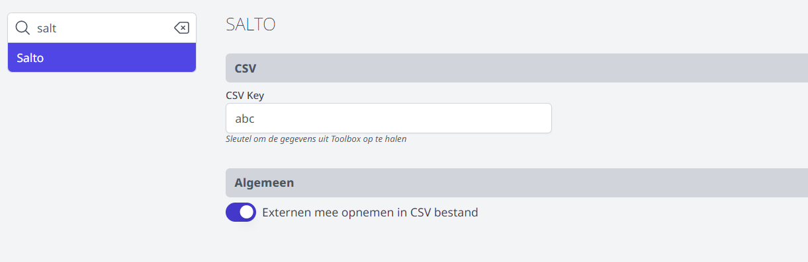
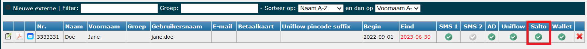
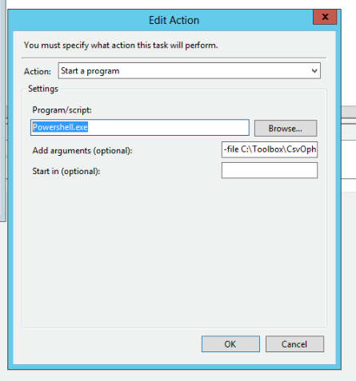
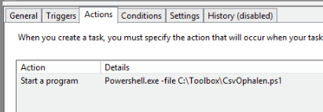
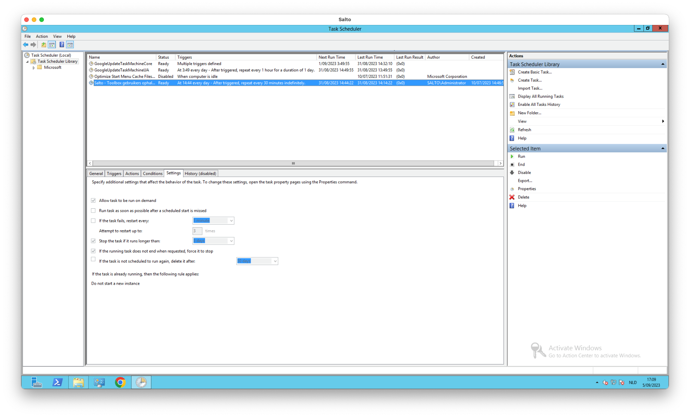
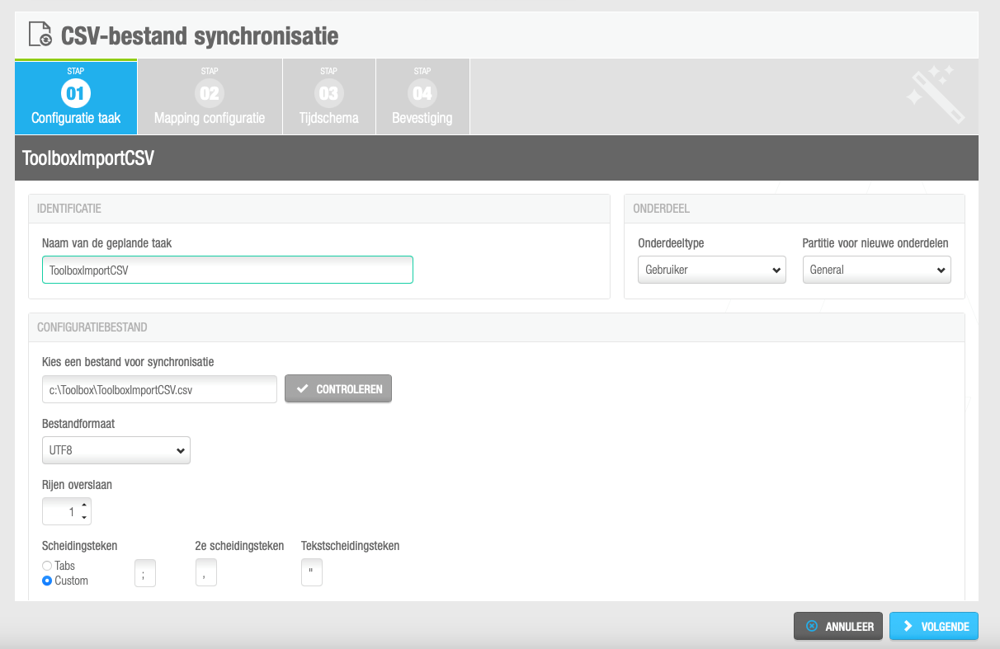
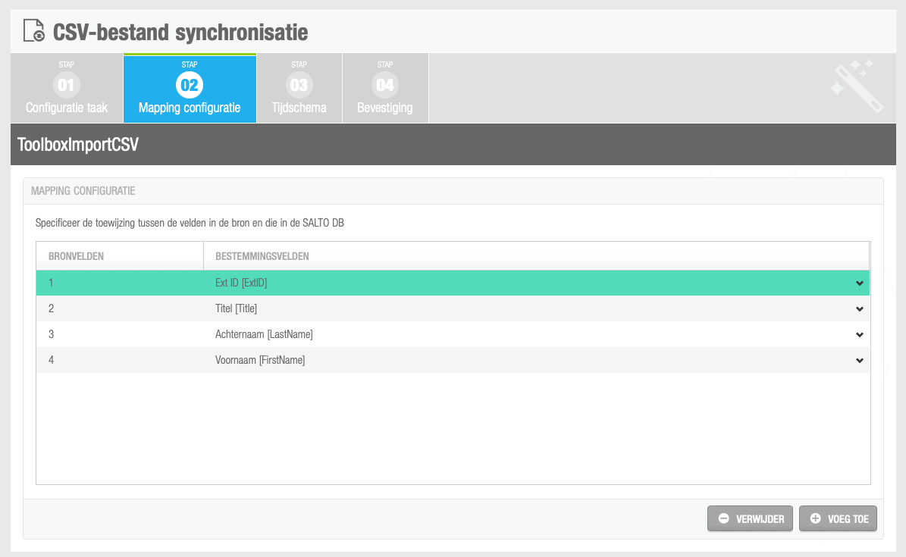

<ImageTitle img="salto.png">Salto</ImageTitle>

Door middel van een koppeling met Toolbox kan Salto automatisch (nieuwe) leraren én externen (die zijn aangemaakt in de module Synchronisatie Externen) aanmaken als Salto-gebruikers. Deze personen komen automatisch in Salto terecht en moeten enkel nog in de juiste groep worden gezet.

Om Toolbox met Salto te kunnen synchroniseren, ga je als volgt te werk: 

- Ga in Toolbox naar de module Instellingen => Salto en geef een zelfgekozen CSV key in. 

- Duid in deze module ook aan of je externen mee wil opnemen in het CSV bestand. Dit kan enkel voor externen die zijn aangemaakt via de module Synchronisatie Externen en waarvoor in die module het vinkje 'Salto' is aangezet bij alle externen die je mee wil opnemen in het bestand. 

- Maak op de Salto-server op de C-schijf een map aan C:\Toolbox
- Plaats volgend PowerShell script in die map: [PowerShell script](./CsvOphalen.ps1)
- Wijzig het bestand: 
    - Pas de URL van de Toolbox aan naar de URL van de eigen Toolbox (piusx.kobam.be => school.toolbox.be).
    - Wijzig de key (key=abc) naar de eigen gekozen key die je hebt ingevuld in Toolbox in de module Instellingen => Salto.
- Maak een Windows taak aan die bv. elk uur loopt. 
    - Als actie geef je mee: programma starten 
    - Als Programma vul je Powershell.exe in. 
    - Bij argumenten: file C:\Toolbox\CsvOphalen.ps1

Dit script haalt nu elk uur uit Toolbox alle personeelsleden en eventueel ook de externen waarvoor Salto is aangevinkt (in de module Synchronisatie externen).

- Maak vervolgens in Salto een geplande taak aan waarmee je een import van gebruikers doet via CSV. 
    - Als bestand vul je 'C:\Toolbox\ToolboxImportCSV.csv' in. 
    - De eerste rij sla je over en als bestandformaat vul je UTF8 in. 
    - Als scheidingsteken gebruik je custom ; (puntkomma).
    - In de mapping gebruik je deze volgorde:
        - 1 = Ext ID
        - 2 = Titel
        - 3 = Achternaam
        - 4 = Voornaam

