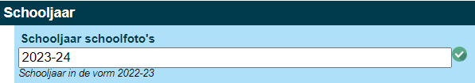
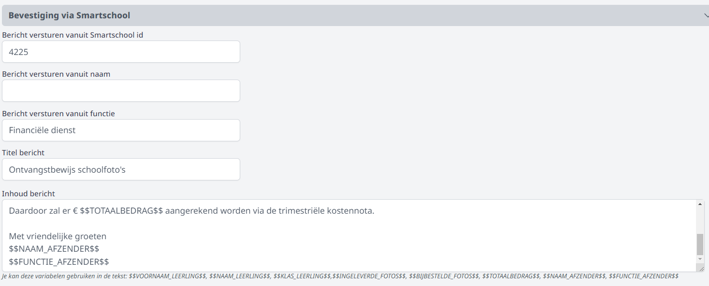
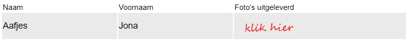
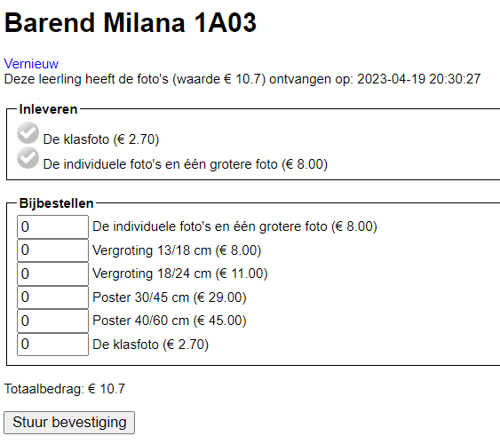
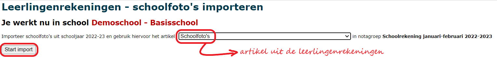

<ImageTitle img="camera.png">Verwerking schoolfoto's</ImageTitle>

In september krijgen heel wat scholen de schoolfotograaf over de vloer. De kiekjes worden na afloop verdeeld in de klassen. Elke leerling krijgt een pakketje met foto's en geeft dat pakketje volledig, deels of niet terug. Afhankelijk daarvan wordt er een kost aangerekend via de leerlingenrekeningen. 

## Gebruikersbeheer

Rechten voor een module worden toegekend via de tegel [gebruikersbeheer](/gebruikersbeheer). De gebruikersrechten voor de module **Verwerking schoolfoto's** zijn opgesplitst in:
- schoolfotos_uitdelen: men enkel aanduiden welke leerlingen een pakket met foto's hebben ontvangen.
- schoolfotos_inleveren: men kan enkel aanduiden welke foto's een leerling terug heeft ingeleverd en/of welke foto's men wil bijbestellen.  
- schoolfotos_beheer: men kan zowel uitdelen, inleveren, bijbestellen als een overzicht printen van alle bestellingen.  

## Instellingen

Vooraleer je aan de slag kan gaan met de module **Verwerking schoolfoto's**, moet je een aantal zaken instellen in de module **Instellingen** van Toolbox => Schoolfoto's. Deze module is enkel toegankelijk voor een beheerder van Toolbox. Om te weten wie je beheerder is, klik je rechtsboven op het vraagteken => contact. 

1. Bovenaan stel je het schooljaar in waarvoor je de foto's wil uitleveren. Let op dat je steeds volgende structuur gebruikt: 2023-24  (en niet 2023-<Text color="red">~~20~~</Text>24)

 

2. Je kan bij het inleveren of bijbestellen van foto's een automatische bevestiging versturen via Smartschool. Dit werkt enkel indien er een Smartschoolplatform is gekoppeld met Toolbox (Instellingen => Smartschool). 
    - Geef op vanuit welk Smartschoolaccount het bericht moet vertrekken. Dit is de gebruikersnaam of het intern nummer van de afzender in Smartschool. Via de module Instellingen => Smartschool kan je nagaan of de school het intern nummer of de gebruikersnaam gebruikt als uniek veld in Smartschool. 
    - Geef vervolgens mee vanuit welke naam of functie het bericht verstuurd moet worden. 
    - Tot slot stel je het onderwerp van het bericht en het tekstbericht zelf in. Je kan hierbij gebruik maken van enkele dynamische variabelen die bij het versturen van het bericht vervangen worden door de overeenkomstige leerling- of bestelgegevens.

      

      Hieronder een voorbeeld van een tekstbericht met variabelen:

          Beste

          Hierbij bevestigen wij volgende foto's te hebben ontvangen van $$VOORNAAM_LEERLING$$ $$NAAM_LEERLING$$,
          $$KLAS_LEERLING$$: $$INGELEVERDE_FOTOS$$
      
          Volgende items werden bijbesteld:$$BIJBESTELDE_FOTOS$$
      
          Daardoor zal er € $$TOTAALBEDRAG$$ aangerekend worden via de eerstvolgende schoolrekening.
      
          Met vriendelijke groeten
          $$NAAM_AFZENDER$$
          $$FUNCTIE_AFZENDER$$

3. Verder moet er nog ingesteld worden hoe het pakket dat de leerlingen meekrijgen, is samengesteld. Er is een aparte instelling voorzien voor secundaire scholen en basisscholen. De structuur is in beide gevallen als volgt: Code,Benaming,Prijs; => INDFOTOS,Individuele foto's,8.00;

   - De **code** is nodig voor de import in de leerlingenrekeningen. Deze bevat best geen spaties of speciale tekens. Bv. INDFOTOS
   - De **benaming** wordt getoond in de module 'Verwerking schoolfoto's'. Die mag wel spaties of andere tekens bevatten. Bv. Individuele foto's
   - Voor de **prijs** gebruik je een punt in plaats van een komma. Bv. 8.00

  Je geeft alle foto's binnen het pakket na elkaar op, gescheiden door een puntkomma: bv. KLASFOTO,De klasfoto,2.70;INDFOTOS,De individuele foto's en één grotere foto,8.00;INDGROOT,Individuele grote foto 18x24,8.00

  Je kan ook opgeven welke foto's bijbesteld kunnen worden zoals bv. vergrotingen. Hiervoor hanteer je dezelfde codering als voor het standaardpakket. 

  Bv. INDVERGROTING1318,Grote individuele foto 13/18 cm,6.00;
  
  

## Foto's uitdelen

Via de module **Verwerking schoolfoto's** kan je de pakketten met foto's uitdelen. Dat kan ineens voor een volledige klas door bovenaan op de blauwe tekst <LegacyAction text="Lever foto's voor heel 1A01 uit" /> te klikken. Het kan ook leerling per leerling door in het lege vakje achter de naam van de leerling te klikken. Dit wordt vervolgens groen en geeft weer op welke datum en welk uur de foto's werden uitgedeeld. 

Als zo goed als de hele klas het pakket kreeg, kan je voor de hele klas ineens uitleveren en vervolgens één of enkele leerlingen terug uitvinken door op het groene vak te klikken. De gegevens worden gewist en het vak is terug leeg. 

## Foto's inleveren/bijbestellen

Na het uitdelen kunnen de leerlingen foto's terug inleveren. Daarvoor kan je de optie Inleveren gebruiken.  Je zoekt de leerling en krijgt te zien welk pakket de leerling ontving. Vervolgens kan je aanduiden wat de leerling heeft ingeleverd en/of wat hij wenst bij te bestellen. Er kan dan ook meteen een bericht via Smartschool worden gestuurd met een overzicht van wat er aangerekend zal worden.

Daarnaast is er in het startscherm ook een export naar Excel voorzien. Daarmee krijg je alle informatie te zien: heeft de leerling het pakket met foto's ontvangen, welke foto's werden terug ingeleverd en welke foto's zijn bijbesteld? In Excel kan je bv. via de subtotalen per leerling het juiste bedrag zien.

## Foto's aanrekenen via de leerlingenrekeningen

Wanneer het inleveren en de bijbestellingen zijn afgehandeld, kan alles aangerekend worden in de module **Leerlingenrekeningen**. Stel eerst en vooral de notagroep in waarvoor je de schoolfoto's wil aanrekenen. 

Ga vervolgens naar [Importeer > schoolfoto's](/leerlingenrekeningen/Importeren/). Selecteer hier het artikel dat moet worden aangerekend. Indien er nog geen toepasselijk artikel bestaat, maak je dit eerst aan bij 'Artikelen'. 
De geïmporteerde data kan je terugvinden bij 'Aanrekenen artikel'. Daar kan je alles controleren en eventueel nog wijzigingen aanbrengen. Je kan de aanrekening ook volledig terug verwijderen en de schoolfoto's eventueel opnieuw importeren.  

