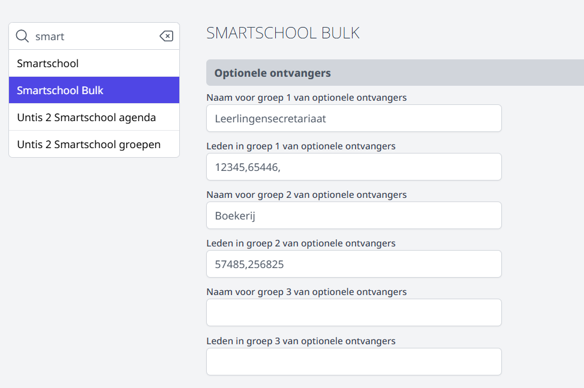
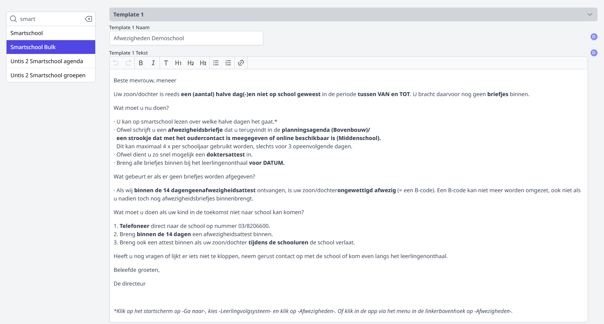
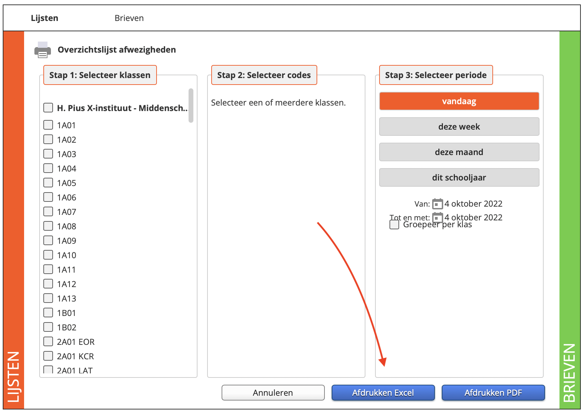
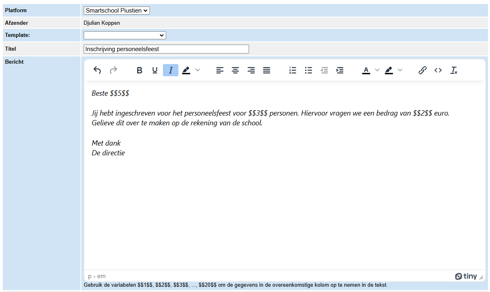
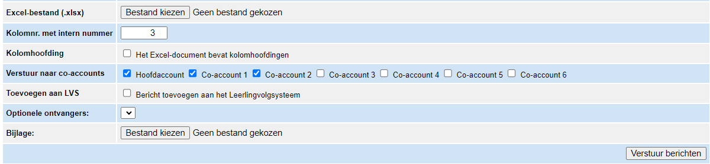

<ImageTitle img="smsbulk.png">Smartschool bulkmail</ImageTitle>

Deze module laat toe om in bulk gepersonaliseerde berichten te verzenden via Smartschool. Je kan de module gebruiken om berichten te versturen naar leerlingen en co-accounts, maar eveneens naar collega's. De module vertrekt vanuit een Excel-document waarin je per lijn de ontvanger opgeeft. Je kan ook per lijn tot 19 bijkomende kolommen invullen waarin je per ontvanger gepersonaliseerde info kan toevoegen. De waarde van die kolommen kan je vervolgens in de tekst van het bericht opnemen als een variabele. Bij het versturen van de berichten, wordt de info uit de bijhorende kolommen samengevoegd tot een gepersonaliseerd bericht per ontvanger.  

## Voorbereiding

### 1. Module activeren

Om de module Smartschool Bulkmail te kunnen gebruiken, moet die geactiveerd zijn via de module **Instellingen > Modules**. Enkel een beheerder in de Toolbox kan modules (de)activeren. Ontdek wie er beheerder door te klikken op het vraagteken rechtsboven in Toolbox. 

### 2. Gebruikersrechten toekennen

Enkel gebruikers met het gebruikersrecht **smartschool_bulkmail** hebben toegang tot deze module en kunnen bulkmails versturen. Het toekennen van gebruikersrechten gebeurt door een beheerder via de module [Gebruikersbeheer](/gebruikersbeheer).

### 3. Algemene configuratie

Via de module **Instellingen > Smartschool bulkmail** kan een beheerder een aantal algemene zaken instellen om bulkmails te kunnen versturen. 

Allereerst is het mogelijk om (een) optionele ontvanger(s) te definiëren. Deze groep ontvangers kan bijgevolg in de module Smartschool Bulkmail gekozen worden om in CC alle bulkberichten van een bepaalde zending te ontvangen. De naam van de groep is een zelf gekozen naam en dient enkel om de groep makkelijk te kunnen  onderscheiden van eventuele andere groepen. Indien je niet wenst te werken met optionele ontvangers, mogen deze velden leeg blijven. 

Bij de leden vul je het intern nummer of de gebruikersnamen in van de betreffende personeelsleden in. Welke van de twee je moet gebruiken, hangt af van wat je hebt ingesteld als uniek veld in Smartschool. Dit kan je nagaan in Smartschool of in Toolbox via de module Instellingen > Smartschool > Uniek veld. Je kan meerdere ontvangers ingeven gescheiden door een komma. 

Verder kan je in de module Instellingen 3 verschillende templates aanmaken. Dit zijn sjablonen die je later in de module Smartschool Bulkmail kan gebruiken voor het opmaken van de bulkberichten. In die module kunnen deze sjabloonteksten nog steeds aangepast worden of kan je verstrekken van een blanco bericht. 

## Gebruik van de module

### Afwezigheden uit Smartschool ophalen
Deze module werd in eerste instantie ontwikkeld om makkelijk te **communiceren over afwezigheden van leerlingen**. In de module 'Afwezigheden' van Smartschool kan je eenvoudig via het 'Afdrukcentrum afwezigheden' een overzichtslijst van de afwezigheden genereren. Die excel kan je meteen gebruiken om via deze module met ouders en/of leerlingen te communiceren.

<Thumbnails img={[
    require('./bulk1.png').default, 
    require('./bulk2.png').default, 
]} />

### Bulkmail versturen

Selecteer eerst en vooral in de module **Smartschool bulkmail** in **Toolbox** bovenaan via welk Smartschoolplatform je berichten wenst te verzenden (indien je meerdere platformen hebt). Vervolgens selecteer je een template die je vooraf hebt aangemaakt in de module Instellingen > Smartschool bulkmail. Na het selecteren van de template wordt automatisch de titel en het bericht aangevuld. Hier kan je nog wijzigingen in aanbrengen. 

Indien je volledig zelf het bericht wil opstellen, selecteer je geen template en vul je rechtstreeks de titel en het bericht in. 

Om de berichten te kunnen personaliseren, moet je nog verwijzen naar de inhoud van de kolommen in het Excel-document. Elke kolom staat gelijk aan een variabele $$1$$ voor kolom 1, $$2$$ voor kolom 2, $$3$$ voor kolom 3, ... $$20$$. Die variabelen worden dan bij het verzenden vervangen door de eigenlijke inhoud van die kolom.

Gebruik je een template altijd in combinatie een Excel-document dat steeds op dezelfde manier is opgebouwd, dan kunnen de variabelen ook ineens in de template worden ingegeven via de module Instellingen > Smartschool bulkmail.  

Selecteer vervolgens het gewenst Excel-document (in .xlsx formaat) en duid aan in welke kolom het systeem de interne nummers van de leerling/het personeelslid kan terugvinden. Voor de afwezigheden is dat momenteel kolom 3.

Bevat het document kolomhoofdingen, dan kan je dat ook aanduiden. Die lijn wordt dan genegeerd en niet gebruikt voor het verzenden van een bericht.

Verder kan je nog aanduiden naar welke accounts het bericht moet gestuurd worden: hoofdaccount en/of co-accounts.

Je kan het bericht ook toevoegen aan het leerlingvolgsysteem door het vinkje aan te zetten. 

Daarnaast kan je nog bijkomende vervangers toevoegen, bv. een directeur of iemand van het secretariaat. Deze ontvangers(groepen) definieer je vooraf in de module Instellingen > Smartschool bulkmail.

Tot slot kan je ook een bijlage meesturen. Deze bijlage kan niet gepersonaliseerd worden en wordt bezorgd aan elke ontvanger op basis van de Excel-lijst. 

### Voorbeeld
Deze module kan je ook gebruiken om in bulk gepersonaliseerde berichten naar bv. personeel te versturen. Als voorbeeld zou je een bijdrage voor het personeelsfeest kunnen vragen. Het Excel-document zou dan deze kolommen kunnen bevatten:

|intern nummer personeelslid| totaalbedrag|aantal personen|naam|voornaam|
|---|---|---|---|---|
|123|15|1|Peeters|Jef|
|456|30|2|Wouters|Marie|
|789|30|2|Janssens|Bernard|

 
**Als tekst zou je volgende deze tekst kunnen gebruiken:**  
        *Beste $$5$$  
        Jij hebt ingeschreven voor het personeelsfeest voor $$3$$ personen. Hiervoor vragen we een bedrag van $$2$$ euro. 
        Gelieve dit over te maken op de rekening van de school.  
        Met dank, 
        De directie *
 
**In het geval van Marie wordt het bericht dan zo verstuurd:**  
        *Beste Marie  
        Jij hebt ingeschreven voor het personeelsfeest voor 2 personen. Hiervoor vragen we een bedrag van 30 euro. 
        Gelieve dit over te maken op de rekening van de school.  
        Met dank, 
        De directie *

**In dit geval stuur je het bericht enkel naar de hoofdaccount. Je vinkt ook aan dat er in de Excel kolomhoofdingen staan.**