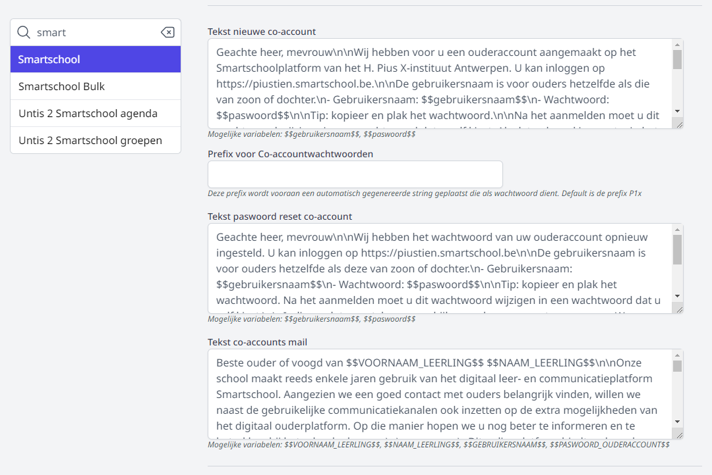
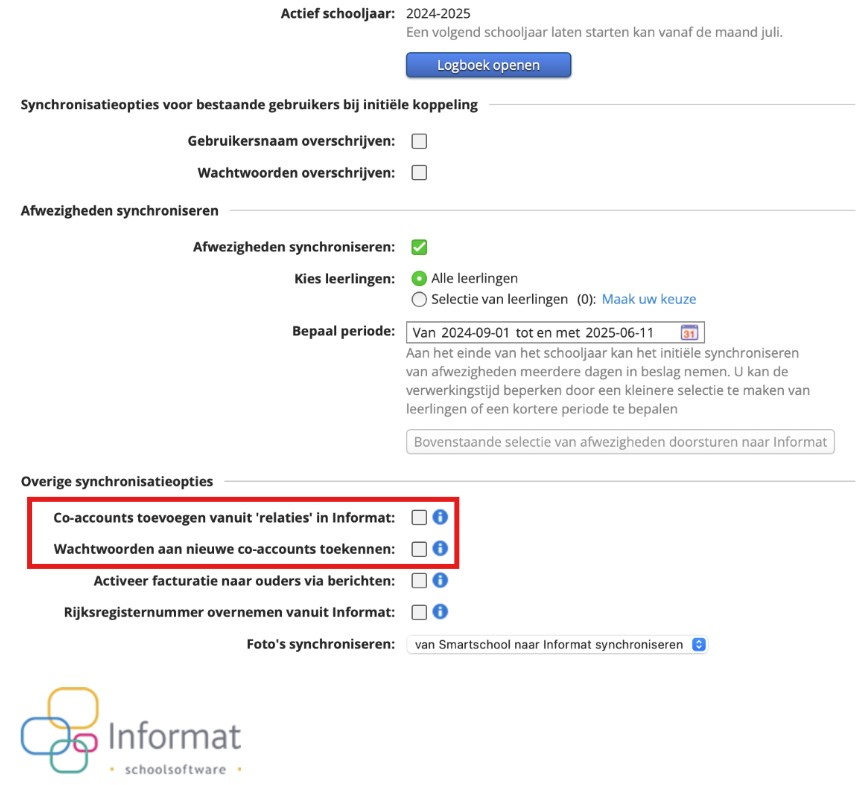
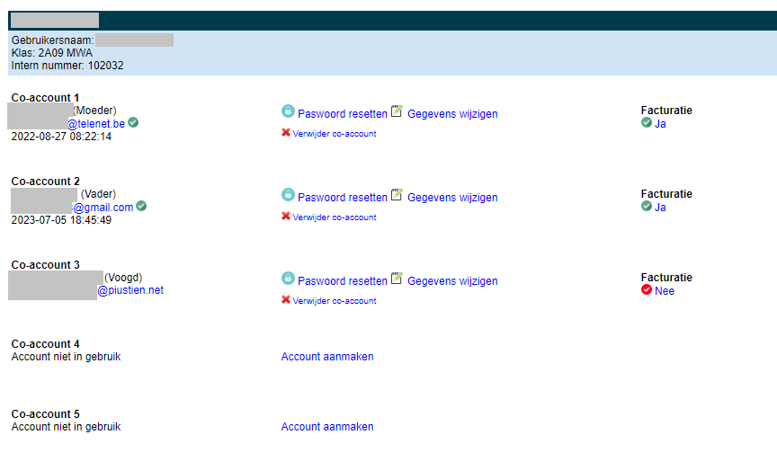
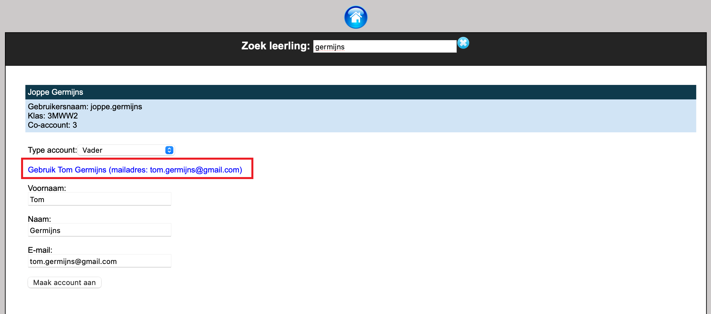
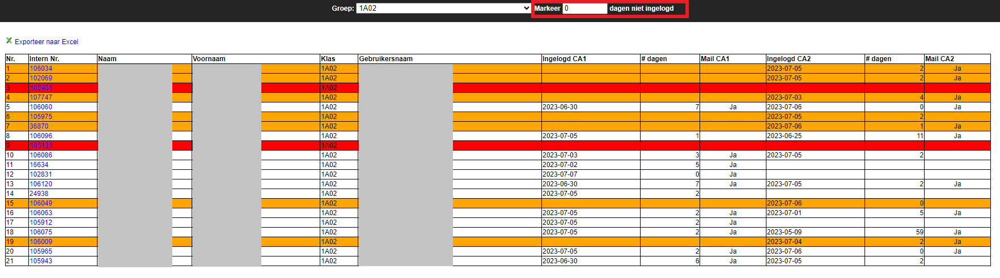

<ImageTitle img="parents.png">Smartschool co-accounts</ImageTitle>

Het is mogelijk om via Toolbox automatisch co-accounts aan te maken in Smartschool op basis van de relaties in het administratief pakket (Informat of Wisa). Het is eveneens mogelijk om volledig manueel een co-account aan te maken via de module **Co-accounts Smartschool**. Daarnaast kunnen de co-accounts rechtstreeks in Toolbox beheerd worden door iedereen met toegang tot deze module zonder dat men smartschoolbeheerder moet zijn. Wanneer een ouder nieuwe logingegevens nodig heeft, kan bv. de onthaalverantwoordelijke of medewerker van het leerlingensecretariaat meteen het wachtwoord resetten. Via deze module kan je ook nagaan wanneer ouders voor het laatst hebben ingelogd en instellen naar welke co-account de leerlingenrekening verstuurd moet worden. 

## 1. Co-accounts automatisch aanmaken (in bulk)

Via de module **[Synchronisatie leerlingen](/synchronisatie/synchronisatie_lln/)** is mogelijk om (in bulk) automatisch co-accounts aan te maken in Smartschool op basis van de relaties in het administratief pakket (Informat of Wisa). Voor elke relatie van een leerling wordt er een co-account en paswoord aangemaakt. De inloggegevens kunnen vervolgens in bulk vanuit Toolbox gemaild worden. Voor leerlingen waarvoor er geen relatie of mailadres te vinden is, wordt er een brief aangemaakt.

- **Stap 1**: Zorg dat alle leerlingen en hun relaties in het adminisratief pakket (Informat of Wisa) zijn ingegeven en dat de leerlingen met Smartschool zijn gesynchroniseerd.
- **Stap 2**: Synchroniseer de leerlingen met Toolbox. Dat doe je in de module [Synchronisatie leerlingen](/synchronisatie/synchronisatie_lln/). Het synchroniseren gebeurt altijd in twee stappen:
  - Informat/Wisa uitlezen = het ophalen van de gegevens uit Informat of Wisa
  - Synchroniseer leerlingen = het intern synchroniseren/gegevens overzetten naar Toolbox
- **Stap 3**: In diezelfde module klik je op **Maak co-accounts**. Je kan die optie best eerst uitvoeren met ‘Wijzigingen worden enkel getoond’, dan wordt er nog niet echt iets aangemaakt. In deze fase gaat Toolbox zoeken naar smartschoolaccounts waarvoor nog geen enkele co-account werd aangemaakt. Je krijgt hierbij al wel een overzicht van alle co-accounts die zullen worden aangemaakt indien je de wijzigingen doorvoert. Klik op de tekst ‘Wijzigingen worden enkel getoond’. Deze zal nu wijzigen naar 'Wijzigen worden doorgevoerd'. Klik vervolgens opnieuw op 'Maak co-accounts'. Voor elk van de leerlingenaccounts wordt nu op basis van de relaties/mailadressen een co-account aangemaakt.

  <Thumbnails img={[
    require('./smsco1.png').default,
    require('./smsco2.png').default, 
  ]} />

- **Stap 4**: Je kan de inloggegevens nu meteen aan alle betrokken personen bezorgen. Klik daarvoor op **Verzend co-accounts**. Daarbij wordt naar elk e-mailadres waarvoor een co-account werd aangemaakt een mail gestuurd met de nodige informatie. Die tekst kan je overigens zelf instellen via de module Instellingen > Smartschool > Platform X > Tekst co-accounts mail. In die tekst kan je dynamische variabelen gebruiken die bij het verzenden van de mail worden vervangen door de eigenlijke waarden. 

  In de Instellingen moet ook een afzender selecteerd worden. Dit is het e-mailadres (bv. van een smartschoolbeheerder of een algemeen mailadres van de school) van waaruit de mail i.v.m. de co-accounts verstuurd mag worden. Indien je hier geen afzender kan selecteren, of niet de juiste afzender, dan moet je die nog aanmaken via de module Instellingen > [E-mail](/e-mail).

  Voor accounts waar geen mailadressen (van ouders) beschikbaar zijn, wordt er één co-account aangemaakt. Die kan je via een brief bezorgen a.d.h.v. een export naar Excel. Deze export is eveneens terug te vinden bij **Verzend co-accounts**.

  
  

:::tip Info
Indien je de co-accounts wil aanmaken via Toolbox, zet je die optie in het administratief pakket (Informat of Wisa) uit.
In de synchronisatieopties van Informat moet er **uitgevinkt** worden dat wachtwoorden automatisch worden toegekend aan nieuwe co-accounts én dat co-accounts worden toegevoegd vanuit 'relaties' in Informat. 

:::

## 2. Co-account manueel aanmaken (individueel)

In de module **Co-accounts Smartschool** is het mogelijk om op individueel leerlingniveau co-accounts aan te maken of de bestaande co-accounts te beheren. Om toegang te krijgen tot deze module, moet het gebruikersrecht 'coaccounts_beheer_platform_x' toegekend zijn via de module [Gebruikersbeheer](/gebruikersbeheer).

Om een co-account aan te maken zoek je op naam van de leerling via <LegacyAction img="parents.png" text="Beheer van co-accounts"/>. Om de volledige leerlingenlijst te tonen, gebruik je een wildcard (%%%). Klik op 'Account aanmaken' om een nieuwe co-account toe te voegen. 

Op basis van de geselecteerde relatie wordt de beschikbare informatie uit Informat opgehaald. Je kan op de blauwe tekst klikken om de velden o.b.v. deze informatie automatisch aan te vullen. Je kan de velden ook manueel invullen. Klik vervolgens op 'Maak account aan'. De nieuwe co-account verschijnt onmiddellijk in het overzicht. Een mail met de logingegevens wordt tevens meteen verstuurd naar het opgegeven e-mailadres. De tekst voor dit e-mailbericht kan je zelf instellen via de module Instellingen => Smartschool => Platform X => Tekst nieuwe co-account. In die tekst kan je dynamische variabelen gebruiken die bij het verzenden van de mail worden vervangen door de eigenlijke waarden. 

## 3. Co-accounts beheren en paswoorden resetten 

In de module **Co-accounts Smartschool** is het eveneens mogelijk om bestaande co-accounts te beheren. Zoek hiervoor op naam van de leerling via <LegacyAction img="parents.png" text="Beheer van co-accounts"/>. Om de volledige leerlingenlijst te tonen, gebruik je een wildcard (%%%).

In het overzicht vind je alle gegevens betreffende de bestaande co-accounts. Zo vind je er het e-mailadres terug maar ook de datum en het tijdstip waarop de co-account voor het laatst heeft ingelogd in Smartschool. Door te klikken op het e-mailadres (blauwe link) opent het mailprogramma en kan je onmiddellijk een e-mail opmaken en versturen naar de co-account.  

Volgende acties zijn mogelijk:

- Klik <LegacyAction img="edit.png"/>  om de gegevens van de co-account te wijzigen (naam, voornaam, e-mailadres of type relatie). 

- Klik <LegacyAction img="remove.png"/> om de co-account volledig te verwijderen.  

- Klik <LegacyAction img="vinkjeGrijsRond.png"/> om de leerlingenrekening al dan niet via Smartschool te ontvangen.  

- Klik <LegacyAction img="lock.png"/> om het wachtwoord van de bijhorende co-account te resetten. 

  Bij het resetten van het wachtwoord wordt er automatisch een mail met de nieuwe logingegevens verstuurd naar het bijhorende e-mailadres. De tekst voor dit e-mailbericht kan je zelf instellen via de module Instellingen => Smartschool => Platform X => Tekst paswoord reset co-account. In die tekst kan je opnieuw dynamische variabelen gebruiken die bij het verzenden van de mail worden vervangen door de eigenlijke waarden van de betreffende co-account. 

## 4. Rapportage co-accounts

In de module **Co-accounts Smartschool** kan je via <LegacyAction img="report.png" text="Rapportage co-accounts"/> per klas een rapport opvragen van de co-accounts en wanneer zij voor het laatst hebben ingelogd. Op die manier kan je snel en eenvoudig nagaan welke ouders Smartschool nog niet (voldoende) gebruiken. 

Per leerling zie je in de tabel wanneer co-account 1 (CA1) en co-account 2 (CA2) voor het laatst hebben ingelogd alsook hoeveel dagen dat geleden is. Als co-account 1 nog nooit heeft ingelogd is de lijn oranje gekleurd. Hebben beide co-accounts nog nooit ingelogd, is de lijn rood. Je kan bovenaan optioneel het aantal dagen ingeven. Alle co-accounts die langer dan X-aantal dagen niet hebben ingelogd, kleuren dan rood.  

Door te klikken op het intern nummer van de leerling opent het scherm waarin je de co-accounts kan beheren. Van hieruit kan je via mail rechtstreeks contact opnemen met de co-accounts of de gegevens van een co-account wijzigen. Voor meer info zie de sectie hierboven over co-accounts beheren en paswoorden resetten.

De gegevens uit het rapport kunnen geëxporteerd worden naar Excel. Het Exceldocument bevat eveneens de e-mailadressen van de co-accounts. 

