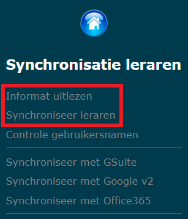
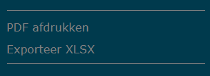
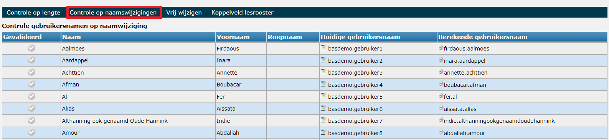

<ImageTitle img="leraren.png">Synchronisatie leraren</ImageTitle>

In Toolbox moeten personeelsleden nooit manueel worden aangemaakt. Het vertrekpunt is steeds het administratief pakket waar het personeelsdossier up-to-date gehouden wordt. Via de synchronisatiemodules in Toolbox worden de gegevens van personeelsleden opgehaald uit Informat of Wisa. In de module Instellingen > Synchronisatie leraren kan je instellen uit welke software die gegevens moeten komen.

Toolbox maakt gebruik van het intern nummer (pointer) uit Informat of Wisa. Bij Informat is dat nummer sowieso uniek. Bij Wisa kan het voorvallen dat een leerling en een personeelslid eenzelfde intern nummer hebben gekregen. Om dat op te lossen kan er in de module Instellingen een prefix ingesteld worden die voor de pointer wordt gezet. Op die manier kunnen leraren en leerlingen uit elkaar gehouden worden.

Na het ophalen van de gegevens worden gebruikersnamen aangemaakt. Het formaat kan je ook zelf definiëren via de module Instellingen > Synchronisatie leraren. Het is eveneens mogelijk om een maximale lengte in te stellen: gebruikersnamen worden dan ingekort. Staat de lengte op 0, dan is er geen limiet.

## Synchroniseren

Het synchroniseren gebeurt altijd in twee stappen:

1. Informat/Wisa uitlezen = het ophalen van de gegevens uit Informat of Wisa
2. Synchroniseer leraren = het intern synchroniseren/gegevens overzetten naar Toolbox

Daarna kan er gesynchroniseerd worden met andere software al naargelang die optie is aangevinkt in de module Instellingen > Synchronisatie leraren. 

## Inloggegevens

Via **PDF afdrukken** in de synchronisatiemodule kan je de gebruikersnamen en wachtwoorden voor de leraren afdrukken en/of versturen per e-mail. Toolbox gebruikt het e-mailadres dat is ingegeven in het administratief pakket. Je kan zelf bepalen hoe die PDF eruit ziet via de module Instellingen > PDF leerlingen (...). Er zijn heel wat dynamische variabelen beschikbaar waardoor het document dynamisch wordt samengesteld en de variabelen worden vervangen door de overeenkomstige gegevens voor het betreffende personeelslid. Dat stelt je in staat om ineens heel wat info mee te geven zoals bv. inloggegevens voor andere softwareplatformen. Je kan deze gegevens ook exporteren naar Excel. 

## Gebruikersnamen controleren en/of wijzigen
In de synchronisatiemodule kan je de gebruikersnamen van personeelsleden controleren en indien nodig te wijzigen. Klik hiervoor in het menu links op **Controle gebruikersnamen**. Hier kan je controleren op lengte of op naamswijziging. In deze twee overzichten krijg je enkel de gebruikersnamen te zien waar een controle voor moet gebeuren, bv. omdat er in het administratief pakket een naamswijziging heeft plaatsgevonden en de huidige gebruikersnaam niet overeenkomt met de voorgestelde gebruikersnaam door Toolbox of omdat een gebruikersnaam langer is dan 20 karakters. Een gebruikersnaam wijzigen kan met behulp van het groene potloodje <LegacyAction img="edit.png"/>. Heb je een gebruikersnaam gecontroleerd en is die goed bevonden, dan kan je vooraan aanvinken dat de gebruikersnaam gevalideerd is. 

Bij de **controle op naamswijzigingen** krijg je 2 kolommen met gebruikersnamen te zien. Enerzijds de huidige gebruikersnaam en anderszijds de (door Toolbox) berekende gebruikersnaam. De berekende gebruikersnaam overnemen kan heel eenvoudig door te klikken op het bijhorende icoontje <LegacyAction img="config.png"/>.

Je kan de gebruikersnamen ook vrij wijzigen. Dan krijg je een lijst te zien van alle personeelsleden. Wijzigen kan ook hier door middel van het potloodje <LegacyAction img="edit.png"/>.

:::tip 
Lukt het voor een gebruiker niet om in te loggen in Toolbox via de koppeling met MS Office of Smartschool? Controleer dan steeds of de gebruikersnaam in MS (alles voor de @schoolnaam.be) of Smartschool overeenkomt met de gebruikersnaam in Toolbox. Indien dat niet het geval is, pas je één van op hogervermelde manieren de gebruikersnaam aan in Toolbox. 
:::

Tot slot kan je onder het menu 'Controle gebruikersnamen' ook het **koppeldveld voor het lesrooster** controleren en eventueel wijzigen. Dit koppelveld wordt gebruikt om een leraar uit Toolbox te koppelen met de overeenkomstige leraar uit het roosterprogramma. Dit is enkel van toepassing voor scholen die werken met de modules [Lessenrooster](/lessenrooster), [Afwezigheden](/afwezigheden) en [Vervangingslijsten](/vervangingslijsten). Klik [hier](/lessenrooster/uurrooster_beheren/#controle-lessenrooster) voor meer info. 

## Koppeling met administratief pakket 
### Gegevens uit Informat ophalen
Het ophalen van gegevens uit Informat gebeurt via de webservices van Informat. Hiervoor zijn drie WSDLs voorzien:

Algemeen
https://webservice.informatsoftware.be/wsInfSoft/wsInformat.asmx?wsdl 

Leerlingen
https://webservice.informatsoftware.be/wsInfSoftLeerlingen.asmx?wsdl 

Leraren
https://webservice.informatsoftware.be/wsInfSoftpersoneel.asmx?wsdl

Om de gegevens op te kunnen halen, moet in Informat een gebruiker worden aangemaakt. Die moet in een Toegangsgroep (niet in een Programmagroep) zitten met leesrechten op de nodige instellingen.
Belangrijk: na het aanmaken van die gebruiker, vraag je via de Informat helpdesk om deze gebruiker te koppelen aan de webservices, incl. de KOBAM webservices.

In de instellingen vul je zeker ook de instellingsnummers in waarvoor je gegevens wenst op te halen.

Als de verschillende instellingsnummers bij Informat in één databank zitten én de aangemaakte gebruiker heeft rechten op al die instellingsnummers, zullen de gegevens zonder problemen doorkomen.

Heb je echter een gebruiker die geen toegang heeft tot alle instellingsnummers, dan kan je in de instellingen bijkomende gebruikers/paswoorden opgeven. In de configuratie gebruikers webservice kan je dan aangeven voor welke instellingsnummers een andere gebruiker moet gebruikt worden dan de standaard gebruiker.

Bijvoorbeeld: voor de instellingsnummers 117093 en 048728 moet een andere gebruiker worden gebruikt dan de standaard gebruiker die is ingevuld bij Gebruiker webservice Informat. Dan voeg je die bijkomende gebruiker bij Gebruiker/paswoord webservice Informat 2 toe.

In de configuratie zet je deze regels:

117093=2;
048728=2;

Die regels zeggen dat voor die twee instellingsnummers de tweede gebruiker/paswoord moet worden gebruikt.

### Gegevens uit Wisa ophalen

Om gegevens uit Wisa op te halen, moeten er enkele stappen doorlopen worden:

Zorg dat de Wisa webservices geïnstalleerd staan op de Wisa server. Staat de server bij Wisa, dan mag je deze stap overslaan. Staat de server in jouw school, dan moet je deze stap zeker nakijken.
Handleiding hiervoor: WISA_API_Service.pdf
In het Querybeheer moeten 3 queries worden toegevoegd:
Leerlingen algemene informatie
Leerlingen loopbanen
Leerlingen bijkomende informatie
Personeel

De inhoud van deze queries wordt bij de opstart van Toolbox doorgestuurd.
In de instellingen van Toolbox - Wisa vul je bij Queries de namen van de verschillende queries in. TB_LLN, TB_LLNLB, TB_LLNDATA en TB_PERS zijn de standaard namen.
In Wisa maak je een gebruiker aan die leesrechten heeft op de nodige instellingsnummers. De credentials van die gebruiker vul je in bij Instellingen - Wisa - Authenticatie.
Vul ook de naam van de databank in alsook de SOAP url van de webservice. Die ziet er meestal zo uit: http://londen.wisa-asp.net:8080/SOAP?service=WisaAPIService
Als dat is gebeurd, komen de huidige leerlingen en leraren binnen via de synchronisatie.

Wil je de leerlingen/personeel van een andere datum opvragen, dan vul je bij de Synchronisatiedata (instellingen - Wisa) de gewenste datum in. Op die manier kan je bijvoorbeeld eind augustus al de leerlingen die in september beginnen opvragen.

