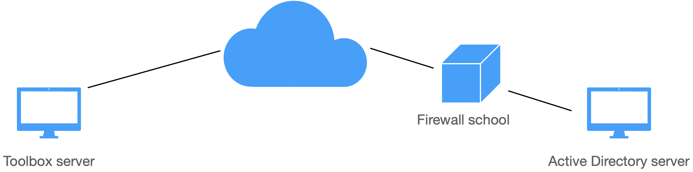

Aangezien Toolbox in de cloud draait en moet kunnen communiceren met de ActiveDirectory die (meestal) in de school draait, werd een bijkomende component 'Toolbox Gateway' ontwikkeld.

Toolbox Gateway draait op de AD of op een machine die verbonden is met de AD. De gateway bestaat uit een webserver (IIS) en enkele PHP/Powershell scripts. Die zorgen voor een beveiligde verbinding tussen Toolbox en de ActiveDirectory.

 

## Webserver installeren

Om Toolbox te laten communiceren met de ActiveDirectory in de school, moeten we de Toolbox Gateway installeren. Die vereist eerst en vooral de installatie van een Webserver (IIS) die PHP kan draaien.

De webserver mag geïnstalleerd worden op de ActiveDirectory server zelf of op een (virtuele) Windows server in het netwerk van de school die ook lid is van het AD domein.

Voeg eerst en vooral een 'Rol' toe via de server manager.

<Thumbnails img={[
    require('./webserver1.png').default, 
    require('./webserver2.png').default, 
    require('./webserver3.png').default, 
    require('./webserver4.png').default, 
]} />

Vink Web Server (IIS) aan

<Thumbnails img={[
    require('./webserver5.png').default, 
]} />

Installeer de Management Console mee (staat standaard aan).

<Thumbnails img={[
    require('./webserver6.png').default, 
]} />

In het volgende scherm vink je de module Active Directory for powershell aan.

<Thumbnails img={[
    require('./webserver7.png').default, 
]} />

In het scherm 'Select role services' vink je onder Application Development de optie 'CGI' aan.
 
<Thumbnails img={[
    require('./webserver8.png').default,
    require('./webserver9.png').default,  
]} />

Bevestig

<Thumbnails img={[
    require('./webserver10.png').default,
    require('./webserver11.png').default,  
]} />

Ben je hiermee klaar, ga dan verder: PHP installeren op je webserver

## PHP op de webserver installeren

Ga naar https://windows.php.net - Downloads

Download daar de X64 Non Thread Safe versie van PHP (in zip formaat).

<Thumbnails img={[
    require('./PHP1.png').default,
    require('./PHP2.png').default,  
]} />

Pak dit zip-bestand uit in de locatie c:\php.

<Thumbnails img={[
    require('./PHP3.png').default,
]} />

Om te testen of PHP werkt, dubbelklik je op php-cgi.exe. Als je een foutmelding krijgt over een ontbrekende DLL, dan moet je de C++ redistributable 2015-2019 installeren.

    The VC15 and VS16 builds require to have the Visual C++ Redistributable for Visual Studio 2015-2019 x64 or x86 installed.

Zorg eerst dat PHP opstart alvorens verder te gaan!

Wijzig de naam van het bestand php.ini-production naar php.ini.

Open het bestand en zoek naar fastcgi.impersonate = 1. Haal daar de puntkomma voor die lijn weg en bewaar het bestand. Activeer ook de extensie openssl: extension=openssl (puntkomma verwijderen voor deze lijn).

<Thumbnails img={[
    require('./PHP4.png').default,
]} />

Ga naar de Internet Information Services Manager.

<Thumbnails img={[
    require('./PHP5.png').default,
]} />

Ga naar de Handler Mappings en voeg een Module Mapping toe.

<Thumbnails img={[
    require('./PHP6.png').default,
]} />

Vul volgende instellingen in:

- Request path: *.php
- Module: FastCgiModule
- Executable: C:\php\php-cgi.exe
- Name: PHP via FastCGI

<Thumbnails img={[
    require('./PHP7.png').default,
]} />

Maak nu door middel van Kladblok een testbestand aan in de map c:\inetpub\wwwroot. 
Noem dit bestand test.php (let op daar er geen verborgen .txt extensie achter staat).
In het bestand zet je deze inhoud: 
```powershell
    <?php
    phpinfo();
    ?>
 ``` 

Surf nu op de server naar http://localhost/test.php. Als alles goed gaat, krijg je deze pagina te zien:

<Thumbnails img={[
    require('./PHP8.png').default,
]} />

## Toolbox gateway AD installeren

Download de laatste versie van Toolbox Gateway op https://www.tbvs.be/downloads/ToolboxGateway1_5_0.zip (versie 01 februari 2023).

Plaats de uitgepakte map op de C: schijf en hernoem de map naar toolbox.

Als je de Toolbox Gateway enkel gebruikt voor de communicatie met de ActiveDirectory, mag je de mappen 'poorten' en 'uniflow_edu' verwijderen uit de map php.

De mappen zien er dan zo uit:

<Thumbnails img={[
    require('./gateway1.png').default,
    require('./gateway2.png').default,
]} />

Ga naar de map powershell en selecteer het eerste powershell-script. Klik rechts en vraag de eigenschappen op. Mogelijk krijg je onderaan een 'Security' melding. Vink dan het vinkje bij Unblock aan en bevestig met OK. Herhaal dit voor de andere powershell-scripts.

<Thumbnails img={[
    require('./gateway3.png').default,
]} />

Ga naar het IIS-beheer, klap het menu links open en selecteer de Default Website. Klik rechts en voeg een virtuele map toe.

<Thumbnails img={[
    require('./gateway4.png').default,
]} />

Als Alias vul je ‘toolbox’ in.

Bij Fysiek pad, selecteer je de php map in de Toolbox Gateway (c:\toolbox\php).

Bij verbinden als vul je een Administrator in die mag schrijven in de ActiveDirectory.

<Thumbnails img={[
    require('./gateway5.png').default,
]} />

Ga naar de map php - inc en open het bestand config.php.

In de variabele $toolbox_url = ''; Vul je het adres van je Toolbox in. bv. $toolbox_url = 'https://piusx.kobam.be'; of $toolbox_url = 'https://mijnschool.tbvs.be';

In de variabele $ad_key zet je een zelfgemaakte willekeurige sleutel die cijfers en (hoofd)letters bevat. bv.
$ad_key = 'v4ZD7RJ9Xsd8947E7beV4SvY4rfeDqhDil';

Als je de Toolbox Gateway enkel gebruikt voor de communicatie met ActiveDirectory mag je de uniflow_key en de poort_key negeren.

In de lijst van $allowed_ips voeg je het IP-adres van je Toolbox toe. Staat je Toolbox op de tbvs.be server, dan is dat IP 217.19.239.174:  $allowed_ips = array('217.19.239.174');

Configureer vervolgens op je firewall van de school één poortforwarding zodat de webserver (IIS) die je hebt geïnstalleerd van buitenaf toegankelijk is. Welke poort je gebruikt, mag je zelf kiezen.

Ga nu naar je Toolbox - Instellingen - ActiveDirectory. In het onderdeel Gateway vul je nu volgende gegevens in:
- Push Key: de sleutel die je in de variabele $ad_key hebt gezet
- URL Gateway: de URL waarop je je webserver kan bereiken. 

Dat kan via een (vast) IP adres zijn: bv. http://12.34.56.78/toolbox/ (als je poort 80 hebt gebruikt) of http://12.34.56.78:8001/toolbox/ als je een portforwarding op poort 8001 hebt gemaakt.
Bij de toegelaten IP-adressen vul je het IP-adres van je Toolbox Gateway in (meestal is dat hetzelfde als dat van de URL van je Toolbox). Je kan meerdere IP-adressen invullen door ze met komma's te scheiden (bv. als je meerdere gateways hebt voor je internetverbinding).
Klik nu op Test gateway om te kijken of Toolbox verbinding kan maken met je Toolbox Gateway.

<Thumbnails img={[
    require('./gateway6.png').default,
]} />

Vul nu in de instellingen in Toolbox - ActiveDirectory de standaard OU voor bv. leraren in. Ga dan naar de synchronisatie Leraren - Synchroniseer met ActiveDirectory. Klik vervolgens op Start volledige synchronisatie en kijk of er resultaten doorkomen.

Indien er geen resultaten doorkomen, controleer je of de PowerShell scripts uitgevoerd kunnen worden. Dat doe je op de Toolbox Gateway server. Selecteer in de map c:\toolbox\powershell het bestand getLerarenJson.ps en kies om te bewerken. Voer het script uit en vul de OU in. Hier zal je nu json output moeten doorkrijgen. Krijg je fouten over unsigned scripts, voer dan deze twee commando's uit als administrator (PowerShell opstarten als administrator):

    Set-ExecutionPolicy -ExecutionPolicy Unrestricted
    dir C:\toolbox\PowerShell\* | Unblock-File
 