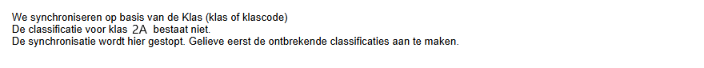

## Synchroniseren

Nadat de meest recente leerlingen- of lerarengegevens zijn opgehaald uit Informat/Wisa en geynchroniseerd met Toolbox, kan je vanuit Toolbox automatisch relatiefiches aanmaken of wijzigen in Exact Online (EOL). 

Het synchroniseren gebeurt vanuit de betreffende synchronisatiemodule (leraren, leerlingen basischool) in Toolbox.

:::caution
Indien de vzw werkt met een overkoepelende Toolbox, kan de synchronisatie met EOL enkel vanuit die centrale Toolbox uitgevoerd worden. Om deze synchronisatie te kunnen doen, is een account in EOL vereist. De eerste twee stappen van de synchronisaties moeten ook nog steeds in de afzonderlijke schooltoolboxen gebeuren om in de verschillende Toolbox-modules gebruik te kunnen maken van de correcte en meest actuele leerlingen- en personeelsgegevens.
:::

Na de eerste twee gebruikelijke stappen volgt er nog een derde stap:

1. Informat/Wisa uitlezen = het ophalen van de gegevens uit Informat of Wisa
2. Synchroniseer leerlingen = het intern synchroniseren/gegevens overzetten naar Toolbox
3. Synchroniseer met Exact Online 

Klik op <LegacyAction img="sync.png" text="Start volledige synchronisatie"/>

Na de volledige synchronisatie zie je een overzicht van alle opgehaalde leerlingen/leerkrachten en de mogelijke wijzigingen. 
Deze wijzigingen worden niet automatisch doorgezet naar Exact Online. Daarvoor moet je terugkeren naar het vorige scherm via de <LegacyAction img="home.png"/> knop. 

 

Vanuit dit scherm kan je de wijzigingen effectief doorzetten naar Exact Online. 

Als je alle wijzigingen ineens wil doorvoeren, volstaat het op te klikken op <LegacyAction img="play.png" text="Voer deze wijzigingen door in Exact Online"/>. **Alle wijzigingen** in dit overzicht worden nu doorgevoerd, ook diegene die niet zijn geselecteerd!

Indien je bepaalde wijzigingen **niet** wil doorvoeren, vink je die aan en verwijder je ze uit de lijst door middel van het <LegacyAction img="remove.png"/> bovenaan of achteraan. Deze wijzigingen worden hiermee **niet** definitief verwijderd en worden bij een volgende synchronisatie opnieuw getoond. 
:::danger Opgelet
Hier geldt dus de omgekeerde denkwijze:
- Niet aanvinken = overzetten
- Wel aanvinken om te kunnen verwijderen.
:::

Indien je bepaalde wijzigingen wil wegfilteren uit de lijst, dan kan je gebruik maken van het filtericoontje <LegacyAction img="filter.png"/>. Door dit bij één item aan te klikken, worden alle items van dezelfde type ineens geselecteerd. Klik bovenaan op het rode kruisje om deze wijziging (tijdelijk) uit de lijst te verwijderen. Zoals eerder gezegd zijn de wijzigingen hiermee niet definitief verwijderd. Bij een volgende synchronisatie worden de verwijderde wijzigingen opnieuw getoond. 

:::danger Tip
Wanneer de wijzigingen zijn doorgezet naar Exact Online, scroll dan door de resultatenlijst tot helemaal onderaan en ga na of er fouten worden getoond en zo ja welke. Indien er fouten zijn, moeten die worden aangepast, zo niet zal de synchronisatie naar Exact Online niet uitgevoerd kunnen worden. 
:::

## Meest voorkomende problemen/foutmeldingen:
### Error 429

    

    Je hebt al heel veel gesynchroniseerd en het maximaal aantal API calls is bereikt. Deze foutmelding komt vooral voor bij het begin van het schooljaar. Dan moeten er over het algemeen heel veel wijzigingen gebeuren. Zo moet de klas van elke leerling aangepast worden, nieuwe leerlingen en personeelsleden worden toegevoegd, ... Exact Online legt limieten op in het aantal wijzigingen dat je per minuut/uur/dag mag doen. Krijg je een foutmelding 429, dan heb je één van die limieten overschreden. Zeker in grotere dossiers kom je hier al snel aan. Soms volstaat het om een minuut of een uur te wachten en dan verder te gaan, maar als je daglimiet is overschreden, dan kan je de volgende wijzigingen pas de dag nadien doorvoeren.

### De classificatie voor (een) bepaalde klas(sen) bestaat nog niet in Exact Online

    

    Ook deze foutmelding komt nagenoeg alleen voor bij het begin van het schooljaar wanneer er klasbenamingen zijn gewijzigd of nieuwe klassen zijn toegevoegd. Om te kunnen synchroniseren naar Exact Online, moeten die nieuwe klassen ook daar eerst worden aangemaakt. 

    Hiervoor open je Exact Online best in een ander browservenster naast Toolbox. Ga vervolgens in de instellingen van Exact Online naar de **Stamgegevens - classificaties (relaties)**. 

    
    

    Onder classificatie 4 zal je de reeds aangemaakte klassen zien staan. Kopieer nu elke klas uit de lijst in Toolbox één voor één en voeg die toe als nieuwe klas binnen classificatie 4.

    Als dat is gebeurd, laat je de synchronisatie in Toolbox opnieuw lopen. Dan zou de lijst met toe te voegen klassen moeten verdwijnen en zou de eigenlijke 
    synchronisatie van start moeten gaan.

### Leerlingen worden niet automatisch uitgeschreven in EOL

    Kijk na of de klas 'UIT' bestaat in Exact Online. Is dat niet het geval, dan kan je die toevoegen volgens de werkwijze die in vorig punt werd opschreven. Dat gebeurt op dezelfde manier als het toevoegen van een klas. 
    
### Bankrekeningnummer
    Enkel het bankrekeningnummer (uit Informat) van personeelsleden kan worden toegevoegd aan Exact Online via de synchronisatie in Toolbox. Voor leerlingen kunnen we deze gegevens niet ophalen. Er zijn enkele situaties mogelijk:
        - Het toe te voegen/te wijzigen rekeningnummer is **nog niet gekend in EOL** => Toolbox voegt het bankrekeningnummer toe en stelt het automatisch in als hoofdrekeningennummer in Exact Online. 
        - Het rekeningnummer is **al wel gekend in EOL**, maar er is reeds een ander rekeningnummer ingesteld als hoofdrekeningnummer => Een manuele ingreep in Exact Online is nodig. Het rekeningnummer dat Toolbox voorstelt, moet in EOL (manueel) aangevinkt worden als hoofdrekeningnummer.  

### Een personeelslid wordt niet aangemaakt met de juiste code
    Het kan voorkomen dat een personeelslid vroeger leerling was in een school uit de regio en dus al gekend is in Informat én in het boekhouddossier. Wanneer een leerling later personeelslid wordt, dan blijft de pointer uit Informat van deze persoon behouden. In Exact Online is deze persoon ook reeds gekend, maar niet als personeelslid. Er moet dus geen nieuwe relatiefiche worden aangemaakt. De bestaande fiche moet worden gewijzigd, met name de classificatie 2 (Soort) moet worden omgezet van Leerling naar Personeel Onderwijs.  

    Toolbox zal in eerste instantie wel een nieuw relatiefiche toevoegen (met een ander nummer dan de pointer). Wanneer er gedetecteerd wordt dat de bestaande account overeenkomt met de nieuw aan te maken account, zal Toolbox de zojuist (dubbel) aangemaakte account met het verkeerde nummer zelf terug verwijderen en de classificatie 2 in de bestaande account omzetten van Leerling naar Personeel Onderwijs. In dergelijk geval krijg je onderstaande melding te zien. Voor de zekerheid kan je dit best nog even nakijken in Exact Online. 

    

