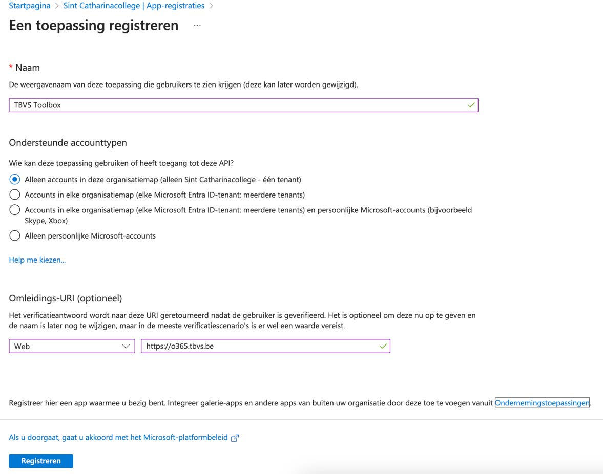
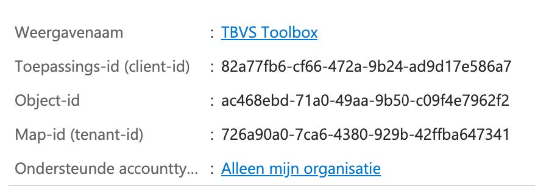
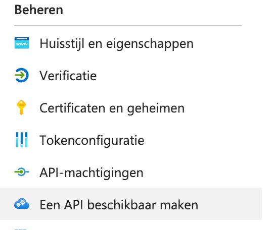
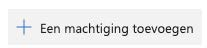
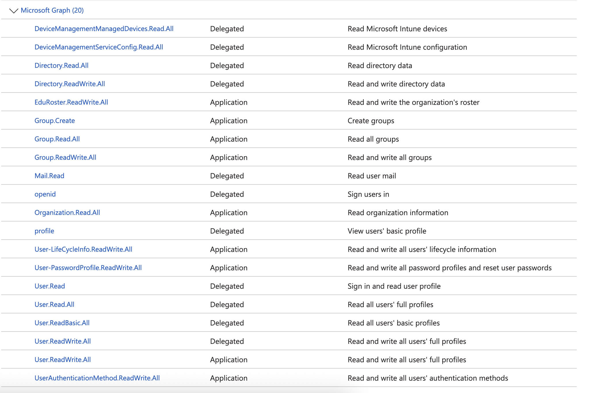
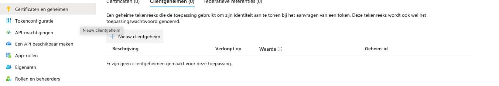
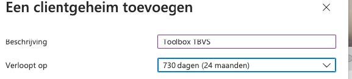
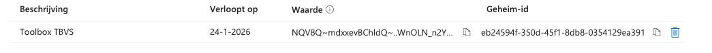
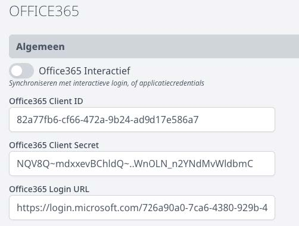

Met deze handleiding kan je vanuit Toolbox synchroniseren met Office365 zonder dat de Toolboxgebruiker zelf beheerdersrechten moet hebben in Azure AD.
Deze instellingen moeten ook gebeuren als je via de module Microsoft, de wachtwoorden van leerlingen wilt kunnen (laten) resetten.

## Stap 1: nieuwe app-registratie 
Ga naar de Azure AD / Entra ID Portal en klik links op “App-registraties” <LegacyAction img="app_registraties.jpg"/> en vervolgens op “Nieuwe registratie” <LegacyAction img="nieuwe_registratie.jpg"/>.

- Vul als naam iets betekenisvol in, bijvoorbeeld “KOBA Toolbox”.
- Duid aan dat alleen accounts in de organisatie toegang mogen hebben.
- Vul bij omleidings-URI de juiste url in o.b.v. het hoofddomein van de toolbox: https://o365.kobam.be, https://o365.kobank.be, https://o365.noordkant.be, https://o365.kobavoorkempen.be, https://o365.kobart.be, https://o365.kobazuidkant.be, https://o365.kobazuiderkempen.be, https://o365.kobaheli.be, https://o365.tbvs.be
- Klik op Registreren.

 

- Kopieer de Toepassings-id (client-id) en de Map-id (tenant-id) van het volgende scherm.

 

## Stap 2: machtiging toevoegen
In het volgende scherm klik je links onder Beheren op "API-machtigingen" en dan op “Een machtiging toevoegen”.

 
 

Klik in de verschenen balk op “Microsoft Graph” en dan op “Toepassingsmachtigingen”.

<Thumbnails img={[
    require('./sync_0365_4.jpg').default, 
    require('./sync_0365_5.jpg').default, 
]} />

Voeg de volgende machtigingen toe:

 

Daarna klik je bovenaan de tabel op “Beheerderstoestemming verlenen voor …”

## Stap 3: clientgeheim toevoegen

Ga naar “Certificaten en geheimen” en klik op “Nieuw clientgeheim”.

 

Geef een passende beschrijving in en zet de verloopdatum zover mogelijk vooruit (maximum 2 jaar).

 

Kopieer de tekst die in de kolom “Waarde” staat.

 

## Stap 4: credentials instellen in Toolbox

Ga naar de Toolbox => Instellingen => Office 365.

- De Toepassings-id uit stap 1 vul je in bij de Client ID.
- De gekopieerde “waarde” uit stap 3 vul je in bij de Client Secret.
- Bij de login URL vul je de volgende URL in waarbij je de *** vervangt door de Map-id (tenant-id) uit stap 1: https://login.microsoft.com/***/oauth2/token .

Dat ziet er dan ongeveer zo uit:

 

Als je de knop “Office365 Interactief” uitzet, maak je in de synchronisatie gebruik van de client ID en hoef je dus geen beheerder meer te zijn om de synchronisatie te kunnen uitvoeren.