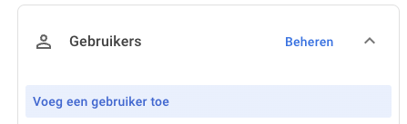

Om Toolbox te kunnen synchroniseren met Google Workspace, moeten er een aantal zaken worden ingesteld. 

## 1. Google Workspace Setup

Wanneer er in de google UI naar tekst verwezen wordt, gebruiken we standaard de Nederlandstalige labels. De Engelse vertaling wordt telkens tussen haakjes vermeld.

## 2. Een serviceaccount aanmaken

Zorg er eerst voor dat er een project is in [Google Cloud](https://console.cloud.google.com) waarin je een service account kan aanmaken. Je mag een bestaand project selecteren, maar we raden aan om een project specifiek voor Toolbox aan te maken. Bovenaan in de Cloud Console is er een dropdown beschikbaar voor projecten, waar je ook meteen een nieuw project kan aanmaken.
 
 
 

- Selecteer het gewenste project en ga vervolgens naar 'APIs & Services > Bibliotheek' (APIs & Services > Library). Zoek hier naar de 'Admin SDK API', en schakel hem in.
   
- Ga nu naar 'APIs & Services > Inloggegevens' (APIs & Services > Credentials) en klik op 'Inloggegevens maken > Serviceaccount' (Create Credentails > Serviceaccount). 
 
- Geef de naam 'toolbox' op voor de accountnaam en klik op 'aanmaken' tot je op het overzichtsscherm van de API accounts komt. 
 
- Klik op de account die je net aangemaakt hebt en selecteer de tab 'Sleutels' (Keys). 
  
- Hier klik je op de knop 'Sleutel toevoegen' > 'Nieuwe sleutel maken' (Add key > Create new Key). 
 
- Selecteer de JSON optie en download het sleutelbestand.
  

## 3. Een admin account aanmaken

De service account die je net hebt aangemaakt, kan in principe enkel gebruikt worden om zonder gebruikersinteractie geauthenticeerde API calls te maken. Er dient nog een gebruiker aangemaakt te worden door wie de wijzigingen in de achtergrond zullen worden doorgevoerd. In principe kan hiervoor een bestaand, persoonlijk admin account gebruikt worden, maar i.v.m. continuiteit raden we aan om hiervoor een nieuw account, specifiek voor toolbox, in te richten.

Ga naar https://admin.google.com en maak daar een gebruiker aan, toolbox@[domein]. Zorg ervoor dat deze gebruiker rechten heeft op alle mogelijke rechten in de groep 'Gebruikers' (Users).
  
  

Als laatste moeten we onze API nog toegang geven tot de directory. 
- Ga hiervoor in de Adminconsole naar 'Beveiliging > Toegangs- en Gegevenscontrole > API functies' (Security > Access & data control > API controls), en ga onderaan de pagina naar 'Domeinbrede machtigingen' (Domain-wide delegation). 
- Klik op 'Nieuw toevoegen' (Add new). Plak onder het 'Client-Id' het 'Client-Id' uit het JSON-bestand dat je eerder downloadde en voeg volgend Oauth bereik toe:
https://www.googleapis.com/auth/admin.directory.user .
- Klik nu op 'Autoriseren' (Authorise).

In de Toolboxinstellingen > Google vul je onderaan de inhoud van de json in, en ook de gebruikersnaam van de account die je hebt aangemaakt.
 