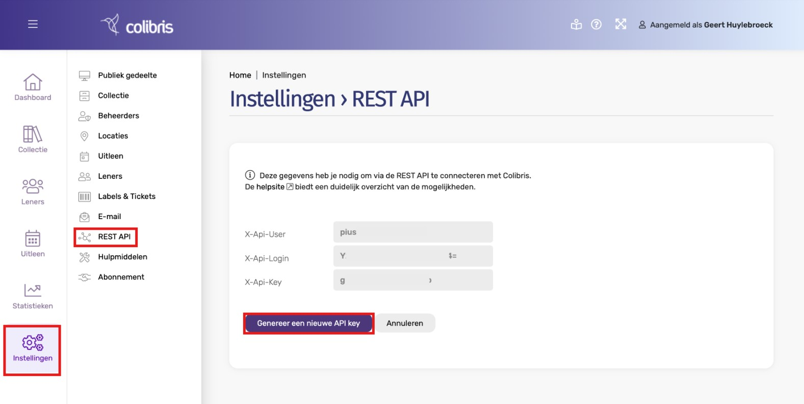
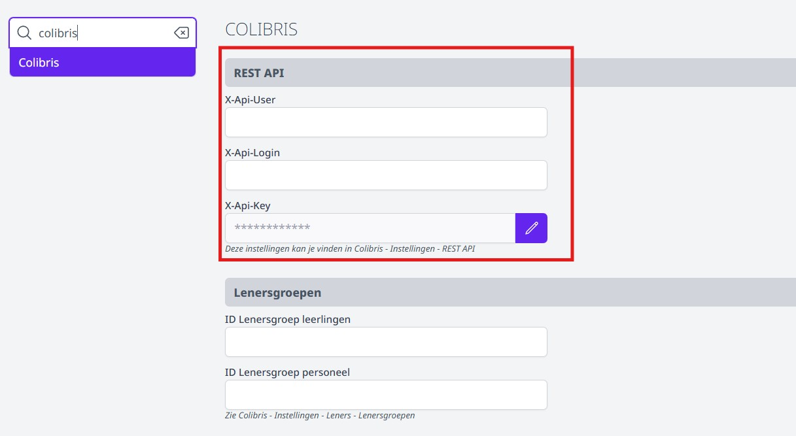
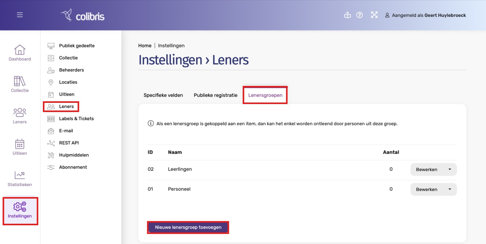
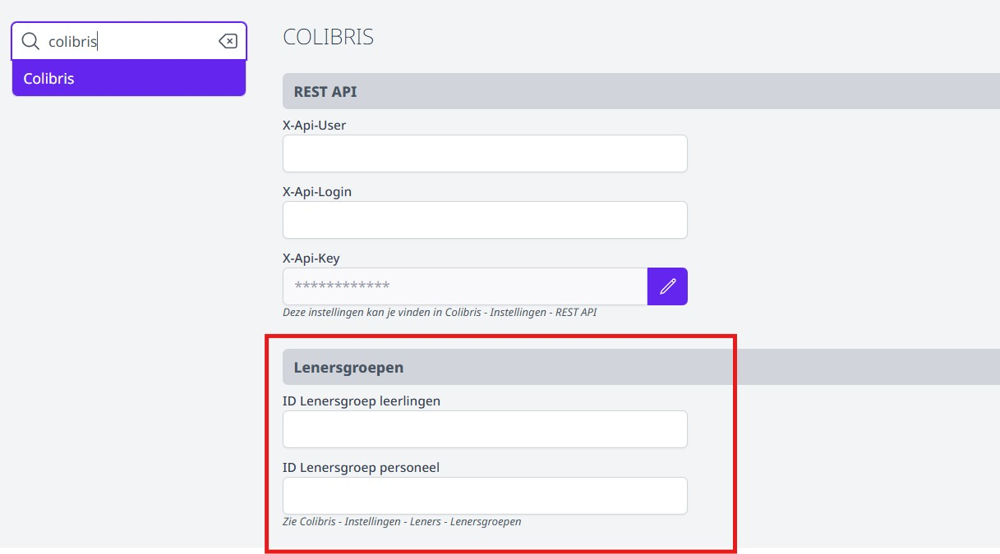
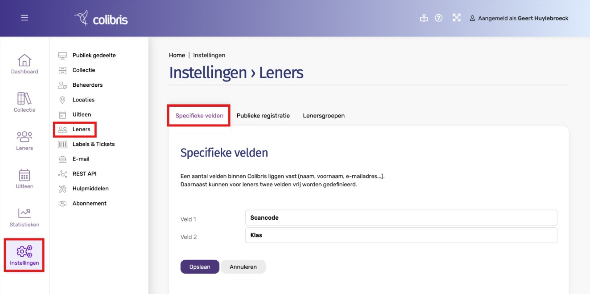
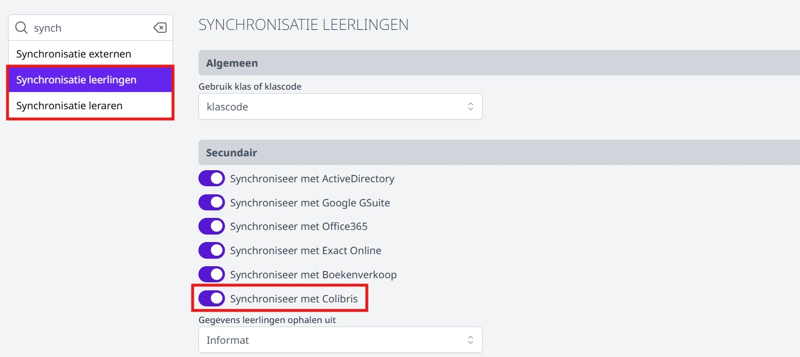
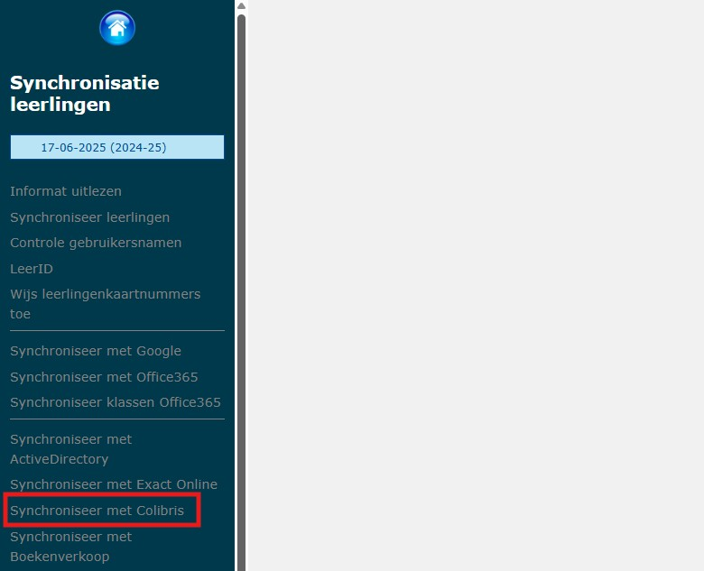
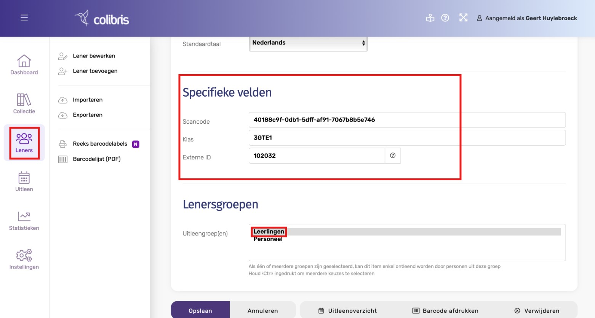
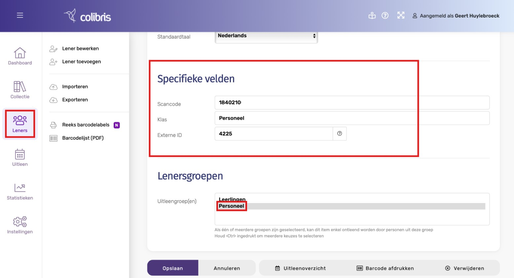

Via de modules **Synchronisatie Leerlingen (Basisschool)** en **Synchronisatie Leraren** kan je op een snelle en eenvoudige manier uitleners aanmaken in de bibliotheeksoftware Colibris. Meer info over deze software vind je op https://www.colibris.be/.  

Vooraleer je leraren en/of leerlingen kan synchroniseren met Colibris, moeten er nog een aantal zaken worden ingesteld.

## API key genereren 

Genereer in Colibris eerst en vooral een nieuwe API key via het menu 'Instellingen => Rest API => Genereer nieuwe API key'. 

In Toolbox vul je deze credentials in bij de module 'Instellingen => Colibris'. 

## Lenersgroepen aanmaken

Maak in Colibris twee lenersgroepen aan, één voor personeel en één voor leerlingen. Ga hiervoor naar het menu 'Instellingen => leners => Lenersgroepen => Nieuwe lenersgroep toevoegen'. 

Vul in de module Instellingen van Toolbox => Colibris de ID’s in die je gebruikte voor de lenersgroepen. In het voorbeeld is dat 01 en 02.

## Specifieke velden instellen

Binnen Colibris liggen een aantal velden vast zoals naam, voornaam, e-mailadres... Daarnaast kunnen voor leners nog twee velden vrij worden gedefinieerd. Vul hier bij veld 1 'Scancode' en bij veld 2 'Klas' in zoals in het voorbeeld hieronder (zie afbeelding). 

Bij de synchronisatie vanuit Toolbox worden die twee velden als volgt opgevuld in Colibris: 
    - Voor personeel:
        - Veld scancode: het stamboeknummer van het personeelslid wordt ingevuld
        - Veld klas: het woord ‘Personeel’ wordt ingevuld
    - Voor leerlingen:
        - Veld scancode: de scancode van Smartschool wordt ingevuld indien beschikbaar in Toolbox 
        - Veld klas: de huidige klas wordt ingevuld

## Synchronisatie met Colibris activeren

Om effectief te kunnen synchroniseren met Colibris, moet die functionaliteit worden aangezet in de instellingen van de synchronisatiemodules in Toolbox. Ga hiervoor in de module Instellingen (in Toolbox) => Synchronisatie Leerlingen en/of Leraren en zet de optie 'Synchroniseer met Colibris' aan.

## Synchronisatie vanuit Toolbox

Als Toolbox vanuit de synchronisatiemodules leraren en leerlingen gaat toevoegen aan Colibris, wordt in het veld ‘Externe ID’ van Colibris het Informatnummer (pointer) van de persoon ingevuld. Ook de vrije velden worden opgevuld zoals hierboven toegelicht.

*Gegevens van een leerling na synchronisatie vanuit Toolbox:*

 
*Gegevens van een leraar na synchronisatie vanuit Toolbox:*

