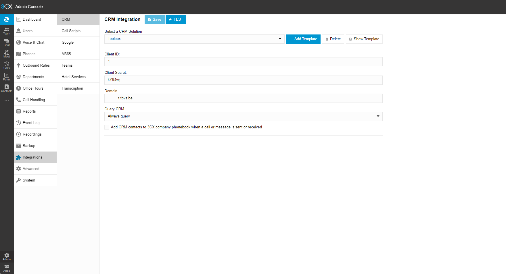
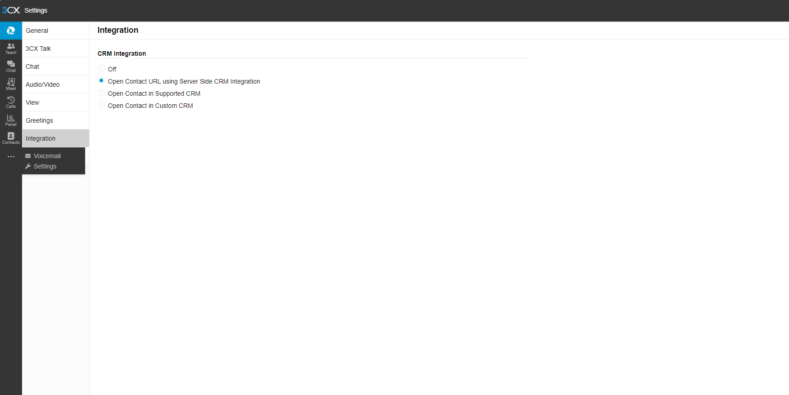

Voor scholen die gebruik maken van een 3CX telefooncentrale werd een specifieke koppeling voorzien. Dit zijn de stappen die je moet doorlopen.

## 1. Credentials aanvragen

Om de koppeling te activeren, vraag je aan de Toolbox helpdesk eerst en vooral credentials aan. Je ontvangt vervolgens een clientID en clientSecret. Die heb je nodig in de volgende stappen.

## 2. XML uploaden

Download het Toolbox XML sjabloon: [download](Toolbox.xml)

Vervolgens moet je die uploaden in de 3CX centrale via admin -> integrations -> CRM

Je krijgt dan de optie om enkele velden in te vullen:
- Client ID: clientID die je van Toolbox ontving
- Client Secret: clientSecret die je van Toolbox ontving
- Domein: xxx.tbvs.be (zonder https://)

 

Als dat klaar is, kan je inloggen op de 3CX web client met de credentials van de gebruiker. 
Daar ga naar settings onder de 3 puntjes ->  integration en dan kiezen voor Open Contact URL using Server Side CRM integration. 
De pagina zal pas openen indien het gesprek werd aangenomen, niet tijdens het overgaan.

 