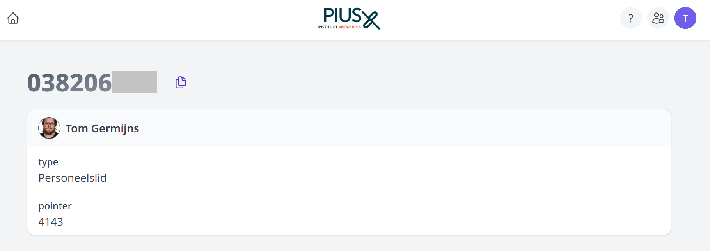
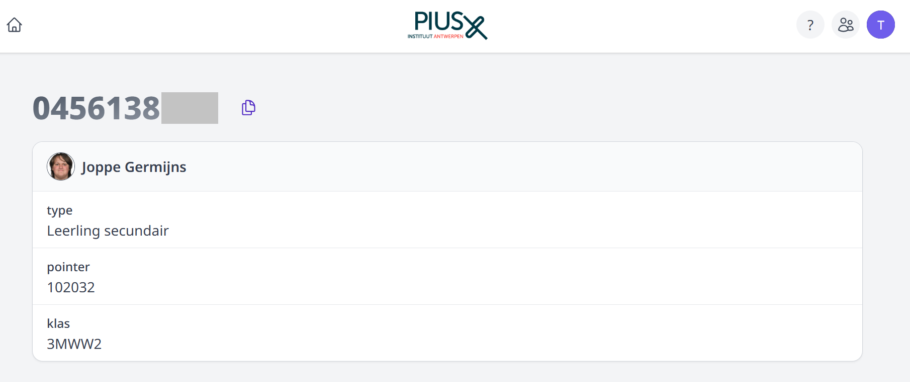
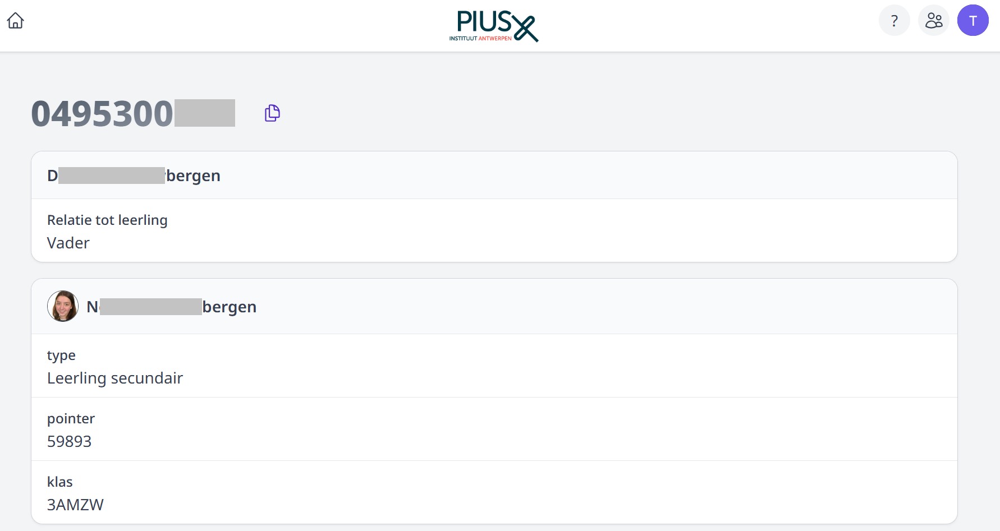

<ImageTitle img="tadicom.png">Telefonie</ImageTitle>

Scholen die voor telefonie een contract hebben afgesloten met **Tadicom** kunnen gebruik maken van de integratie met Toolbox. Wanneer men dan ingelogd is in Toolbox, zal de belleridentificatie actief zijn. Dat wil zeggen dat er bij een inkomende oproep een pop-up verschijnt met meer info over de beller. 

In Toolbox zelf hoeft hiervoor niets ingesteld te worden. Aan de kant van Tadicom is dat wel noodzakelijk. Wat je hiervoor precies moet doen, vind je hieronder terug. Ondervind je daar problemen mee, neem dan rechtstreeks contact op met de helpdesk van Tadicom via support@helpdesk4u.eu of op het nummer 02 747 01 01.

**1. Benodigdheden**
- Aangekochte licentie van Zoiper
- MyTelephony 2de identiteit van een user
- Link gekoppeld aan jullie Tadicom-account. Die vraag je aan via Tadicom. Voorbeeld link: https://power.helpdesk4u.eu/V3/MaatwerkScripts/Toolbox.php?URL=JOUWSCHOOLNAAM&Nummer={phone}

**2. Voorbereiding**
- Maak een 2de identiteit voor de gebruiker van het toestel waarvan je gebruik maakt. Bijvoorbeeld het toestel van het onthaal.
- Zet deze identiteit mee in de wachtrij waarvan de oproepen Toolbox moeten openen.
- Koop een Zoiper licentie voor op de gewenste computer en installeer deze.
- Ga in Zoiper naar Event Rule instellingen en zet daar de link: https://power.helpdesk4u.eu/V3/MaatwerkScripts/Toolbox.php?URL=JOUWSCHOOLNAAM&Nummer={phone} en de
tweede registratie van het toestel: bv. phone_4443385_1
- Sluit Zoiper zodat dit wel blijft afspelen op de achtergrond. Wanneer je nu een oproep binnenkrijgt, opent Zoiper de link naar Toolbox.

**3. Wat gebeurt er nu?**

Wanneer er een oproep binnenkomt op de wachtrij, zal deze oproep automatisch een pop-up oproepen met de webpagina van de ouder/contactpersoon in kwestie. Dat ziet er als
volgt uit:

- **Situatie 1: Oproep van een personeelslid**

    

- **Situatie 2: Oproep van een leerling**

    

- **Situatie 3: Oproep van een ouder**

    

Wanneer je in het scherm klikt op het icoon <LegacyAction img="kopieer.PNG"/> naast het telefoonnummer, kan je dit nummer kopiëren. Indien je dit nummer zou willen bellen zou je dit kunnen plakken in de software “Bridge” en via daar oproepen. 

Meer info over de software “Bridge” van Tadicom? Klik [hier](https://workdrive.zohopublic.eu/external/344d314bf5596d05cba5a91b4b90cfc03312c0cafe30e05565add72daaf26d16).

