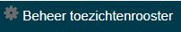
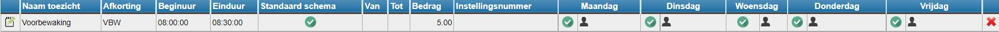
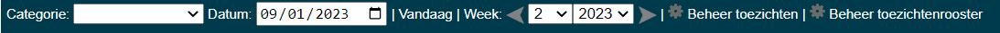
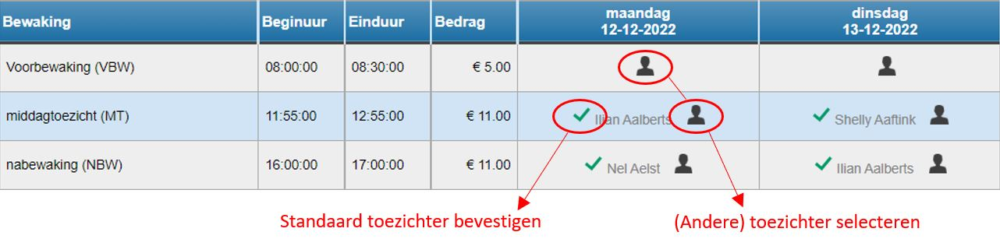
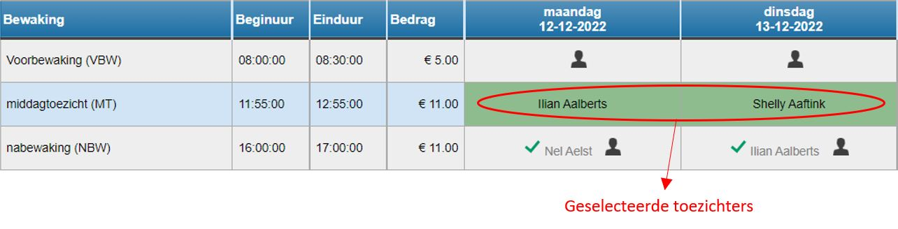
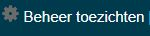
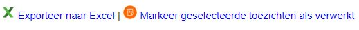

<ImageTitle img="toezichtBasisschool.png">Toezichten basisschool</ImageTitle>

Deze module laat toe om bij te houden welk personeelslid welk toezicht voor zijn/haar rekening heeft genomen en eventueel tegen welke prijs. Dit toezicht kan geregistreerd worden door een beheerder, maar evengoed door de toezichter zelf. Op voorhand wordt door een beheerder ingesteld welke toezichten er zijn. Per toezicht geef je op op welke dag(en) het doorgaat. Per dag kan je indien gewenst ook instellen wie de 'standaard toezichter' is. Dat maakt het invullen nadien makkelijker.

<Youtube url="https://www.youtube.com/embed/3y8LCcaekXw" />

### Toezichten aanmaken
Om toezichten aan te kunnen maken, moet je in het gebruikersbeheer het recht 'toezichten_basisschool_beheer' hebben. Zie ook [Gebruikersbeheer](/gebruikersbeheer). Hierdoor krijg je in de module 'Toezichten basisschool' een extra optie 'Beheer toezichtenrooster'. In dit scherm kan je het rooster van de toezichten opmaken.

Klik op <LegacyAction img="pluscircle.png" text="Toezicht toevoegen" /> en vul de nodige velden in. In het veld 'categorie' kan je een overkoepeldende naam geven aan het toezicht. Dit is handig wanneer er meerdere toezichten zijn van dezelfde soort. Later kan je ook filteren op categorie. Geef verder ook een naam (bv. voorbewaking), unieke afkorting per toezicht (bv. VBW of VBW1 indien er meerder voorbewakingen worden georganiseerd), het begin- en einduur van het toezicht in alsook het bedrag dat een personeelslid krijgt voor dit toezicht. Dat bedrag kan ook 0 zijn. 

Je kan optioneel het instellingsnummer invullen. Dat is handig als er meerdere scholen in één Toolbox werken. Op die manier kan je makkelijker onderscheid maken tussen de verschillende toezichten van de verschillende scholen. Bovendien zien leraren enkel de toezichten voor de instellingsnummers waaraan ze verbonden zijn.

Een toezicht wordt toegevoegd als standaard toezicht. Door een toezicht van een begin- en einddatum te voorzien, kan je het standaard schema voor die bepaalde periode overschrijven met andere toezichten.

<Thumbnails img={[
    require('./Toezichten_basisschool2.jpg').default, 
]} />

Als het toezicht is aangemaakt, kan je per dag aanvinken op welke dag(en) het toezicht doorgaat door op <LegacyAction img="vinkjeGrijsRond.png" /> te klikken. Het vinkje wordt vervolgens groen. Van zodra een toezicht is aangevinkt voor een bepaalde dag, kan je via het mannetje <LegacyAction img="person.png" /> opgeven wie de standaard toezichter is voor die dag. De lijst van toezichters is de personeelslijst die wordt opgehaald uit het administratief pakket (Informat of Wisa) via de module 'Synchronisatie leraren'. Externe toezichters kunnen eventueel worden ingegeven als personeelslid zonder ambt.  

Je kan de standaard toezichter wijzen door opnieuw op het mannetje <LegacyAction img="person.png" /> te klikken en in de lijst een andere toezichter te selecteren. Indien een toezichter eenmalig wijzigt, wordt dit best aangepast bij de registraties. 

Je kan een toezicht aanpassen door vooraan op het groene potloodje <LegacyAction img="edit.png" /> te klikken of volledig verwijderen door achteraan op het kruisje <LegacyAction img="remove.png" /> te klikken . 

### Registreren
Voor het registeren heb je de keuze: je laat de leraren zelf aanduiden welke toezichten zij hebben gedaan of je registreert als beheerder wie welk toezicht deed. Als leraren zelf de toezichten mogen registreren, moeten zij in het gebruikersbeheer het recht 'toezichten_basisschool' krijgen. Zie ook [Gebruikersbeheer](/gebruikersbeheer). 

Bij het openen van de module 'Toezichten basisschool' zie je standaard het vast toezichtrooster van deze week. Bovenaan kan je de datum of de week wijzigen door op de kalender of op de pijltjes te klikken. Je kan eventeens filteren op categorie waardoor je enkel toezichten van een bepaalde categorie te zien krijgt. 

Als de standaard toezichter effectief het toezicht heeft gedaan, kan je dit bevestigen door op het groene vinkje te klikken. Als **beheerder** kan je ook een andere toezichter kiezen door op het mannetje te klikken. Er verschijnt vervolgens een lijst met alle personeelsleden. De selectie is geslaagd wanneer het volledige vakje groen kleurt. 

Leraren die zelf registeren, kunnen het toezicht aanklikken zodat het op hun naam wordt bevestigd. Ze kunnen enkel toezichten van zichzelf selecteren of deselecteren en kunnen geen geregistreerd toezicht van een andere collega uitvinken. Als een collega een toezicht foutief heeft aangevinkt, dan kan enkel de beheerder of de leraar die foutief registreerde zelf het toezicht terug uitvinken.

 
### Geregistreerde toezichten opvolgen

De beheerder kan via de knop  bovenaan opvolgen wie welk toezicht deed.

Standaard worden de geregistreerde toezichten van vandaag getoond. Je kan de begin- en/of einddatum wijzigen door op de kalendericoontjes te klikken. Een kalender verschijnt waarin je vervolgens een datum kan selecteren. Klik tot slot op 'Toon toezichten' om alle geregistreerde toezichten voor de geselecteerde periode weer te geven. 

<Thumbnails img={[
    require('./Toezichten_basisschool8.jpg').default, 
]} />

Je kan de getoonde toezichten exporteren naar Excel en de aangevinkte toezichten markeren als verwerkt. Vervolgens kan je filteren op verwerkte of onverwerkte toezichten.  

