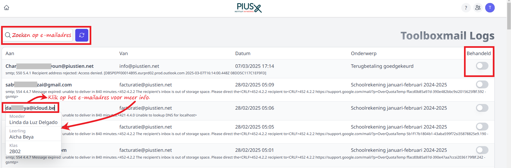

<ImageTitle img="toolboxmail.png">Toolboxmail logs</ImageTitle>

In deze module krijg je een overzicht te zien van alle foutmeldingen die er zijn na het versturen van e-mails vanuit Toolbox, bv. via de module Leerlingenrekeningen, Openstaande facturen, Inventaris, … Op basis van deze foutmeldingen kan je achterhalen waarom bepaalde mails niet kunnen worden afgeleverd. De foutmeldingen zijn soms complex en worden steeds in het Engels weergegeven. Heb je hulp nodig om de foutmeldingen te interpreteren, raadpleeg dan de ICT-dienst van je school. 

:::info
Deze module kan enkel gebruikt worden voor mails die verstuurd zijn via Toolboxmail. Of je gebruik maakt van Toolboxmail kan je terugvinden in de module 'Instellingen > E-mail'.  
:::

- Via het zoekveld linksboven kan je zoeken op e-mailadres.
- Heb je het probleem met het e-mailadres opgelost (bv. gecorrigeerd in Informat), dan kan je de log achteraan aanduiden als 'Behandeld'.
- Door het e-mailadres aan te klikken wordt er meer info getoond. Zo kan je op een eenvoudige manier achterhalen aan welke leerling dit e-mailadres gekoppeld is (bv. vader van Pietje Puk uit 1A3). Deze functie werkt enkel voor e-mailadressen die gekend zijn in Informat. 
- Een foutmelding die je vaak zal tegenkomen is: *'Amazon SES did not send the message to this address because it is on the suppression list for your account.'* Dat wil zeggen dat er eerder al een foutmelding is geweest voor dit e-mailadres. In dit geval gebruik je best de zoekfunctie om te zoeken op e-mailadres. Ga vervolgens terug naar de allereerste foutmelding voor dit e-maildres en doe het nodige om de fout te verhelpen. 

 

