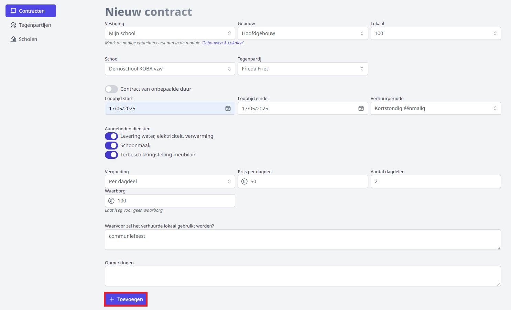

<ImageTitle img="verhuurcontracten.svg">Verhuurcontracten</ImageTitle>

De Vlaamse Regering wil het buitenschools gebruik van schoolgebouwen maximaliseren. Bij het openstellen van onderwijsinfrastructuur is belangrijk om goede afspraken te maken met de huurder over het gebruik van het lokaal of het schoolgebouw. Die afspraken leg je het best vast in een huurovereenkomst. Daarbij houd je ook voldoende rekening met veiligheid en preventie, verzekeringen en fiscaliteit.

Met de module **Verhuurcontracten** in Toolbox is het opstellen van een verhuurcontract een fluitje van een cent. 

Vooraleer je een verhuurcontract kan opstellen, moeten eerst de betrokken partijen gedefinieerd worden. Enerzijds is dat de verhuurder, in Toolbox de [**school**](/Verhuurcontracten#1-school-verhuurder-instellen) genoemd. En anderzijds is dat de huurder, in Toolbox de [**tegenpartij**](/Verhuurcontracten#2-tegenpartij-huurder-instellen) genoemd. Daarnaast moeten alle te verhuren ruimtes gekend zijn in Toolbox. Hiervoor maak je gebruik van de module [Gebouwen en lokalen](/gebouwen_lokalen). 

## 1. School (verhuurder) instellen

De gegevens van de verhuurder zijn terug te vinden onder het menu **Scholen**. Bij de eerste ingebruikname van de module zal er nog een school moeten worden ingesteld. Er kunnen ook meerdere scholen (lees: verhuurders) worden aangemaakt. 

- Klik in de menubalk links op **Scholen** en klik vervolgens op **+ Nieuwe school**.

    

- Vul alle gevraagde velden in en klik onderaan op **Toevoegen** om de gegevens te bewaren.

    

- Er kunnen meerdere scholen/verhuurders worden ingesteld. Dat kan nodig zijn wanneer de school over meerdere rekeningnummers beschikt of wanneer er voor bepaalde ruimtes een andere ondertekenaar nodig is. Klik hiervoor opnieuw op **+ Nieuwe school**. 
- Via het potloodje <LegacyAction img="potlood3.PNG"/> achteraan kan je de gegevens van een school wijzigen. Eens een school is aangemaakt, kan die niet meer worden verwijderd. 

    

## 2. Tegenpartij (huurder) instellen

Elke huurder maak je aan als tegenpartij. Na het invoeren van de algemene gegevens van de tegenpartij heb je de mogelijkheid om één of meerdere contactpersonen toe te voegen in het geval de tegenpartij geen particulier persoon is. 

### 2.1 Nieuwe tegenpartij aanmaken
- Klik in de menubalk links op **Tegenpartijen** en klik vervolgens op **+ Nieuwe tegenpartij**.

    

- Selecteer als eerste het **statuut** van de tegenpartij. Deze selectie bepaalt welke velden er vervolgens getoond worden. Zo zal er bij een particuliere huurder (niet beroepsmatig) geen ondernemingsnummer ingevuld moeten worden, terwijl dit bij de overige statuten wel een verplicht veld zal zijn. 
    
    

- Vul alle getoonde velden in en geef aan of de betrokken tegenpartij BTW-plichtig is. Enkel bij een niet-beroepsmatige particulier wordt de info omtrent ondernemingsnummer en BTW niet opgevraagd. 

    

- Klik op **Toevoegen** om de info op te slaan.

### 2.2 Contactpersoon toevoegen

Wanneer de tegenpartij geen persoon is, kan je na het ingeven van die tegenpartij één of meerdere contactpersonen toevoegen. 

- Open de tegenpartij en klik onderaan op **+ Contact toevoegen**.

    

- Vul minimaal de naam van de contactpersoon in en klik op **+ Toevoegen**.

    

### 2.3 Contactpersoon wijzigen/verwijderen

Open de tegenpartij om de contactperso(o)n(en) voor die tegenpartij te kunnen raadplegen. Klik achter de betreffende contactpersoon op het vuilnisbakje om die volledig te verwijderen. Klik op het potloodje om de contactgegevens aan te passen. 

    

### 2.4 Tegenpartij wijzigen/verwijderen

Om een tegenpartij te wijzigen of te verwijderen, open je betreffende tegenpartij en klik je rechtsboven op het potloodje om te bewerken of op het vuilnisbakje om de tegenpartij volledig te verwijderen. 

    

## 3. Contracten

### 3.1 Contract aanmaken

Wanneer de gegevens van de [school](/Verhuurcontracten#1-school-verhuurder-instellen) (verhuurder) en de [tegenpartij](/Verhuurcontracten#2-tegenpartij-huurder-instellen) (huurder) zijn ingegeven, kan het contract worden opgesteld. Hiervoor volstaat het om een aantal velden in te vullen. 

- Klik in de menubalk links op **Contracten** en klik vervolgens op **+ Nieuw contract**.

    

- Selecteer op de eerste rij het betreffende gebouw en/of lokaal waarvoor je een verhuurcontract wil opmaken. Deze gegevens worden opgehaald uit de module [Gebouwen en lokalen](/gebouwen_lokalen). Worden hier geen gegevens getoond of niet de correcte gegevens? Klik dan op de blauwe link naar de module Gebouwen en lokalen om die aan te maken in Toolbox. 

  

- Selecteer op de tweede rij de **school** (verhuurder) en de **tegenpartij** (huurder) uit een dropdown menu. Deze heb je eerder aangemaakt onder het menu 'Scholen' en 'Tegenpartijen'.  

  

- Vul de volgende velden zoveel mogelijk aan en klik onderaan op **+ Toevoegen**. 

  

### 3.2 Contract wijzigen / aanvragen / verwijderen 

Na het toevoegen van het contract, kan je het nog steeds bewerken met behulp van de knop 'Bewerken' bovenaan. Indien het contract volledig is, kan het worden ingediend ter goedkeuring met behulp van de knop 'Contract aanvragen'. Het kan ook volledig worden verwijderd via het vuilnisbakje. 
  
  

### 3.3 Aanvraag opvolgen

In het menu **Contracten** wordt een overzicht getoond van alle contracten. Aan de rechterkant wordt bij elk contract de status van de aanvraag weergegeven. 

  

Van zodra de aanvraag is ingediend en het **totaalbedrag is lager dan 250 euro**, wordt het contract automatisch goedgekeurd. Het kan bijgevolg onmiddellijk worden gegenereerd om af te drukken of te mailen. Het contract wordt dan met behulp van alle ingevulde gegevens samengesteld. 

Wanneer het totaalbedrag binnen het huurcontract **hoger is dan 250 euro**, is er een bijkomende goedkeuring nodig van de vzw. Bij het aanvragen van het contract, maakt Toolbox automatisch een onderscheid op basis van het bedrag. Bij een hoger totaalbedrag zal er een mail verstuurd worden naar de betrokken verantwoordelijken binnen de vzw. Zij keuren vervolgens het contract zo snel mogelijk goed. Na goedkeuring of afkeuring krijgt de aanvrager een melding via e-mail. Bij goedkeuring kan het volledig ingevulde contract onmiddellijk in Toolbox worden gegenereerd. Bij afkeuring wordt er steeds een motivatie meegegeven en kan je via de knop 'bewerken' de aanvraag aanpassen en opnieuw indienen ter goedkeuring. 

### 3.4 Goedgekeurd contract downloaden en ondertekenen

Een goedgekeurd contract kan na het openen worden gedownload via de knop bovenaan. Dit bestand kan worden afgedrukt of verstuurd via e-mail naar de tegenpartij. Nadien kan de ondertekende versie worden ingescand en opnieuw worden geüpload in deze module bij het onderdeel 'Ondertekende documenten'. Klik op 'Selecteer' om het ingescande document op je computer te selecteren. Klik vervolgens op het plus-icoon achteraan om het toe te voegen. 

  

