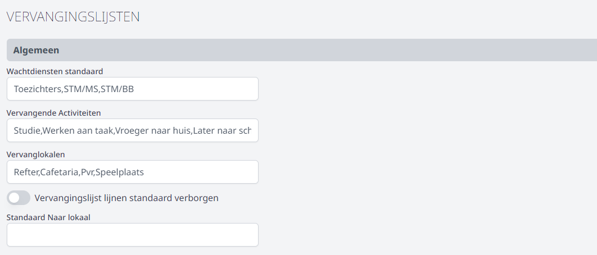
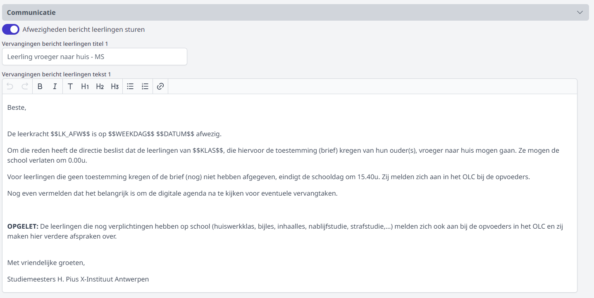
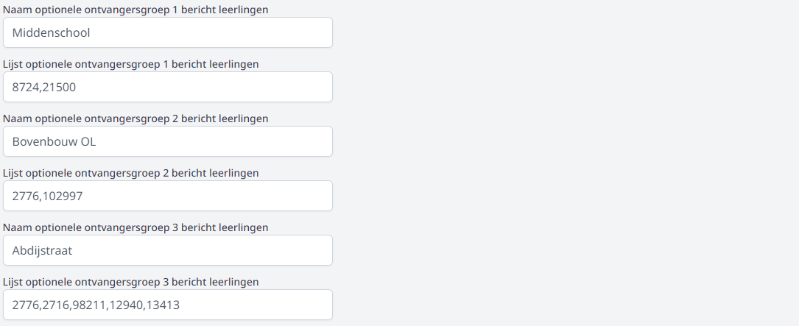
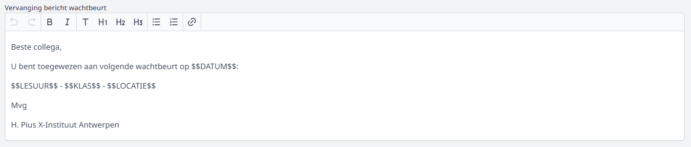
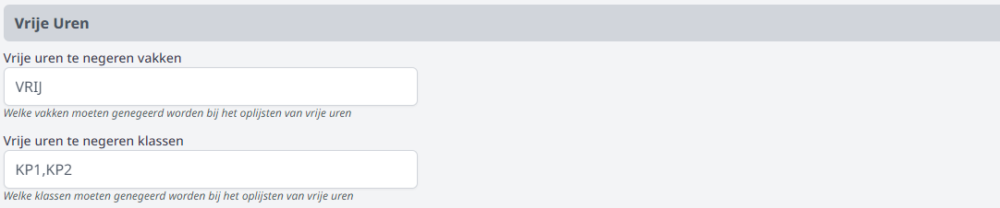
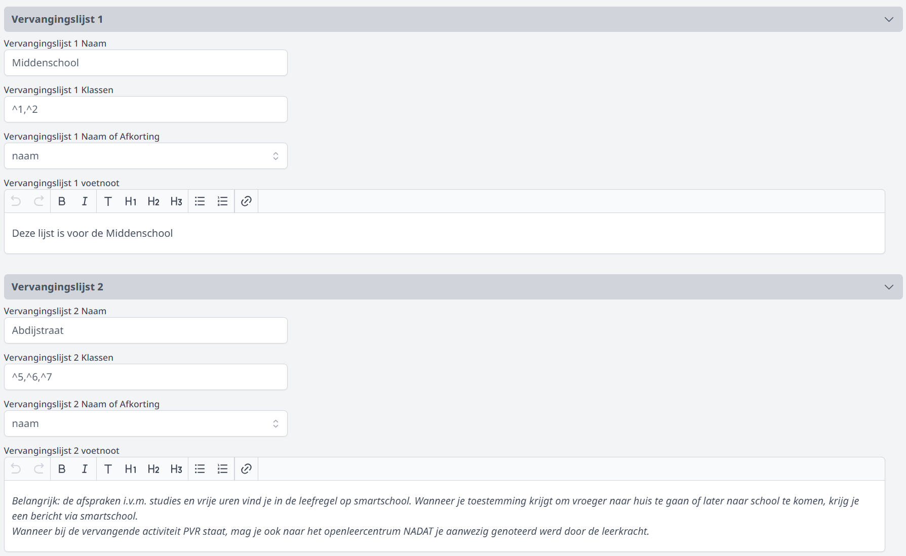

## Gebruikersrechten toekennen

Om de module Vervangingslijsten te kunnen gebruiken, moeten er gebruikersrechten worden toegekend. Dat gebeurt door een beheerder via de module [Gebruikersbeheer](/gebruikersbeheer). Voor de module Vervangingslijsten bestaan er 2 verschillende rechten:
- **Vervangingslijsten**: met dit gebruikersrecht kan men alle functionaliteiten binnen de module Vervangingslijsten gebruiken, zoals afwezige leraren en/of klassen ingeven, maar ook de vervangingslijsten aanmaken, vervangers koppelen, leraren en leerlingen via Smartschool verwittigen, ...
- **Vervangingslijsten_alleenlezen**: met dit gebruikersrecht kan men enkel de opgemaakte vervangingslijsten raadplegen. Er kunnen verder geen wijzigingen worden aangebracht. 

## Algemene instellingen 

Alvorens te kunnen starten met de module Vervangingslijsten moeten er een aantal algemene zaken worden ingesteld. Deze instellingen moeten in principe slechts éénmaal worden geconfigureerd, zolang er geen structurele zaken worden gewijzigd.

Ga hiervoor in de module Instellingen naar Vervangingslijsten. 

### 1. Algemeen 

- **Wachtdiensten standaard**: Bovenop de wachtdiensten die gedefinieerd zijn in het opgeladen lessenrooster en/of in de module [Wacht en toezicht](../../wacht_toezicht) kan je hier nog andere wachtdiensten invullen. Je kan meerdere benamingen toevoegen, gescheiden door een komma. Deze wachtdiensten zullen in de vervangingslijsten steeds te selecteren zijn bovenop de leraren die van wacht zijn. 
- **Vervangende activiteiten**: Je kan meerdere activiteiten toevoegen, gescheiden door een komma. Deze vervangende activiteiten zal je standaard kunnen selecteren in de module Vervangingslijsten. 
- **Vervanglokalen**: Indien er gebruik gemaakt wordt van vaste lokalen voor vervangingen, kan je die hier opgeven. 
- **Vervangingslijst lijnen standaard verborgen**: Bij gebruik van de module Digital signage zullen de vervangingslijsten meteen bij het aanmaken getoond worden op de tv-schermen in de school. Vaak is het wenselijk om deze lijsten pas kort voor de start van de eerste lessen te publiceren. Met deze knop kan je ervoor kiezen om de vervangingslijsten standaard te verbergen. Ze worden pas gepubliceerd van zodra men in de module Vervangingslijsten de opdracht geeft om de lijsten te tonen. 
- **Standaard naar lokaal**: Wanneer leerlingen standaard naar een bepaald lokaal moeten gaan wanneer ze studie hebben, kan je dat hier opgeven. Dit lokaal kan in de vervangingslijst zelf nog worden aangepast. 

### 2. Communicatie

#### a. Communicatie met leerlingen

Er is de mogelijkheid om rechtstreeks vanuit de module Vervangingslijsten via Smartschool berichten te sturen naar leerlingen in verband met studie en afwezige leraren. Hiervoor kunnen 6 standaardberichten worden ingesteld. Voor elk bericht voer je een titel en een berichtinhoud in. In de inhoud van het bericht kunnen onderstaande dynamische variabelen gebruikt worden. Deze variabelen  worden op het moment van versturen vervangen door de correcte gegevens. 

- $$LK_AFW$$: naam van de afwezige leraar
- $$WEEKDAG$$: dag van de afwezigheid
- $$DATUM$$: datum van de afwezigheid
- $$KLAS$$: klas die geen les heeft o.w.v. de afwezigheid van de betrokken leraar

Naast standaardberichten kan je ook optionele ontvangersgroepen aanmaken. Geef de ontvangersgroep een naam en vul vervolgens de interne nummers of gebruikersnamen uit Smartschool in. Bij het verzenden van een bericht vanuit de module Vervangingslijsten kan dergelijke optionele ontvangersgroep worden toegevoegd. Dat kan b.v. de directie en/of de onthaalbediende zijn die op de hoogte worden gebracht wanneer een groep leerlingen de boodschap krijgt dat men de school vroeger mag verlaten. 

#### b. Communicatie met leraren

Wanneer er een wachtbeurt wordt toegekend aan een leraar, kan deze hierover via Smartschool worden verwittigd. Het standaardbericht kan in de module Instellingen worden ingevoerd. Onderstaande dynamische variabelen kunnen gebruikt worden. Deze variabelen worden op het moment van versturen vervangen door de correcte gegevens.

- $$DATUM$$: datum waarop de leraar de vervanging moet doen
- $$LESUUR$$: lesuur waarop de leraar de vervanging moet doen
- $$KLAS$$: klas die opgevangen moet worden
- $$LOCATIE$$: lokaal waar de vervanging plaatsvindt

### 3. Vrije uren

Het kan voorkomen dat er in het lessenrooster vakken of klassen zijn opgenomen die niet op de vervangingslijsten moeten verschijnen. Wanneer een klas bv. elke week een vast springuur heeft en dit is ingeroosterd als VRIJ, moet dit uur nooit vervangen worden. Het is aanbevolen om hiervoor in het roosterprogramma zoveel mogelijk dezelfde vakbenaming te gebruiken. De benamingen uit het roosterprogramma van vakken die genegeerd mogen worden, lijst je hier op, gescheiden door komma's.

Ook wanneer bepaalde klassen (bv. huiswerkklas) nooit vervangen moeten worden, kan je die in de instellingen oplijsten, waardoor ze in de module vervangingslijsten niet zullen voorkomen. 

### 4. Vervangingslijsten
In de module Instellingen kan je 5 voorgedefinieerde vervangingslijsten maken.

- Stap 1: Kies een naam voor de vervangingslijst
- Stap 2: Kies de klassen die je wil toevoegen of verwijderen uit de selectie. Dit kan je op enkele manieren doen:
    
    Door te beginnen met een ^ duid je aan dat de klas moet beginnen met dat deel. Bijvoorbeeld : ^1,^2 toont alle klassen die beginnen met 1 of 2.

    Door te beginnen met een - filter je de klassen met dat deel eruit. Bijvoorbeeld: ^3,^4,-BAV,-WKD toont alle klassen die beginnen met 3 of 4, maar niet de klassen 3BAV, 4BAV, 3WKD en 4WKD
- Stap 3: Voeg optioneel een voetnoot toe aan de vervangingslijst. 

