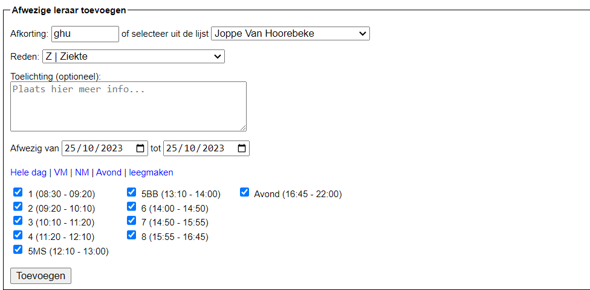
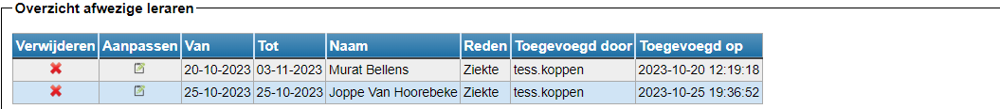

<LegacyAction img="sick.png" text="Beheer afwezige leraren"/>    

Net als in de module [Afwezigheden](/afwezigheden) heb je hier de mogelijkheid om de afwezigheid van een leerkracht te registreren. De afwezigheden die eerder al in de module Afwezigheden zijn geregistreerd, kan je hier in het overzicht ook terugvinden. De module Afwezigheden is iets uitgebreider. Daar kan je ook vervangers toewijzen en dat kan in de module Vervangingslijsten niet. Het opzet is dat studiemeesters/administratief medewerkers in de module Vervangingslijsten 's morgens op een snelle manier de inkomende afwezigheidsmeldingen van leraren kunnen verwerken in de vervangingslijsten. Afwezigheden die hier worden ingegeven, kunnen wel verder beheerd worden in de module Afwezigheden. 

- Stap 1: Zoek de leerkracht op via afkorting of zoek hem in de lijst.
- Stap 2: Geef een reden op en een begin- en (voorlopige) einddatum. 

  Je kan zelf de verschillende redenen instellen in de module Instellingen => Afwezigheden.

  <Thumbnails img={[
    require('./afwezig01.png').default, 
  ]} />

- Stap 3: Duid aan of de leerkracht afwezig is voor een hele dag, enkel de voor- of namiddag of voor de avond (indien gedefinieerd in de lessenrooster). Het is ook mogelijk om één of enkele lesuren aan te vinken. 
- Stap 4: Voeg de afwezigheid toe.

  

De afwezigheid wordt geregistreerd en komt onderaan in het overzicht te staan. In deze lijst kan je de geregistreerde afwezigheden nog aanpassen <LegacyAction img="edit.png"/> en/of verwijderen <LegacyAction img="remove.png"/>. Een afwezigheid wijzigen die door iemand anders werd geregistreerd of een interimaris toewijzen, doe je in de module [Afwezigheden](/afwezigheden).

  