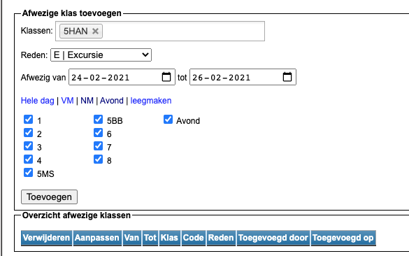
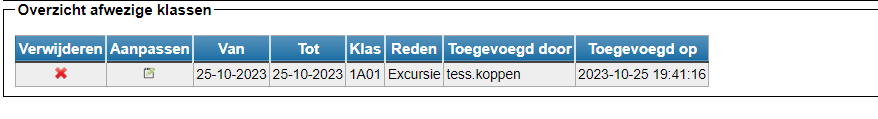

<LegacyAction img="klas.png" text="Beheer afwezige klassen"/>  

Hier kan je de afwezigheid van een klas registreren.

- Stap 1: Zoek 1 of meerdere klassen op. 

- Stap 2: Geef een reden op en een begin- en (voorlopige) einddatum. De verschillende redenen kan je instellen in de module Instellingen => Afwezigheden.

- Stap 3: Duid aan of de klas afwezig is voor een hele dag, enkel de voor- of namiddag of voor de avond (indien gedefinieerd in de lessenrooster). Je kan ook aanduiden dat een klas slechts 1 of enkele lesuren afwezig is, door de betreffende lesuren aan te vinken.

  

- Stap 4: Voeg de afwezigheid toe. De afwezigheid wordt geregistreerd en komt onderaan in het overzicht te staan. 
  In dit overzicht kan je foutief geregistreerde afwezigheden verwijderen door op het kruisje te klikken. Via het potloodje kan je de registratie nog wijzigen, bv. het begin- en einddatum, reden, afwezige lesuren.
  
  
  
Leerkrachten die vrijkomen omwille van de afwezigheid van een klas, kan je in een latere fase kiezen als toezichthoudende leerkracht voor een klas die op de vervangingslijst staat. 

  

