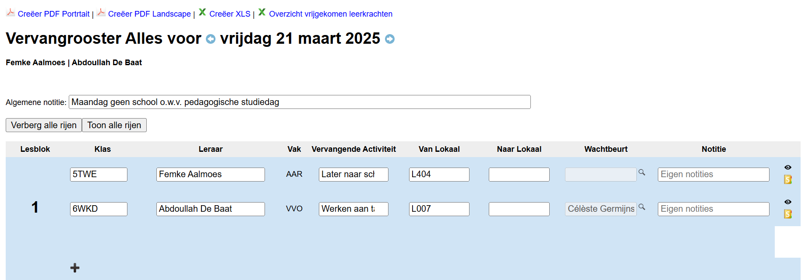
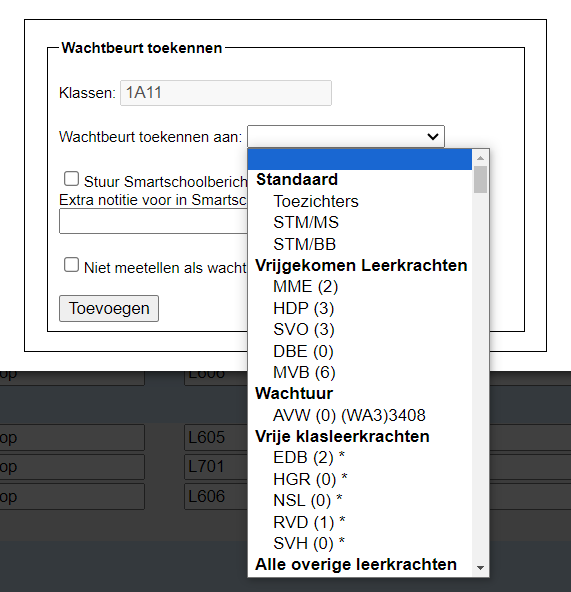
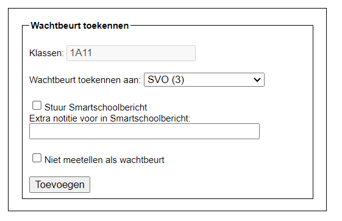
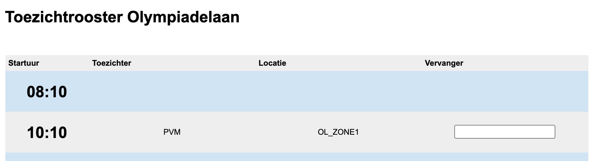

## Roosteropties kiezen

- Stap 1: Kies een voorgedefinieerde vervangingslijst (aangemaakt via de module Instellingen) of selecteer voor welke jaren je een rooster wil maken.
- Stap 2: Selecteer de datum waarvoor een je vervangrooster wil maken. 
- Stap 3 (optioneel): Selecteer voor welke uren je een rooster wil maken. Indien je dit niet doet, worden standaard alle uren genomen.
- Stap 4: Duid aan of je een toezichtrooster wil maken voor een bepaalde campus of niet. Dit kan enkel gebruikt worden indien de toezichten zijn ingevoerd in de module 'Wacht-en toezichtbeurten' of in het roosterprogramma.
- Stap 5: Klik op 'Aanmaken'.

## Vervangingsrooster Aanpassen

Per lesuur krijg je een overzicht te zien van alle lessen die vervangen moeten worden. In het rooster kan je nog verschillende velden aanpassen of invullen vooraleer je gaat afdrukken of publiceren. Wijzigingen worden automatisch bewaard. Je kan dus al enkele dagen op voorhand het vervangingsrooster voorbereiden. Bv. vervangende taken aanvullen, vervangende leraar aanduiden bij leswissel, ... 

- **Algemene notitie**: Dit facultatief veld kan gebruikt worden om een algemene boodschap mee te geven op de vervangingslijst. De boodschap wordt getoond op de afdruk in PDF of Excel en ook op de tv-schermen bij gebruik van de module [Digital Signage](/digital_signage).

- **Klas**: Hier wordt standaard de klas of groep uit het lessenrooster getoond. Indien het niet gewoon de klas, maar bijvoorbeeld een keuzegroep is, kan je de naam aanpassen zodat het in het rooster duidelijk wordt welke klas/groep geen les heeft.
- **Leraar**: Hier wordt automatisch de naam van de afwezige leraar ingevuld. Die kan je nog aanpassen. 
- **Vervangende Activiteit**: Selecteer hier een vervangende activiteit of vul er zelf één in. Een lijst met standaardactiviteiten kan je vooraf definiëren in de module Instellingen => Vervangingslijsten.
- **Van Lokaal**: Dit is het lokaal uit het lessenrooster. Dat kan je hier nog wijzigen indien die klas/groep tijdelijk in een ander lokaal zit.
- **Naar Lokaal**: Kies hier het lokaal waar de leerlingen naartoe moeten (indien van toepassing). De lijst met standaardlokalen kan je eveneens invoeren in de module Instellingen => Vervangingslijsten. Deze lijst wordt aangevuld met de lokalen die op dat uur niet in gebruik zijn volgens het lessenrooster.
- **Wachtbeurt**: Kies hier de leerkracht die de wachtbeurt op zich moet nemen. De lijst met standaardwachters kan je vooraf invoeren in de module Instellingen => Vervangingslijsten. Deze lijst wordt aangevuld met de leerkrachten die op dat moment vrijkomen of een wachtbeurt hebben. Verder kunnen hier ook steeds alle andere leerkrachten geselecteerd worden. Het aantal wachtbeurten telt op en wordt achteraan tussen haakjes getoond zodat de verdeling eerlijk kan gebeuren. 

    - Wanneer een leraar klasleraar is in de klas op de wachtlijst, zal er een sterretje * getoond worden bij diens naam. 
    - Wanneer een leraar reeds gekoppeld is aan een andere wachtbeurt tijdens datzelfde lesuur, zal er een plusteken + getoond worden bij diens naam. 
    - Het is mogelijk om aan één lesuur meerdere leraren van wacht te koppelen. 
    - Het aantal achter de afkorting van de leraar geeft het totaal weer van het aantal wachtbeurten dat deze leraar reeds heeft uitgevoerd vanaf een bepaalde datum. Die datum kan je instellen via de module 'Instellingen > Wacht- en toezichtbeurten'. Daar kan je ook aangeven of je de uitgevoerde wachtbeurten wil prorateren om zo makkelijker een vergelijking te kunnen maken tussen leraren met een ongelijk aantal geroosterde wachtbeurten. 

    
    
    Bij het toekennen van de wachtbeurt kan je er tevens voor kiezen om de beurt niet te laten meetellen en om de toezichthoudende leraar op de hoogte te brengen van zijn wachtbeurt door middel van een Smartschoolbericht. Het standaardbericht kan ingevoerd worden via de module Instellingen => Vervangingslijsten. In deze module kan er nog een extra notitie worden toegevoegd aan het bericht. Bv. de titularis zal halverwege het lesuur terug zijn, de taak ligt in de leraarskamer, ...

    

- Via het oogje achteraan kan je een lijn verbergen <LegacyAction img="oogrood.png"/> of juist zichtbaar maken <LegacyAction img="oogzwart.png"/> op de vervanginglijst. Het is eveneens mogelijk om alle rijen ineens te verbergen of zichtbaar te maken via de 2 actieknoppen bovenaan. 
- Met behulp van het Smartschoolicoon achteraan <LegacyAction img="smartschool1.png"/> kan je berichten versturen naar de leerlingen, hun co-accounts en eventueel bijkomende ontvangers zoals de directie, administratie, onthaal, de afwezige leraar... Je kan meerdere templates creëren via de module Instellingen => Vervangingslijsten. 

## Toezichtrooster aanpassen

Indien er een toezicht wegvalt omwille van een afwezige leerkracht, kan je onderaan in het toezichtrooster een vervanger selecteren voor dit toezicht. 

## Afdrukken / publiceren

Wanneer de vervangingslijst en (optioneel) het toezichtrooster gepubliceerd kunnen worden, kan je een PDF- of XLS-bestand genereren door de actieknoppen bovenaan de pagina te gebruiken. 

Het is eveneens mogelijk om de vervangingslijsten te tonen op tv-schermen in de school. De koppeling daarmee gebeurt via de module [Digital Signage](/digital_signage).

