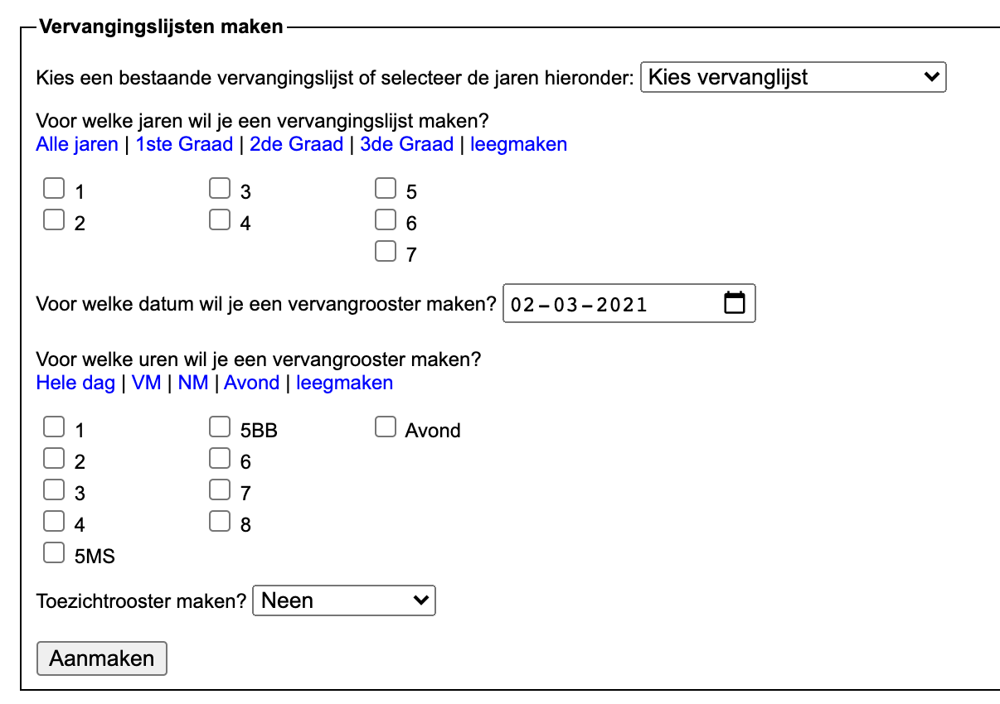
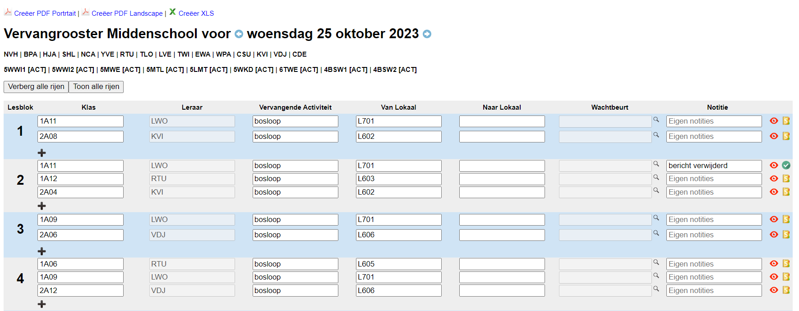

## Rooster opties kiezen

- Stap 1: Kies een [voorgedefinieerde vervangingslijst](/vervangingslijsten/vervangingslijst_maken) of selecteer voor welke jaren je een rooster wil maken.
- Stap 2: Selecteer de datum waarvoor een je vervangrooster wil maken. 
- Stap 3: (optioneel) Selecteer voor welke uren je een rooster wil maken. Indien je dit niet doet, worden standaard alle uren genomen.
- Stap 4: Duidt aan of je een toezichtrooster wil maken voor een bepaalde campus of niet.
- Stap 5: Klik op Aanmaken

## Vervangingsrooster Aanpassen

In het rooster kan je nu verschillende velden aanpassen/invullen:

- Klas: Indien het niet gewoon de klas maar bijvoorbeeld een keuzegroep is, kan je de naam aanpassen zodat het in het rooster duidelijk wordt welke klas/groep geen les heeft.
- Leraar: Als de les wel doorgaat maar wordt overgenomen door een andere leerkracht, kan je die hier invullen.
- Vervangende Activiteit: Kies hier een vervangende activiteit of vul er zelf 1 in. Een lijst met standaardactiviteiten kan je instellen in "Instellingen --> Vervangingslijsten"
- Van Lokaal: Dit lokaal dat in de lessenrooster staat, kan je wijzigen indien die klas/groep tijdelijk in een ander lokaal zit.
- Naar Lokaal: Kies hier het lokaal waar de leerlingen naartoe moeten. Deze lijst met standaarlokalen kan je instellen in "Instellingen --> Vervangingslijsten". Deze wordt aangevuld met de lokalen die op dat uur niet in gebruik zijn volgens het lessenrooster.
- Wachtbeurt: Kies hier de leerkracht die de wachtbeurt op zich moet nemen. Deze lijst met standaardwachters kan je instellen in "Instellingen --> Vervangingslijsten". Deze wordt aangevuld met de leerkrachten die op dat moment een wachtbeurt hebben. Maar hier kunnen ook alle leerkrachten ingevuld worden.
- Via het kruisje achteraan kan je een lijn verwijderen, bijvoorbeeld wanneer een klas op excursie is.

## Toezichtrooster aanpassen

Indien er een toezicht wegvalt door een afwezige leerkracht, kan je onderaan in het toezichtrooster een vervanger aanduiden voor deze toezicht indien nodig.

<Thumbnails img={[
    require('./vervangingslijst4.png').default, 
]} />

## Afdrukken / publiceren

Bovenaan de pagina vind je een link om de vervang- en toezichtrooster om te zetten in een PDF-bestand.

Het is eveneens mogelijk om de vervangingslijsten te tonen op schermen in de school. De koppeling daarmee gebeurt via de module Digital signage.

