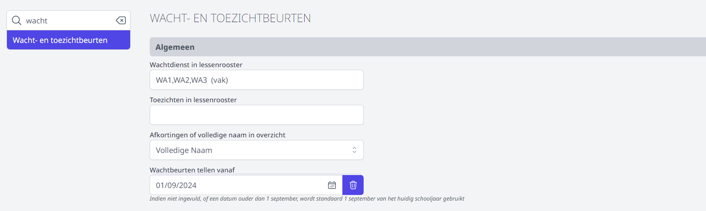

Een wachtbeurt vindt plaats **tijdens** de gebruikelijke lesuren, bv. wanneer een leraar een klas opvangt van een zieke collega. De wachtbeurten moeten in Toolbox gekend zijn om de module [Vervangingslijsten](/vervangingslijsten) te kunnen gebruiken. Ze kunnen op 2 manieren gedefinieerd worden: via het lessenrooster of manueel.

### 1. Via het lessenrooster

Als de wachtbeurten reeds in het geïmporteerde lessenrooster staan, kan je via de module 'Instellingen => Wacht- en toezichtsbeurten' de vakbenaming instellen die in het roosterprogramma gebruikt wordt om de wachtbeurt te benoemen. 
Indien er meerdere vakbenamingen gebruikt worden voor wacht (bijvoorbeeld verschillende vakbenamingen per graad) lijst je ze op met een komma ertussen. 

### 2. Manueel
Indien de wachtbeurten niet in de lessenrooster staan, moet je ze dus **manueel** invullen.
Dit doe je via de module Wacht- en toezichtsbeurten.

Om in het rooster een wachtbeurt toe te voegen of te verwijderen, klik je op het edit icoontje van dat lesblok: <LegacyAction img="edit.png"/>  
Er verschijnt dan een popup venster waar je bestaande wachtbeurten kan verwijderen door op het x'je te klikken naast de naam,
of door een nieuwe naam toe te voegen door deze in te typen of te kiezen uit de lijst.

<Thumbnails img={[
    require('./wachtbeurten2.png').default, 
]} />

Dit kan je dan doen voor elk lesuur waar nodig.

:::caution
Wachtbeurten die in het lessenrooster staan, kunnen **niet** manueel verwijderd worden.
Hiervoor moet een aangepast lessenrooster worden opgeladen.
:::