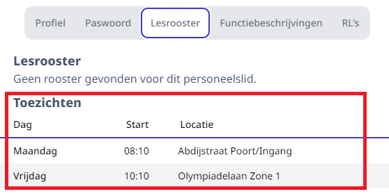
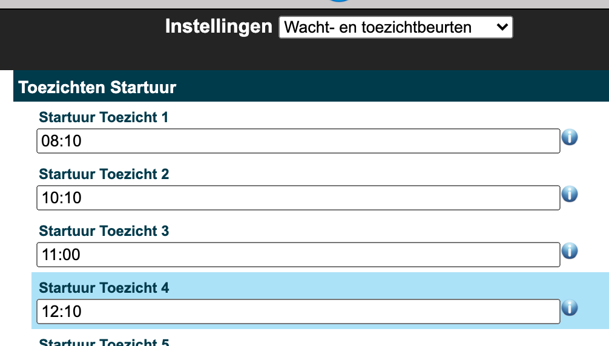
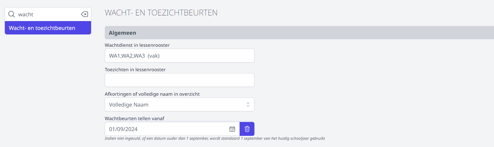

Een toezichtbeurt vindt plaats **buiten** de gebruikelijke lesuren, bv. wanneer een leraar toezicht houdt tijdens de speeltijd.

De toezichten kunnen op 2 manieren gedefinieerd worden: via het lessenrooster of manueel.
Belangrijk hierbij is dat een toezicht steeds gekoppeld is aan een locatie.

De toezichtbeurten van afwezige leraren kunnen in de module [Vervangingslijsten](/vervangingslijsten) getoond en vervangen worden. Een leraar kan ook steeds zijn toezichtbeurten raadplegen via zijn persoonlijk profiel in Toolbox. 

## Toezichturen & toezichtlocaties definiëren

Aangezien de toezichturen verschillend zijn van de lesuren, moeten ze apart gedefinieerd worden. Dat doe je via de module Instellingen => Wacht- en toezichtbeurten.

Ook de verschillende toezichtlocaties kan je definiëren via de module Instellingen => Wacht- en toezichtbeurten.
Elke locatie bestaat uit een afkorting en een omschrijving. De afkorting begint met een prefix voor de campus, deze moet ook geconfigureerd staan in de module Instellingen => Campussen.

<Thumbnails img={[
    require('./toezicht2.png').default, 
    require('./toezicht3.png').default, 
]} />

## Toezichten beheren

Als de toezichten reeds in het geïmporteerde lessenrooster staan, kan je via de module Instellingen => "Wacht- en toezichtbeurten" de naam van het 'vak' horende bij de toezichten instellen.
Indien er meerdere vakken zijn (bijvoorbeeld verschillende benamingen per graad) lijst je ze op met een komma ertussen. 

Indien de toezichten niet in het lessenrooster staan, moet je ze dus **manueel** invullen. Dit doe je via de module Wacht- en toezichtbeurten.

Om in het rooster een toezicht toe te voegen of te verwijderen, klik je op het edit-icoontje <LegacyAction img="edit.png"/> van dat toezichtuur op die toezichtlocatie.
Er verschijnt dan een pop-upvenster waar je bestaande toezichten kan verwijderen door op het kruisje <LegacyAction img="remove.png"/> te klikken naast de naam,
of door een nieuwe naam toe te voegen door deze in te typen of te kiezen uit de lijst.

<Thumbnails img={[
    require('./toezicht5.png').default, 
    require('./toezicht6.png').default, 
]} />

Dit kan je dan doen voor elk toezichtuur en toezichtlocatie waar nodig.

:::caution
Toezichten die in het lessenrooster staan, kunnen **niet** manueel verwijderd worden.
Hiervoor moet een aangepast lessenrooster worden opgeladen.
:::
