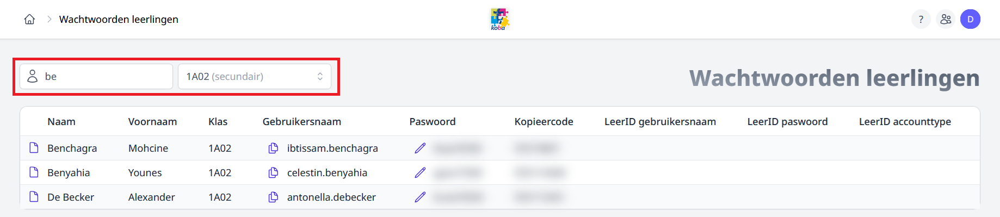

<ImageTitle img="paswoord.png">Wachtwoorden leerlingen</ImageTitle>

De module Wachtwoorden leerlingen laat toe om op een eenvoudige manier de wachtwoorden van leerlingen te beheren.

## Module activeren en gebruikersrechten
Om deze optie te kunnen gebruiken moet je de module eerst activeren. Dat doe je in de instellingen - Modules personeel. Daar zet je 'Wachtwoorden leerlingen opzoeken' op actief.

Om de module te kunnen gebruiken zijn er verder geen gebruikersrechten vereist. Dat wil zeggen dat elk personeelslid automatisch volledige rechten heeft op deze module.

## De module gebruiken

Leerlingen kunnen op basis van karakters in hun naam, op klas en via een combinatie van beide opgezocht worden.

 Document openen
- Klik om een pdf document te openen met de wachtwoordgegevens voor de desbtreffende leerling. 

:::info
    Je kan zelf bepalen hoe die PDF eruit ziet via de module Instellingen > PDF leerlingen (...). Er zijn heel wat dynamische variabelen beschikbaar waardoor het document dynamisch wordt samengesteld en de variabelen worden vervangen door de overeenkomstige gegevens voor de betreffende leerling. Dat stelt je in staat om ineens heel wat info mee te geven zoals bv. inloggegevens voor andere softwareplatformen. 
:::

 Gegevens kopiëren
- Je kan de gebruikersnaam via dit icoontje kopiëren om elders te kunnen gebruiken. Door over een paswoord te scrollen wordt deze zichtbaar en kan je deze ook gemakkelijk kopieren door erop te klikken.

 Gegevens bewerken
- Door op het potloodje te klikken kan het wachtwoord worden gewijzigd.

