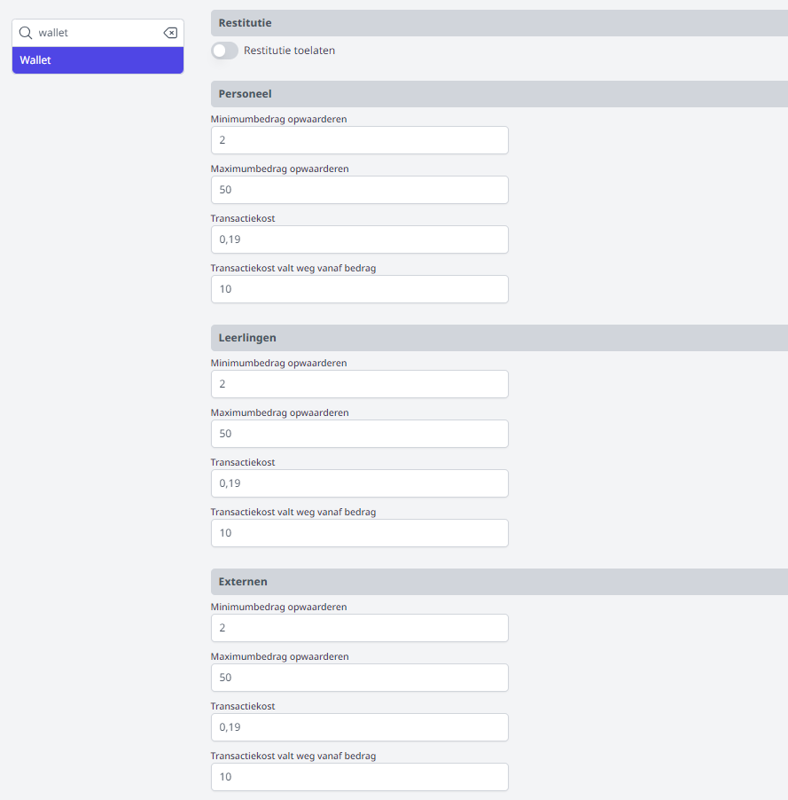
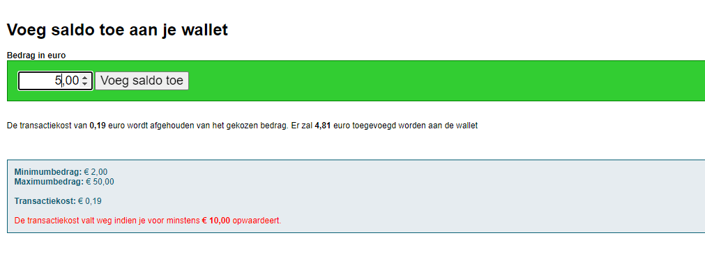
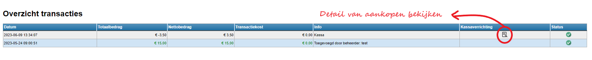
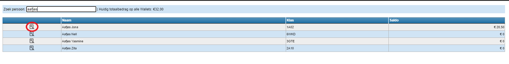
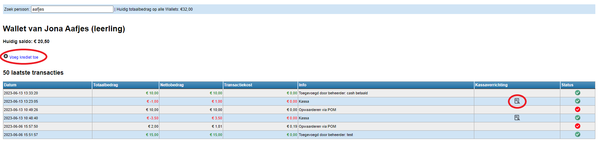
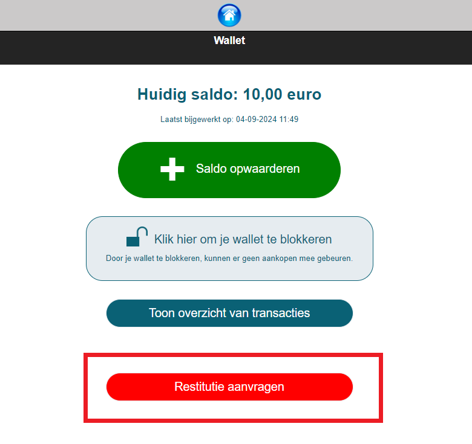
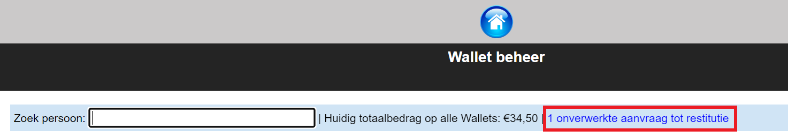
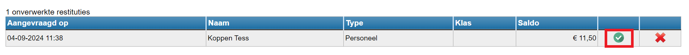

<ImageTitle img="wallet.png">Wallet</ImageTitle>

De wallet van Toolbox is een digitale portefeuille die gebruikt kan worden om aankopen te betalen via de module [Kassa](/kassa). Gebruikers (of hun ouders) kunnen zelf geld opladen en met behulp van een scanapparaat en een unieke barcode kan de wallet gescand worden om zo de betaling uit te voeren. De wallet kan zowel door leraren, leerlingen als externen gebruikt worden. Om deze module te kunnen gebruiken is een contract met POM vereist. Tarieven raadplegen en POM activeren kan via https://app.pom.be/nl/connect/koba-toolbox/tarieven. 

### Instellingen

Vooraleer je aan de slag kan met de module Wallet moet die geactiveerd worden. Dat gebeurt via de module Instellingen > Modules. De module is voor personeel en leerlingen apart te activeren. Die voor leerlingen vind je helemaal onderaan. Eens geactiveerd, moeten er geen gebruikersrechten meer worden toegekend. De module is onmiddellijk toegankelijk voor iedereen die beschikt over een gebruikersnaam en wachtwoord of een MS Office, Google of Smartschoolaccount (naar gelang de instellingen in de betreffende Toolbox). 

Het personeelslid dat de wallet zal beheren, moet daarvoor het gebruikersrecht 'Wallet_beheer' krijgen via de module [Gebruikersbeheer](/gebruikersbeheer).

In de module Instellingen > Wallet moeten er ook nog enkele zaken ingesteld worden. Zo kan je instellen of de gebruiker een terugbetaling van het saldo op diens wallet kan aanvragen (restitutie), bv. wanneer de leerling of leraar de school zal verlaten. 
Daarnaast kan je per gebruikersgroep opgeven wat het minimum- en maximumbedrag is dat er opgeladen kan worden. Verder kan je ook de transactiekost van de POM-betaling doorrekenen door hier een bedrag per transactie in te vullen. Die kost zal bij het opladen in mindering gebracht worden van het op te laden bedrag. Bv. een gebruiker wil 5 euro opladen. De gebruiker zal 5 euro betalen, maar er wordt maar 4,81 euro opgeladen (indien de transactiekost 0,19 euro bedraagt). 
Het is mogelijk om de transactiekost vanaf een bepaald bedrag te laten wegvallen. Dat bedrag kan hier per gebruikersgroep opgegeven worden. 

### Wallet voor personeel

Indien de module Wallet geactiveerd is in de Toolbox (via module Instellingen > Modules) is er geen bijkomend gebruikersrecht nodig. Personeelsleden kunnen via deze module hun wallet opladen of hun verrichtingen en aankopen in detail bekijken. Wanneer het op te waarderen saldo is ingegeven, wordt er een POM QR code gegenereerd om de betaling uit te voeren. Die kan gescand worden via de eigen bankapp of met Payconiq. Personeelsleden gebruiken de barcode op hun identiteitskaart om aankopen via de module [Kassa](/kassa) te betalen. 

<Thumbnails img={[
    require('./wallet2.PNG').default, 
]} />

### Wallet voor leerlingen 

Leerlingen gebruiken **niet** dezelfde Toolbox als personeelsleden. Zij hebben een eigen Toolbox die bereikbaar is door '/leerling' achter de gebruikelijke toolbox-url te plakken, bv. demotoolbox.kobavzw.be/leerling. 

Leerlingen kunnen inloggen met hun gebruikersnaam en wachtwoord. Die gegevens zijn terug te vinden via de module Synchronisatie leerlingen > 'PDF afdrukken' of 'Exporteer XLSX'. Gebruikersnamen en wachtwoorden kunnen in bulk en gepersonaliseerd verstuurd worden via de module Smartschool bulkmail. Klik [hier](/smartschool_bulkmail) voor meer info over deze module.

Het is voor leerlingen ook mogelijk om in te loggen via Smartschool. Wanneer leerlingen reeds ingelogd zijn in Smartschool en zij gebruiken de rechstreekse url de wallet (bv. demotoolbox.kobavzw.be/leerling/wallet/), komen zij meteen in de Wallet terecht. Ook de ouders kunnen via hun co-account inloggen in de Toolbox voor leerlingen. Op die manier kunnen zij het saldo opwaarderen of de wallet van hun kind blokkeren. 

Om aan de kassa te kunnen betalen met de wallet, is er een barcode of QR code en een scanner nodig. De QR code van de digitale leerlingenkaart in Smartschool kan gebruikt worden in combinatie met de wallet. Om die te kunnen gebruiken, moeten de QR codes opgehaald worden uit Smartschool via de module Synchronisatie leerlingen > Scancodes ophalen. Het is ook mogelijk om via Toolbox eigen barcodes te genereren en leerlingenkaarten aan te maken. Meer info hierover vind je terug bij het onderdeel [Leerlingenkaarten](/leerlingenkaarten). De module Leerlingenkaarten kan eveneens gebruikt worden in combinatie met de QR codes van Smartschool. Zo kan men ervoor kiezen om de Smartschool QR codes te tonen op deze leerlingenkaarten. In dat geval kan men een leerlingenkaart bezorgen aan leerlingen die niet beschikken over een smartphone, terwijl andere leerlingen hun digitale leerlingenkaart gebruiken. 

### Wallet voor externen 

Ook externen (personen die geen personeelslid of leerling zijn) kunnen gebruik maken van de wallet. Denk aan werknemers van het CLB of het ondersteuningsnetwerk die regelmatig op de school aanwezig zijn en ook bv. een broodje of drankje via de kassa moeten kunnen aankopen.

Aangezien externen niet ingegeven zijn in het administratief pakket (Informat of Wisa) zullen zij niet gesynchroniseerd kunnen worden met Toolbox. Daarom is het nodig om deze personen manueel in te geven via de module Synchronisatie externen. Via deze weg kan er een pdf-document afgedrukt worden waarin gebruikersnaam en wachtwoord worden getoond alsook een barcode die gescand kan worden om te betalen met de wallet.  

Externen gebruiken **niet** dezelfde Toolbox als personeelsleden. Zij moeten inloggen via een aparte toolbox die bereikbaar is door '/externe' achter de gebruikelijke toolbox-url te plakken, bv. demotoolbox.kobavzw.be/externe. 

### Beheer en manueel betalingen toevoegen aan een wallet 

Iemand met het gebruikersrecht 'Wallet_beheer' kan in de module Wallet via <LegacyAction img="configure.png" text="Beheer"/> de stand van zaken van alle wallets raadplegen. Bovenaan kan men zoeken op naam. Het is ook mogelijk om een overzicht van alle gebruikers op te roepen door %%% in te typen in het tekstveld. Naast dit tekstveld zie je het saldo dat op dit moment nog beschikbaar is op alle wallets tezamen. 

Klik op <LegacyAction img="detail.png"/> om de details van een gebruiker te raadplegen of om manueel een bedrag op te laden. 

- Klik in de kolom 'Kassaverrichting' op <LegacyAction img="detail.png"/> om de details van een aankoop te raadplegen. 

- Via <LegacyAction img="pluscircle.png" text="Voeg krediet toe"/> kan je de wallet manueel opwaarderen zonder dat er een betaling via POM moet gebeuren. Dit kan noodzakelijk zijn wanneer een leerling bv. niet in de mogelijkheid is om met POM te betalen. 
- De rode vinkjes geven aan dat een transactie niet geslaagd is. 

### Boekhoudkundige opvolging

Bij het opwaarderen van de wallet zal het volledige bedrag ineens binnenkomen in Exact Online. Aangezien het bedrag zich op dat moment nog in een digitale portefeuille van een gebruiker bevindt en nog niet (volledig) is besteed, worden de inkomsten best geboekt op een voorschotrekening. 

Wanneer er een aankoop plaatsvindt, wordt de wallet in Toolbox in mindering gebracht. Daarom is het nodig om periodiek (elke 2 à 3 maanden) de aankopen via de kassa op te volgen. Dat kan rechtrstreeks in de module [Kassa](/kassa/gebruik_verwerking/verkopen_opvolgen/). In het exportbestand kan er makkelijk achterhaald worden voor welk bedrag er in totaal is aangekocht via de wallet en over welke aankopen deze bedragen zijn verdeeld. Per categorie/grootboekrekening (bv. schoolmateriaal, dranken- en versnaperingen) kan er in Exact Online manueel één totaalbedrag worden afgeboekt. Het is niet nodig om dit per aparte verrichting te doen. Na het manueel boeken zou het bedrag op de voorschotrekening overeen moeten komen met het huidige beschikbare bedrag op alle wallets tezamen.  

### Restitutie saldo
Indien in de module Instellingen > Wallet is ingesteld dat gebruikers de terugbetaling van hun saldo mogen aanvragen, wordt in de wallet van alle gebruikersgroepen onderaan de knop 'Restitutie aanvragen' getoond. 

Wanneer een gebruiker op deze knop heeft geklikt, zal een beheerder in de module Wallet de aanvraag verder kunnen opvolgen bij het onderdeel beheer (tandwieltje bovenaan). Daar wordt bovenaan getoond hoeveel onverwerkte aanvragen er zijn. Klik op de blauwe linktekst om het overzicht met  te behandelen aanvragen te openen. 

Voor de terugbetaling is er geen automatische koppeling met het boekhoudpakket voorzien. Een terugbetaling zal dus manueel verwerkt moeten worden op basis van deze lijst. Indien de terugbetaling in orde is, kan je in dit scherm aanvinken dat de aanvraag verwerkt is. Daarna zal de aanvraag definitief uit de lijst verdwijnen. Is de restitutie om een bepaalde reden toch niet nodig, dan kan je de aanvraag verwijderen door op het rode kruisje te klikken. De gebruiker behoudt hiermee het huidige saldo op diens wallet. 

