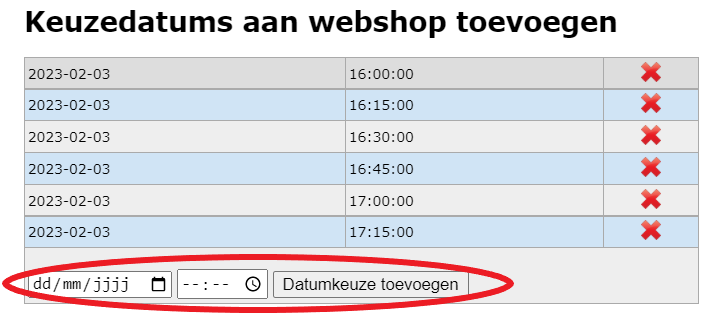

Per webshop kan je keuzedatums of -uren instellen. Zo kan men bij het bestellen via de webshop voor bv. een mosselfeest opgeven op welke dag en binnen welk tijdvak men wil komen eten. Bij een verkoop kan men aangeven op welk moment men de bestelling wil komen afhalen. Klik bij de betreffende webshop in de kolom 'Datums' op het getal. Aan de hand van dit getal kan je zien hoeveel verschillende keuzemomenten er zijn ingesteld. 

Voer een datum en/of tijdstip in en klik op 'datumkeuze toevoegen'. Je kan meerdere keuzemomenten na elkaar toevoegen. Een foutief ingevoerd keuzemoment kan via het rode kruisje terug worden verwijderd. 

