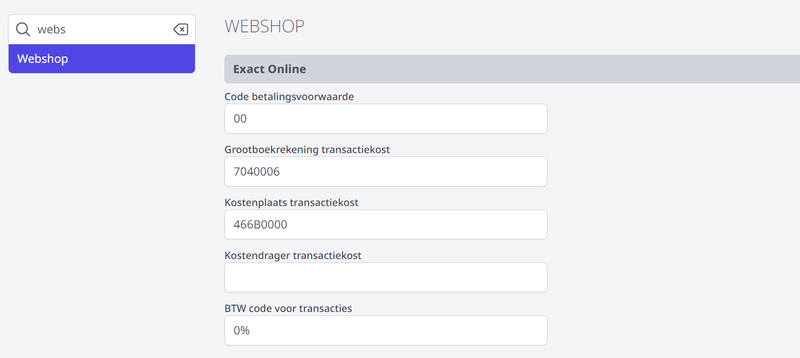

## Gebruikersbeheer

Om een webshop aan te maken of te beheren, moet er in de module [Gebruikersbeheer](/gebruikersbeheer) het recht webshop_beheer zijn toegekend aan de juiste persoon. 

## Algemene instellingen

Ook in de module **Instellingen => Webshop** moeten nog een aantal algemene zaken worden ingesteld. 

### 1. Exact Online

De code voor de betalingsvoorwaarde is steeds 00, aangezien de betaling onmiddellijk bij het afronden van de bestelling plaatsvindt. 

De transactiekost voor de betaling kan worden doorgerekend aan de klant. In dat geval moeten hiervoor de boekhoudkundige parameters worden ingevuld.  

### 2. Mailsettings

Na elke bestelling wordt er een bevestigingsmail gestuurd naar de klant. De e-mailsettings van de verzender kunnen hier worden ingesteld. Hieronder vind je een voorbeeld van de instellingen voor Office 365. Deze instellingen verschillen naar gelang de provider. Ondervind je hiermee moeilijkheden, neem dan contact op met de lokale ICT'er of met het Toolbox-team via toolbox@kobavzw.be.

### 3. Algemene voorwaarden

Tot slot kan je nog de algemene voorwaarden voor de webshop instellen. Na het invullen van dit tekstveld verschijnt in elke webshop onderaan de knop 'Algemene voorwaarden'. Dit is enkel verplicht om te kunnen werken met de **internationale betaalmiddelen** van POM (bv. Maestro/Mastercard/Visa/ApplePay). De website zal in dat geval grondig gescreend worden alvorens de toekenning te doen. 
Vooral volgende elementen zijn van groot belang:
- Vermelding van de entiteitgegevens (naam, adres, KBO nummer)
- Retourbeleid / Herroepingsrecht
- Terugbetaalbeleid
- Klachtenregeling

Werk je niet met internationale betaalmiddelen, dan mag je dit veld blanco laten. Er zal in de webshop bijgevolg geen knop 'Algemene voorwaarden' te zien zijn. 

