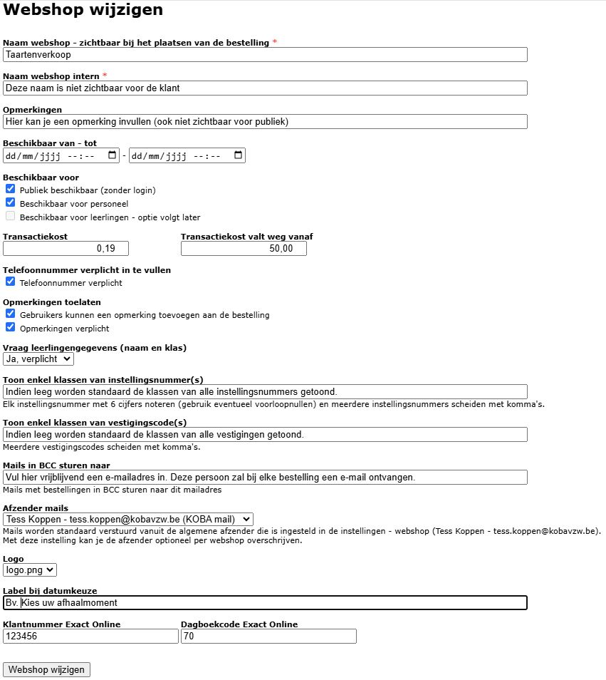

Klik in de module Webshop op <LegacyAction img="configure.png" text="beheer" /> om een nieuwe webshop aan te maken of een bestaande webshop te beheren. 

Klik vervolgens op <LegacyAction img="pluscircle.png" text="Nieuwe webshop toevoegen" /> en vul de nodige velden in. 

- **Beschikbaar van-tot**: Dit is geen verplicht veld! Indien leeg is de webshop onbeperkt geopend. Om een webshop gedurende een beperkte periode open te stellen, kan hier een datum- en tijdsslot worden ingesteld. 

- **Beschikbaar voor**: Momenteel zijn de webshops enkel maar publiek beschikbaar. In een volgende versie kan ervoor gekozen worden om een webshop enkel beschikbaar te maken voor leerlingen (bv. schoolwinkeltje) of voor personeel (bv. inschrijven voor personeelsfeest).

- **Transactiekost**: Indien gewenst, kan hier het bedrag worden ingevuld dat wordt doorgerekend aan de koper. Dit bedrag zal automatisch bij de afrekening van de bestelling worden toegevoegd.

- **Transactiekost valt weg vanaf**: Wanneer er voor minimaal dit bedrag aangekocht wordt, zal er geen transactiekost worden aangerekend. 

- **Telefoonnummer verplicht in te vullen**: Indien aangevinkt, zal de klant verplicht zijn telefoonnummer moeten opgeven bij de bestelling. 

- **Opmerkingen toelaten**: Vink aan om kopers in de webshop de mogelijkheid te geven om een opmerking toe te voegen. Bij 'teksten' kan hier een tekst of omschrijving aan toegevoegd worden. Bv. de vraag naar allergieën of bijkomende specifcaties bij de bestelling. 

- **Vraag leerlingengegevens**: Vink deze optie aan om de klant bij de aankoop de naam en klas van de leerling te laten invullen.  

- **Logo**: Het schoollogo kan hier geselecteerd worden. Gebruik je voor de webshop graag een ander logo, bezorg het aan het Toolbox-supportteam via toolbox@kobavzw.be.

- **Label bij datumkeuze**: Indien er in een volgende stap keuzemomenten (datums) ingesteld zullen worden, kan men hier opgeven welke tekst er in de webshop getoond moet worden bij deze datumkeuze. Bv. *Selecteer hier uw afhaalmoment*. 

- **Klantnummer Exact Online**: Geef hier het klantnummer uit Exact Online in waarop de aankopen via de webshop geboekt moeten worden. Dit kan één klantnummer zijn voor meerdere webshops tegelijk, maar het is ook mogelijk om per webshop een klantnummer in te geven.  

- **Dagboekcode Exact Online**: Geef hier de dagboekcode uit Exact Online in waarop de aankopen via de webshop geboekt moeten worden. Dit kan één dagboek zijn voor meerdere webshops tegelijk, maar het is ook mogelijk om per webshop een ander dagboek in te geven. 

- **Webshop toevoegen**: Klik hier om de webshop aan te maken. Alle velden van dit scherm kunnen nadien nog gewijzigd worden. 

Als de webshop is aangemaakt, verschijnt die in het overzicht met webshops. De eerder ingevoerde gegevens kunnen nog worden gewijzigd door vooraan op het potloodje <LegacyAction img="potlood2.png"/>te klikken. 

Enkel webshops waarvoor nog geen bestellingen geplaatst zijn, kunnen volledig verwijderd worden via het rode kruisje achteraan <LegacyAction img="remove.png"/>.

