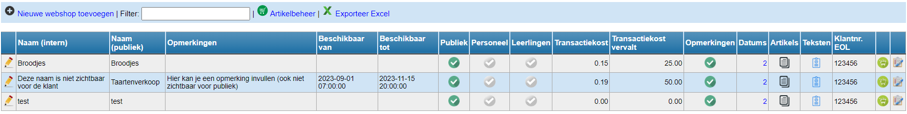

Klik op <LegacyAction img="configure.png" text="beheer" /> om een nieuwe webshop aan te maken of een bestaande webshop te beheren. 

Klik vervolgens op <LegacyAction img="pluscircle.png" text="Nieuwe webshop toevoegen" /> en vul de nodige velden in. 

**Beschikbaar van-tot**: Dit is geen verplicht veld! Indien leeg is de webshop onbeperkt geopend. Om een webshop gedurende een beperkte periode open te stellen, kan hier een datum- en tijdsslot worden ingesteld. 

**Beschikbaar voor**: Momenteel zijn de webshops enkel maar publiek beschikbaar. In een volgende versie kan ervoor gekozen worden om een webshop enkel beschikbaar te maken voor leerlingen (bv. schoolwinkeltje) of voor personeel (bv. inschrijven voor personeelsfeest).

**Transactiekost**:  Indien gewenst, kan hier het bedrag worden ingevuld dat wordt doorgerekend aan de koper. Dit bedrag zal automatisch bij de afrekening van de bestelling worden toegevoegd.

**Transactiekost valt weg vanaf**: Wanneer er voor minimaal dit bedrag aangekocht wordt, zal er geen transactiekost worden aangerekend. 

**Opmerkingen toelaten**: Vink aan om kopers in de webshop de mogelijkheid te geven om een opmerking toe te voegen. Bij 'teksten' kan hier een tekst aan toegevoegd worden. Bv. de vraag naar allergieën of bijkomende specifcaties bij de bestelling. 

**Webshop toevoegen**: Klik hier om de webshop aan te maken. Alle velden van dit scherm kunnen nadien nog gewijzigd worden. 

Als de webshop is aangemaakt, verschijnt die in het overzicht met webshops. De eerder ingevoerde gegevens kunnen worden gewijzigd door vooraan op het potloodje te klikken. 
