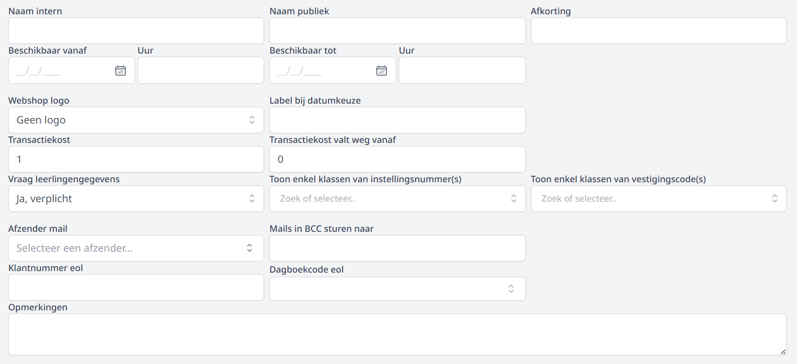
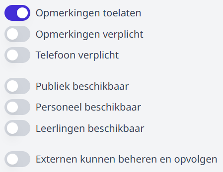
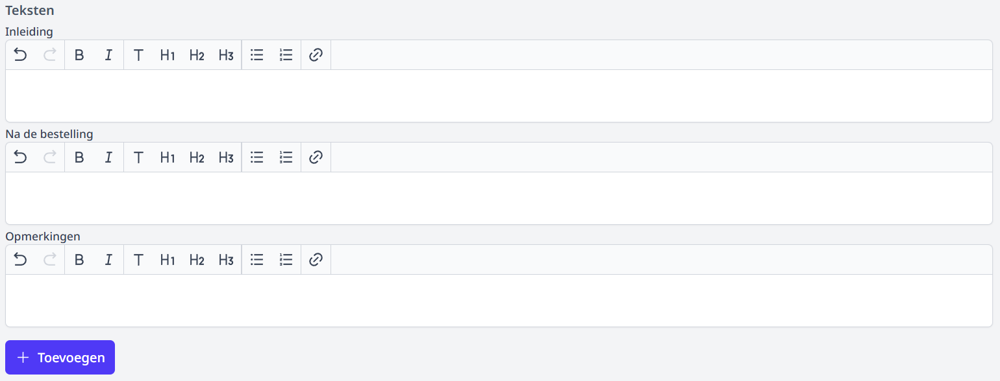
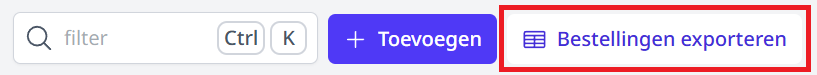
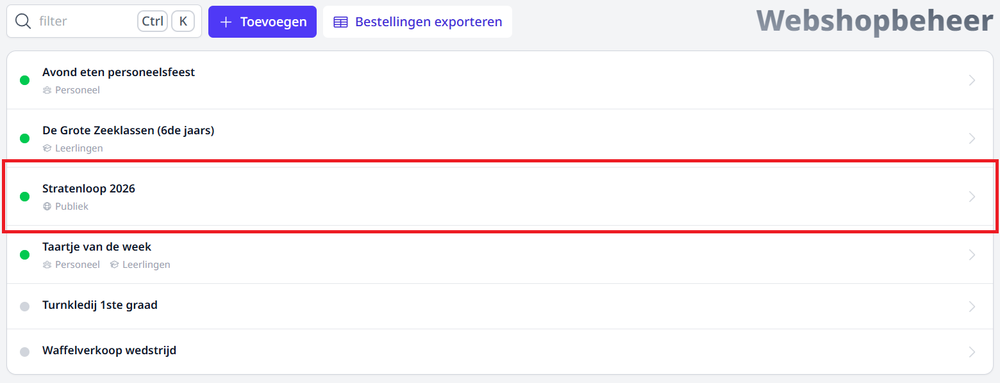

# Webshop Beheer

De webshopbeheer pagina biedt een overzicht van alle webshops. Hier kun je nieuwe webshops toevoegen en bestellingen van alle webshops in één keer exporteren.

### Filteren

Via de **Filter** kun je zoeken op de naam van een webshop.

## Toevoegen

Via de **Toevoegen** knop kun je een nieuwe webshop aanmaken.

### Formulier

- **Beschikbaar van-tot**: Dit is geen verplicht veld! Indien leeg is de webshop onbeperkt geopend. Om een webshop gedurende een beperkte periode open te stellen, kan hier een datum- en tijdsslot worden ingesteld.

- **Logo**: Het schoollogo kan hier geselecteerd worden. Gebruik je voor de webshop graag een ander logo, bezorg het aan het Toolbox-supportteam via de helpdesk (bij het vraagteken rechtsboven in Toolbox). Ook bij het onderdeel 'Teksten' is het nog mogelijk om een afbeelding op te laden.

- **Label bij datumkeuze**: Indien er in een volgende stap [keuzemomenten](/webshop/webshopPagina/#keuze-datums) ingesteld zullen worden, kan men hier opgeven welke tekst er in de webshop getoond moet worden bij deze datumkeuze. Bv. _Selecteer hier uw afhaalmoment_.

- **Transactiekost**: Indien gewenst, kan hier het bedrag worden ingevuld dat wordt doorgerekend aan de koper. Dit bedrag zal automatisch bij de afrekening van de bestelling worden toegevoegd.

- **Transactiekost valt weg vanaf**: Wanneer er voor minimaal dit bedrag aangekocht wordt, zal er geen transactiekost worden aangerekend.

- **Vraag leerlingengegevens**: Vink deze optie aan om de klant bij de aankoop de naam en klas van de leerling te laten invullen. Hier kan men er nog voor kiezen om het veld met leerlingengegevens in de webshop verplicht te laten invullen of optioneel.

- **Toon enkel klassen van instellingsnummer(s)**: Wanneer er in een Toolbox meerdere instellingsnummers beschikbaar zijn, zullen in de webshop standaard (indien dit veld leeg is) alle klassen van alle instellingsnummers getoond worden in een dropdown lijst wanneer de optie 'vraag leerlingengegevens' is aangevinkt. Indien men voor een bepaalde webshop enkel de klassen van een welbepaald instellingsnummer moet kunnen selecteren, kan je in dit veld het betreffende instellingsnummer selecteren. Het is mogelijk om meerdere instellingsnummers te selecteren.

- **Toon enkel klassen van vestigingscode(s)**: Wanneer er in een Informat meerdere vestigingscodes beschikbaar zijn, zullen in de webshop standaard (indien dit veld leeg is) alle klassen van alle vestigingen getoond worden in een dropdown lijst wanneer de optie 'vraag leerlingengegevens' is aangevinkt. Indien men voor een bepaalde webshop enkel de klassen van een welbepaalde vestiging moet kunnen selecteren, kan je in dit veld de betreffende vestigingscode selecteren. Het is mogelijk om meerdere codes te selecteren.

- **Afzender mails**: Indien je werkt met dezelfde afzender voor alle webshops volstaat het om die afzender in te stellen via de module Instellingen > Webshop. Het is ook mogelijk om per webshop een andere afzender te voorzien. In dat geval selecteer je de gewenste afzender in dit scherm bij de algemene gegevens van de betreffende webshop. Opgelet! Om de afzender te kunnen selecteren, moet die toegevoegd zijn via de module Instellingen > [E-mail](/e-mail). Vraag hiervoor eventueel hulp aan je lokale ICT'er of Toolboxbeheerder. Die vind je terug via het startscherm in Toolbox bij het vraagteken rechtsbovenaan.

- **Mails in BCC sturen naar**: Vul hier het e-mailadres in van de persoon die van elke bestelling een bevestigingsmail in blind copy moet krijgen. Dit veld is optioneel. Laat het leeg indien je geen mails wil ontvangen.

- **Klantnummer Exact Online**: Geef hier het klantnummer uit Exact Online in waarop de aankopen via de webshop geboekt moeten worden. Dit kan één klantnummer zijn voor meerdere webshops tegelijk, maar het is ook mogelijk om per webshop een klantnummer in te geven.

- **Dagboekcode Exact Online**: Geef hier de dagboekcode uit Exact Online in waarop de aankopen via de webshop geboekt moeten worden. Dit kan één dagboek zijn voor meerdere webshops tegelijk, maar het is ook mogelijk om per webshop een ander dagboek in te geven.

:::caution Ter info
De velden **Klantnummer Exact Online** en **Dagboekcode Exact Online** zijn enkel zichtbaar voor personeel met het gebruikersrecht **webshop_boekhouding**. dit recht kan toegewezen worden in de module [Gebruikersbeheer](/gebruikersbeheer)
:::

### Opties

- **Opmerkingen toelaten**: Vink aan om kopers in de webshop de mogelijkheid te geven om een opmerking toe te voegen. Bij 'teksten' kan hier een tekst of omschrijving aan toegevoegd worden. Bv. de vraag naar allergieën of bijkomende specificaties bij de bestelling.

- **Opmerkingen verplicht**: Indien aangevinkt, zal de klant verplicht het opmerkingenveld moeten invullen bij de bestelling. Zoniet zal men de bestelling niet kunnen afronden.

- **Telefoonnummer verplicht in te vullen**: Indien aangevinkt, zal de klant verplicht zijn telefoonnummer moeten opgeven bij de bestelling.

- **publiek beschikbaar**: iedereen met de URL kan de webshop raadplegen en bestellingen plaatsen. De URL vind je terug via de webshop pagina.
:::info noot
De webshop is publiek toegankelijk voor iedereen met de link of QR code.
:::

- **Personeel beschikbaar**: Personeelsleden kunnen de webshop bereiken via de module 'Webshop' in Toolbox. Hiervoor moeten geen extra gebruikersrechten worden toegekend. Het is ook mogelijk om meerdere webshops voor personeel aan te maken. Wanneer een personeelslid een bestelling plaatst via de Toolbox webshop, zullen automatisch de persoonsgegevens worden ingevuld, aangezien die gekend zijn vanuit de synchronisatie met Informat. Een webshop voor personeel hoeft niet gepubliceerd te worden.

:::caution opgelet
Gebruik **NOOIT** de url uit de webshop voor personeel om de link naar de publieke webshop te verspreiden! Die bevat namelijk jouw persoonlijke gegevens.
:::

- **Leerlingen beschikbaar**: In een volgende versie zal men een webshop ook voor leerlingen beschikbaar kunnen maken (bv. schoolwinkeltje).

- **Externe kunnen beheren en opvolgen**: Je stelt de webshop open voor de externen die het gebruikersrecht _webshop_beheer_ of _webshop_bestellingen_opvolgen_ hebben. Zie ook [Externen](/webshop/externen)

### Teksten

- **Inleiding**: Hier kan je een inleidende tekst schrijven. Deze wordt boven aan in je webshop getoond.

- **Na de bestelling**: Deze tekst krijgt de klant direct na het voltooien van de bestelling op het scherm te zien; de tekst wordt ook opgenomen in de bevestigingsmail.

- **Opmerkingen**: In deze tekst kan je specificeren wat men kan ingeven in het opmerkingenveld. Deze tekst wordt net boven het opmerkingenveld getoond.

- **Webshop toevoegen**: Klik hier om de webshop aan te maken. Alle velden van dit scherm kunnen nadien nog gewijzigd worden.

Als de webshop is aangemaakt, verschijnt die in het overzicht met webshops. De eerder ingevoerde gegevens kunnen nog worden gewijzigd in de webshop pagina.

## Bestellingen exporteren

Klik op de **Bestellingen exporteren** knop om een volledig overzicht van alle bestellingen over de verschillende webshops heen te downloaden als Excel-bestand.

## Webshop pagina

Klik op een rij in het overzicht om de [webshop pagina](/webshop/webshopPagina) van de betreffende webshop te bekijken.

