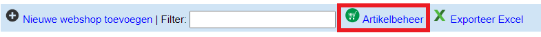
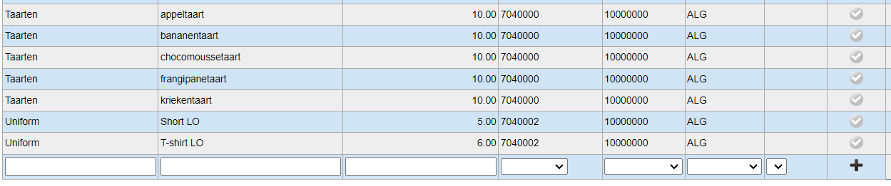
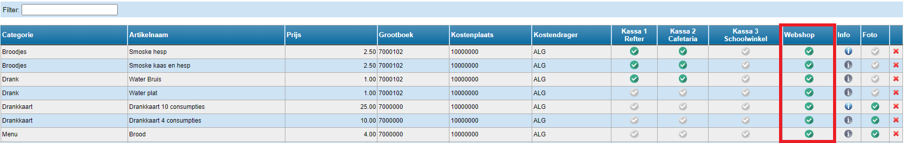
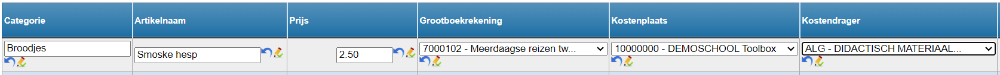
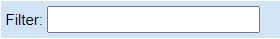

Wanneer de webshop is aangemaakt, moeten de aan te kopen artikelen worden toegevoegd. Vooraleer je artikelen kan toevoegen aan een specifieke webshop, moeten ze worden aangemaakt in het algemeen artikelbestand. Ga hiervoor bovenaan naar <LegacyAction img="winkelwagen.png" text="Artikelbeheer" />. Eens een artikel hier is aangemaakt, kan dit worden gebruikt in alle webshops alsook in de module 'Kassa'. De artikelen die in de module 'Kassa' zijn aangemaakt, zullen ook zichtbaar zijn in het artikelbeheer van de module 'Webshop'. 

## Artikel toevoegen

Je kan een nieuw artikel toevoegen door de gegevens in de onderste (lege) rij te typen. 

Om naderhand gemakkelijk een artikel terug te vinden, worden de artikels gegroepeerd onder zelf te kiezen categorieën (bv. schoolgerief, uniform, broodjes, drank, ...). Deze kunnen eenvoudig worden aangemaakt door in het witte vak van de kolom “Categorie” een zelf te kiezen naam in te typen. Eenmaal je een categorie voor de eerste keer hebt opgegeven, zal je die in de toekomst kunnen selecteren via het dropdown menu.

Op een soortgelijke wijze kan ook een artikelnaam worden opgegeven, een prijs en de boekhoudkundige parameters. De boekhoudkundige parameters worden gekozen vanuit een lijst met gegevens die in het verbonden Exact Online dossier beschikbaar zijn. Dit om ervoor te zorgen dat Exact Online naderhand de factuur zal accepteren en correct kan verwerken.

:::caution
Grootboekrekening, Kostenplaats en Kostendrager zijn belangrijke velden. Vraag de correcte gegevens na bij de boekhouding. 
:::

Klik vervolgens op <LegacyAction img="plus.png" /> om de lijn met het artikel aan het beheersysteem toe te voegen.

Duid tot slot aan dat het artikel beschikbaar moet zijn voor de module webshop en eventueel ook in welke kassa. Klik hiervoor op <LegacyAction img="vinkjeGrijsRond.png" />.  Als het artikel succesvol is gekoppeld aan de module webshop of aan een kassa dan zal dit symbool groen kleuren <LegacyAction img="vinkjeGroenRond.png" />. Nu is het artikel enkel beschikbaar om te gebruiken in eender welke webshop. Let op! Het is nog niet gekoppeld aan een specifieke webshop. 

## Foto toevoegen aan artikel

Om een foto te koppelen aan een artikel, klik je achteraan in de kolom 'Foto' op <LegacyAction img="vinkjeGrijsRond.png" />.  Selecteer vervolgens de foto van op je computer. Als de foto succesvol is gekoppeld, zal dit symbool groen kleuren <LegacyAction img="vinkjeGroenRond.png" />. Je kan de foto in preview bekijken door op het groene vinkje te klikken. Via deze weg kan je de foto vervolgens verwijderen. 

<Thumbnails img={[
    require('./foto.png').default, 
]} />

## Artikel wijzigen

Om de categorie, artikelnaam, prijs of boekhoudkundige parameters van een artikel aan te passen, dubbelklik je op het te wijzigen vak. Het tekstvak zal weer invulbaar zijn. Klik vervolgens op <LegacyAction img="potlood.png" /> om de wijziging te bewaren. Je kan de wijzing ongedaan maken door te klikken op <LegacyAction img="undo.png" />. 

## Artikel verwijderen

Om een artikel te verwijderen klik je op <LegacyAction img="remove.png" /> aan het eind van de regel.

## Artikel zoeken

Via de zoekfilter bovenaan kan je zoeken op categorie of artikelnaam.

