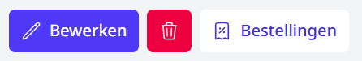
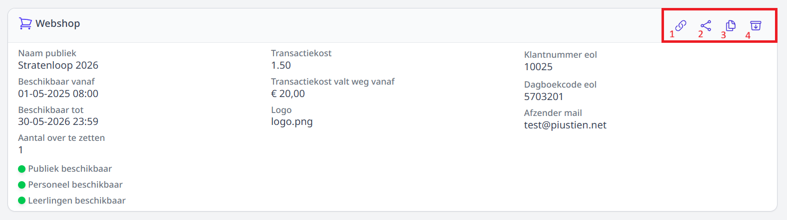
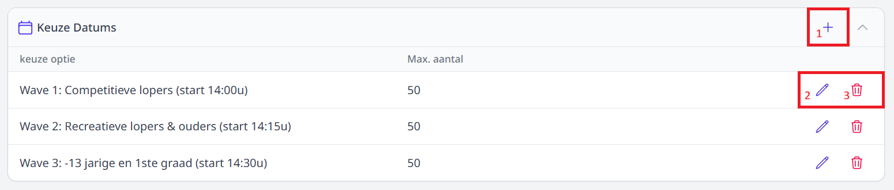
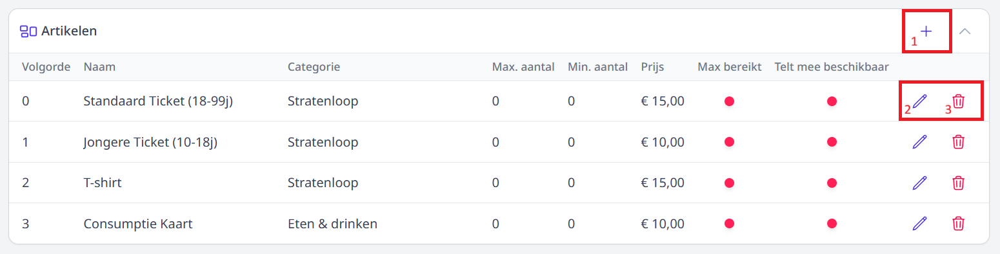
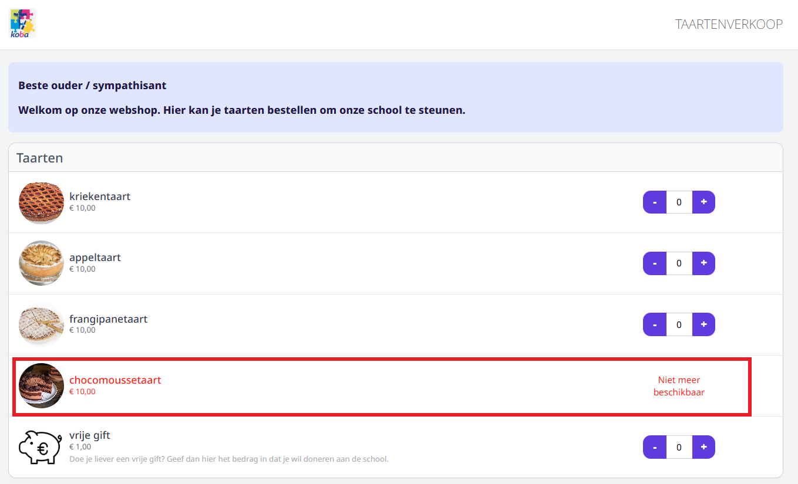

# Webshop pagina

## Bewerken | Verwijderen | Bestellingen

Via de **Bewerken** knop kan je de details van je webshop wijzigen.

Via de **Verwijder** knop kun je een webshop verwijderen, Dit kan enkel voor webshops waarvoor nog geen bestellingen geplaatst zijn.

Via de **Bestellingen** knop navigeer je naar de [bestellingen pagina](/webshop/bestellingenPagina).

## Webshop details en acties

> 1. **Openen:** Een rechtstreekse link om de webshop te openen. 
> 2. **Delen:** Als je webshop helemaal af is kan je hem delen, je kan kiezen om hem te delen als Qr-code of met een link.
> 3. **Dupliceren:** Gebruik deze functie om een bestaande webshop te kopiëren, zodat u bij een gelijkaardige actie niet vanaf nul hoeft te beginnen.
> 4. **Archiveren:** Wanneer een verkoop of actie is afgelopen, kan het voorkomen dat je de webshop niet meer nodig hebt. Van zodra er bestellingen gekoppeld zijn aan een webshop, 
kan die niet meer worden verwijderd. Je kan hem wel archiveren.

:::info Ter info
De opties **(1) Openen** en **(2) Delen** zijn enkel zichtbaar als de webshop publiekelijk beschikbaar is.
:::

## Keuze Datums

Per webshop kan je keuzedatums of -uren instellen. Zo kan men bij het bestellen via de webshop voor bv. een mosselfeest opgeven op welke dag en binnen welk tijdvak men wil komen eten. 
Bij een verkoop kan men aangeven op welk moment men de bestelling wil komen afhalen.

> 1.  Toevoegen
> 2.  Bewerken
> 3.  Verwijderen

Je kan per keuzemoment maximumaantallen instellen, omdat je bv. voor een eetfestijn maar X-aantal zitplaatsen kan voorzien. 
Indien je geen gebruik wenst te maken van de maximumaantallen, laat je het aantal op 0 staan. In dit geval is het aantal onbeperkt.

Indien je werkt met maximumaantallen per keuzemoment is het nodig om per artikel in de webshop nog aan te geven of dit artikel meetelt voor de maxima. 
Klik [hier](/webshop/webshopPagina/#artikelen) voor meer informatie.

:::danger opgelet

**ZET HET MAXIMUMAANTAL IETS LAGER**

Aan het begin van de bestelling controleert Toolbox of de maximumcapaciteit al dan niet is bereikt. Indien dat niet het geval is, kan er nog een nieuwe bestelling geplaatst worden, 
ongeacht het aantal. Bv. Als er voor een bepaalde datum nog 2 vrije plaatsen zijn, dan controleert Toolbox bij het begin van een nieuwe bestelling alleen **of** 
er nog plaats is en niet hoeveel vrije plaatsen er nog zijn. Het is dus ook mogelijk om een bestelling van 5 plaatsen te maken. 
Na het afronden van deze laatste bestelling zal Toolbox vaststellen dat het maximumaantal is bereikt. Een nieuwe bestelling zal vanaf nu niet meer mogelijk zijn.
:::

## Artikelen

Wanneer de webshop is aangemaakt, moeten de aan te kopen artikelen worden toegevoegd. 
Vooraleer je artikelen kan toevoegen aan een specifieke webshop, moeten ze worden aangemaakt in het [artikelbeheer](/webshop/artikelbeheer).

> 1.  Toevoegen
> 2.  Bewerken
> 3.  Verwijderen

Je kan de **volgorde** van de artikels in de webshop bepalen. De categorieën worden automatisch alfabetisch gesorteerd. Daaraan kan je zelf niets wijzigen. 
Binnen een categorie kan je de artikels wel sorteren door elk artikel een nummer te geven. Het artikel met het nummer 1 zal eerst komen te staan, enz. 

Het **maximum aantal** wijst op het aantal dat dit artikel maximaal gekocht kan worden per bestelling.

Het **minimum aantal** wijst op het aantal dat dit artikel minimaal gekocht kan worden per bestelling.

Je kan aanvinken of een artikel meetelt voor de maximumaantallen die werden ingesteld bij de [keuzedatums](/webshop/webshopPagina/#keuze-datums). 
Dat kan via de optie **Telt mee voor aantal beschikbaar**. Denk er goed over na welke artikels je laat meetellen voor het maximum. 
Organiseer je bv. een eetfestijn, dan moet je enkel weten hoeveel hoofdgerechten er besteld worden om het aantal zitplaatsen te kunnen bepalen. 
De drankkaarten, bijgerechten zoals frietjes en brood, nagerechten,... hoeven niet meegeteld te worden voor het maximum aantal. 

:::caution belangrijk
Er is in Toolbox geen optie voorzien om per webshop een maximaal aantal (lees: voorraad) per artikel  in te geven. De op te geven aantallen zijn steeds per bestelling of per keuzemoment.  
:::

Wel is er een mogelijkheid om bij de artikels in webshop aan te vinken dat het maximum aantal bereikt is ofwel dat de voorraad uitgeput is. 
Het gaat hier over het maximum aantal van een artikel **over alle bestellingen en keuzemomenten heen**, 
niet te verwarren met de eerste kolom 'Maximum aantal' waar je kan aangeven hoeveel men *per bestelling* maximimaal mag afnemen van dit artikel. 

Wanneer het maximum aantal van een artikel is bereikt en dat wordt alsdusdanig aangevinkt bij het betreffende artikel, dan wordt dat als volgt getoond in de webshop. 
Voor de klant is het op deze manier zeer duidelijk dat die dit artikel niet meer kan bestellen.

