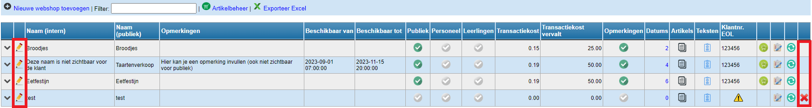
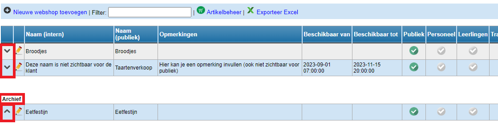

## Webshop verwijderen

Eens een webshop is aangemaakt, verschijnt die in het overzicht met webshops. De eerder ingevoerde gegevens kunnen nog worden gewijzigd door vooraan op het potloodje <LegacyAction img="potlood2.png"/>te klikken. 

Enkel webshops waarvoor nog geen bestellingen geplaatst zijn, kunnen volledig verwijderd worden via het rode kruisje achteraan <LegacyAction img="remove.png"/>.

## Webshop archiveren

Wanneer een verkoop of actie is afgelopen, kan het voorkomen dat je de webshop niet meer nodig hebt. Van zodra er bestellingen gekoppeld zijn aan een webshop, kan die niet meer worden verwijderd. Je kan hem wel archiveren via de knop <LegacyAction img="PijlOnder.png"/>.

Een webshop kan terug uit het archief gehaald worden en zodoende gereactiveerd worden via de knop <LegacyAction img="pijlOmhoog.png"/>.

## Webshop dupliceren

Wanneer je twee gelijkaardige webshops wil openen (bv. één voor afhaal en één voor ter plaatse eten OF één voor leraren en één voor breed publiek), kan je ervoor kiezen om een bestaande webshop te dupliceren via dit icoon <LegacyAction img="syncGreen.png"/>. Alle instellingen, artikels, teksten, ... worden overgenomen, enkel de reeds geplaatste bestellingen niet. 

Deze functie kan ook gebruikt worden wanneer je jaarlijks een gelijkaardige verkoop of actie organiseert, maar de bestellingen van vorig jaar niet meer in de bestellijst wil zien staan.

Na het dupliceren kan de nieuwe webshop nog volledig aangepast en/of geactualiseerd worden. 

