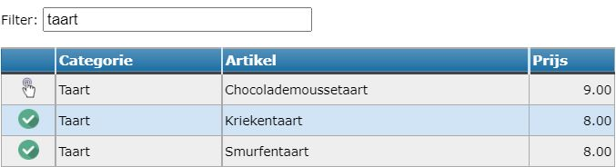

Eens de artikels in het artikelbeheer zijn ingesteld, kunnen ze aan eender welke webshop toegevoegd worden. Om artikels aan een bepaalde webshop toe te voegen, klik op <LegacyAction img="artikels.png" /> in de kolom Artikels van de betreffende webshop. 

Klik vervolgens op <LegacyAction img="pluscircle.png" text="Artikel toevoegen aan webshop" />. Je kan zoeken op categorie of artikel door bovenaan het tekstveld bij 'filter' in te vullen. Klik op <LegacyAction img="select.png" /> om het artikel aan de webshop toe te voegen. Als een artikel is toegevoegd, wijzigt het handje naar een groene bol <LegacyAction img="vinkjeGroenRond.png" />.

Je kan een foutief toegevoegd artikel terug verwijderen door in het overzicht achteraan op het rode kruisje <LegacyAction img="remove.png" /> te klikken. 

In het overzicht kan je nog instellen hoeveel stuks er minimaal of maximaal per bestelling aangekocht kunnen worden. Klik hiervoor op 0 en wijzig het aantal. Indien er geen minimum of maximum is, mag dit 0 blijven. 

Achteraan kan je de volgorde van de artikels in de webshop bepalen. De categorieën worden automatisch alfabetisch gesorteerd. Daaraan kan je zelf niets wijzigen. Binnen een categorie kan je de artikels wel sorteren door elk artikel een nummer te geven. Het artikel met het nummer 1 zal eerst komen te staan, enz. 

