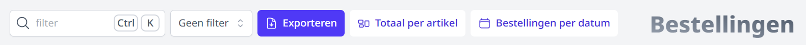
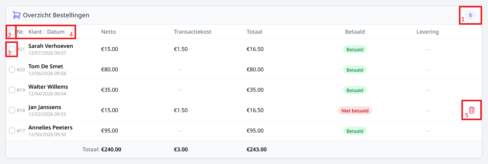
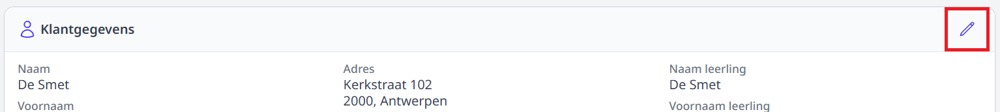
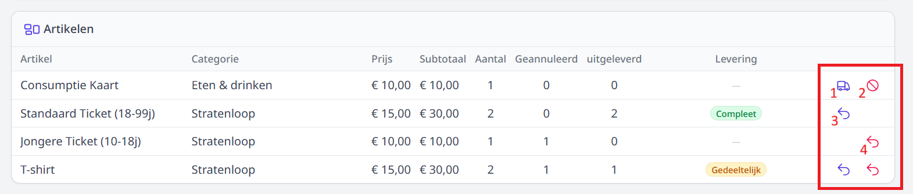
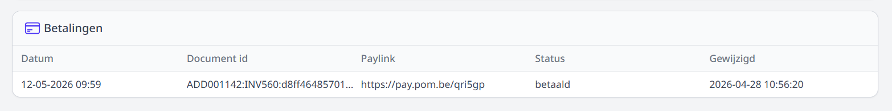
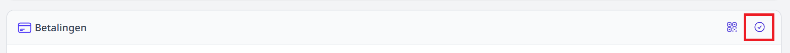
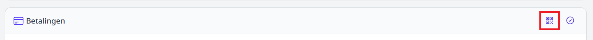

# Bestellingen

## Bestellingen overzicht

Hier vind je een overzicht terug waarmee je de bestellingen van je webshop kan opvolgen

> 1.  **Zoek filter:** Via de zoek filter kun je zoeken op de klantnaam.
> 2.  **Selectie filter:** Via de selectie filter kun je gaan filteren op **bestelstatus** en **leverstatus**.
> 3.  **Exporteren:** Afhankelijk van je selectie kan je alle of enkele bestellingen gaan exporteren naar **Excel** of **PDF**. Heb je niets geselecteerd dan zullen alle bestellingen geexporteerd worden.
> 4.  **Totaal per artikel:** Geeft een overzicht terug van totaal aantallen per artikel van alle bestellingen.
> 5.  **Bestellingen per datum:** Geeft een overzicht terug van alle [keuzedatums](/webshop/webshopPagina/#keuze-datums) met hun betreffende bestellingen.

:::info Exporteren naar PDF
Lees bij het exporteren naar pdf de instructies onder info goed na.
:::

> 1.  **Totaal aantal** bestellingen.
> 2.  **Selecteer** alle bestellingen.
> 3.  **Selecteer** deze bestelling.
> 4.  Klik op _Nr._ _Klant_ of _Datum_ om de lijst te **sorteren**.
> 5.  **Verwijder** de bestelling. Enkel onbepaalde bestellingen kunnen verwijderd worden.

## Bestelling pagina

### Klantgegevens

Een beheerder kan foutieve klantgegevens aanpassen. Klik hiervoor bovenaan op de **Potlood icoon** knop.

Bij elke bestelling kan de school een **interne opmerking** meegeven die niet zichtbaar is voor de klant.
Deze kan je toevoegen bij het bewerken van de klant gegevens.

### Artikelen

Een overzicht van welke artikelen er besteld zijn en het aantal. Hier kan je ook je bestelling volledig of gedeeltelijk uitleveren en annuleren.

> 1.  **Uitleveren:** opent een menu om de bestellijn volledig of gedeeldelijk uit te leveren.
> 2.  **Annuleren:** opent een menu om de bestellijn volledig of gedeeldelijk te annuleren.
> 3.  **Uitleveren ongedaanmaken** 
> 4.  **Annuleren ongedaanmaken**

:::danger opgelet
Een annulatie heeft enkel invloed op het bestelde aantal. Mogelijks is het ook noodzakelijk om apart een creditnota op te maken en eventueel een terugbetaling te doen.
:::

### Betalingen

Een overzicht van de betaal geschiedenis voor deze bestelling. Is de bestelling met POM betaald staat al de info hier weergeven.

#### Bestelling manueel op 'betaald' zetten

In uitzonderlijke gevallen kan een school toestaan om een bestelling toch contant te betalen. In dat geval moet de bestelling alsnog geplaatst worden via de webshop (door de klant of door de school). 
Die bestelling zal uiteraard niet onmiddellijk digitaal betaald worden. De onbetaalde bestelling zal toch in de bestellijst terecht komen, weliswaar als onbetaald. 
Door op het **check icoon** te klikken kan je de bestelling manueel de status betaald geven waarna ze kan overgezet worden naar Exact Online.

:::danger opgelet
De contante betaling zal je ook nog in het kasdagboek of in de module Kas van Toolbox moeten registreren.
:::

#### Achteraf betalen

Liep er iets mis met de betaling na het maken van de bestelling kan je de klant later betalen door een nieuwe POM qr te genereren. 
Klik hier voor op het **QR-code icoon**

