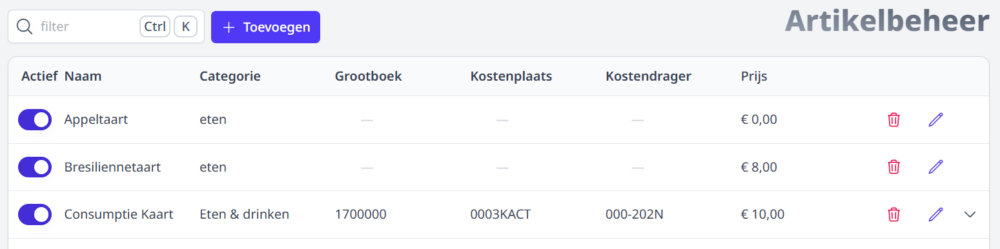
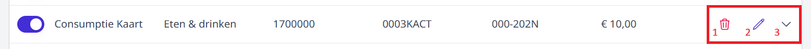

# Artikel Beheer

In het artikelbeheer beheer je al de producten en diensten voor je webshops. Je kan de artikels navigeren
Via de **Filter** hier mee kun je zoeken op de naam of categorie van een artikel.

## Artikel toevoegen

Je kan een nieuw artikel toevoegen via de **Toevoegen** knop.

Eens een artikel is toegevoegd in het artikelbeheer, kan dit worden gebruikt in alle webshops alsook in de module 'Kassa'.
De artikelen die in de module 'Kassa' zijn toegevoegd, zullen ook zichtbaar zijn in het artikelbeheer van de module 'Webshop'.

Om naderhand gemakkelijk een artikel terug te vinden, worden de artikels gegroepeerd onder zelf te kiezen categorieën (bv. schoolgerief, uniform, broodjes, drank, ...).
Deze kunnen eenvoudig worden aangemaakt door in het invoerveld van “Categorie” een zelf te kiezen naam in te typen. Eenmaal je een categorie voor de eerste keer hebt opgegeven,
zal je die in de toekomst kunnen selecteren via het dropdown menu.

Op een soortgelijke wijze kan ook een artikelnaam worden opgegeven, een prijs, afbeelding, omschrijving en de boekhoudkundige parameters. De boekhoudkundige parameters worden gekozen vanuit een lijst met gegevens die in het verbonden Exact Online dossier beschikbaar zijn. Dit om ervoor te zorgen dat Exact Online naderhand de factuur zal accepteren en correct kan verwerken.

:::danger Opgelet
Grootboekrekening, kostenplaats, kostendrager en BTW code zijn belangrijke velden. Vraag de correcte gegevens na bij de boekhouding!
:::

## Artikel

> 1.  **Verwijderen**
> 2.  **Bewerken**
> 3.  **extra info:** Als er achteraan een artikel een pijl staat betekendt dit dat er meer info beschikbaar is voor dit artikel. klik op de artikelrij om de info weer te geven.
