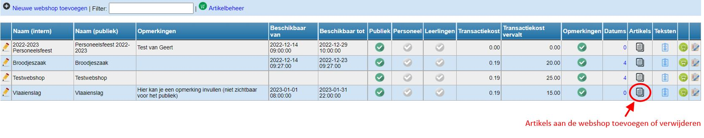
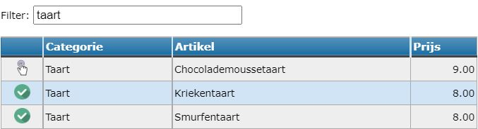
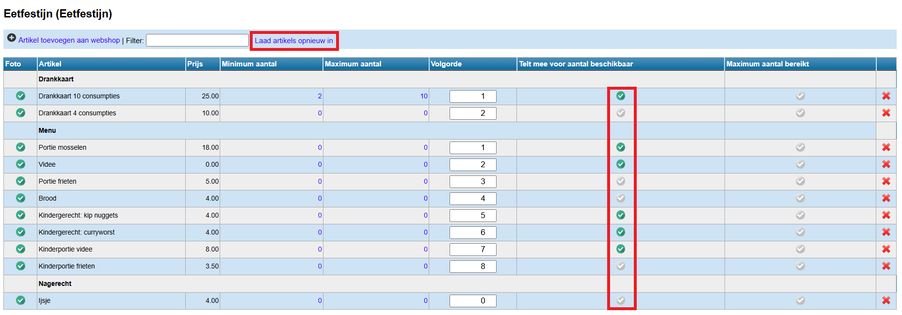
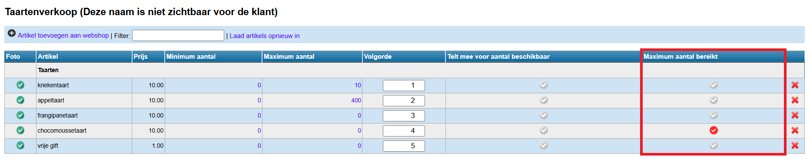
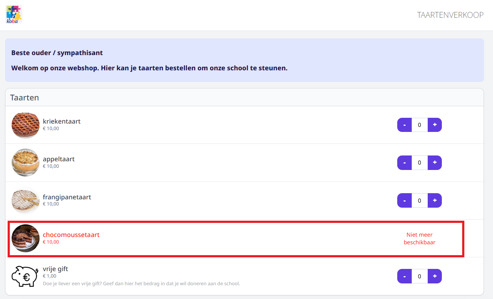

Eens de artikels in het artikelbeheer zijn ingesteld, kunnen ze aan eender welke webshop toegevoegd worden. Om artikels aan een bepaalde webshop toe te voegen, klik op <LegacyAction img="artikels.png" /> in de kolom Artikels van de betreffende webshop. 

Klik vervolgens op <LegacyAction img="pluscircle.png" text="Artikel toevoegen aan webshop" />. Je kan zoeken op artikel door bovenaan het tekstveld bij 'filter' in te vullen. Klik op <LegacyAction img="select.png" /> om het artikel aan de webshop toe te voegen. Als een artikel is toegevoegd, wijzigt het handje naar een groene bol <LegacyAction img="vinkjeGroenRond.png" />.

Je kan een foutief toegevoegd artikel terug verwijderen door in het overzicht achteraan op het rode kruisje <LegacyAction img="remove.png" /> te klikken. 

In het overzicht kan je nog instellen hoeveel stuks er minimaal of maximaal **per bestelling** aangekocht moeten/kunnen worden. Klik hiervoor op 0 en wijzig het aantal. Indien er geen minimum of maximum is, mag dit 0 blijven. 

Achteraan kan je de volgorde van de artikels in de webshop bepalen. De categorieën worden automatisch alfabetisch gesorteerd. Daaraan kan je zelf niets wijzigen. Binnen een categorie kan je de artikels wel sorteren door elk artikel een nummer te geven. Het artikel met het nummer 1 zal eerst komen te staan, enz. Klik op 'Laad artikels opnieuw in' om de artikels in de juiste (aangepaste) volgorde op het scherm te tonen. 

Tot slot kan je nog aanvinken of een artikel meetelt voor de maximumaantallen die werden ingesteld bij de [keuzedatums- en uren](/webshop/keuzedatums_of_uren_instellen/). Dat kan via het vinkje in de kolom 'Telt mee voor aantal beschikbaar'. Indien er geen gebruik gemaakt wordt van maximumaantallen bij de keuzemomenten, moet hier niets aangevinkt worden. Denk er goed over na welke artikels je laat meetellen voor het maximum. Organiseer je bv. een eetfestijn, dan moet je enkel weten hoeveel hoofdgerechten er besteld worden om het aantal zitplaatsen te kunnen bepalen. De drankkaarten, bijgerechten zoals frietjes en brood, nagerechten,... hoeven niet meegeteld te worden voor het maximum aantal. Deze items vink je dus niet aan. 

:::caution belangrijk
Er is in Toolbox geen optie voorzien om per webshop een maximaal aantal (lees: voorraad) per artikel  in te geven. De op te geven aantallen zijn steeds per bestelling of per keuzemoment.  
:::

Wel is er een mogelijkheid om bij de artikels in webshop aan te vinken dat het maximum aantal bereikt is ofwel dat de voorraad uitgeput is. Het gaat hier over het maximum aantal van een artikel **over alle bestellingen en keuzemomenten heen**, niet te verwarren met de eerste kolom 'Maximum aantal' waar je kan aangeven hoeveel men *per bestelling* maximimaal mag afnemen van dit artikel. 

Wanneer het maximum aantal van een artikel is bereikt en dat wordt alsdusdanig aangevinkt bij het betreffende artikel, dan wordt dat als volgt getoond in de webshop. Voor de klant is het op deze manier zeer duidelijk dat die dit artikel niet meer kan bestellen. 

