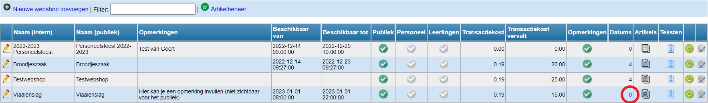

Per webshop kan je keuzedatums of -uren instellen. Zo kan men bij het bestellen via de webshop voor bv. een mosselfeest opgeven op welke dag en binnen welk tijdvak men wil komen eten. Bij een verkoop kan men aangeven op welk moment men de bestelling wil komen afhalen. Klik bij de betreffende webshop in de kolom 'Datums' op het getal. Aan de hand van dit getal kan je zien hoeveel verschillende keuzemomenten er zijn ingesteld. 

Voer een datum en/of tijdstip in en klik op 'datumkeuze toevoegen'. Je kan meerdere keuzemomenten na elkaar toevoegen. Een foutief ingevoerd keuzemoment kan via het rode kruisje terug worden verwijderd. 

<Thumbnails img={[
    require('./webshop_datum3.png').default, 
]} />

Het is eveneens mogelijk om alternatieve keuzemomenten toe te voegen. Dan moet je geen datum en tijdstip ingeven, maar kan je vrij in het teskstveld typen. Datumkeuzes en alternatieve keuzes kunnen perfect gecombineerd worden binnen eenzelfde webshop. 

<Thumbnails img={[
    require('./webshop_alternatief.png').default, 
]} />

Tot slot kan je per keuzemoment nog maximumaantallen instellen, omdat je bv. voor een eetfestijn maar X-aantal zitplaatsen kan voorzien. Indien je geen gebruik wenst te maken van de maximumaantallen, laat je het aantal op 0 staan. In dit geval is het aantal onbeperkt. 

Indien je werkt met maximumaantallen per keuzemoment is het nodig om per artikel in de webshop nog aan te geven of dit artikel meetelt voor de maxima. Klik [hier](/webshop/artikels_toevoegen_aan_de_webshop/) voor meer informatie. 

:::danger opgelet

**ZET HET MAXIMUMAANTAL IETS LAGER**

Aan het begin van de bestelling controleert Toolbox of de maximumcapaciteit al dan niet is bereikt. Indien dat niet het geval is, kan er nog een nieuwe bestelling geplaatst worden, ongeacht het aantal. Bv. Als er voor een bepaalde datum nog 2 vrije plaatsen zijn, dan controleert Toolbox bij het begin van een nieuwe bestelling alleen **of** er nog plaats is en niet hoeveel vrije plaatsen er nog zijn. Het is dus ook mogelijk om een bestelling van 5 plaatsen te maken. Na het afronden van deze laatste bestelling zal Toolbox vaststellen dat het maximumaantal is bereikt. Een nieuwe bestelling zal vanaf nu niet meer mogelijk zijn. 
:::
 
<Thumbnails img={[
    require('./webshop-aantallen.png').default, 
]} />
